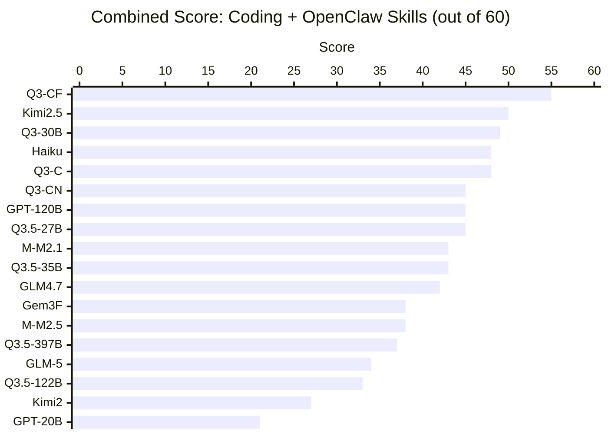
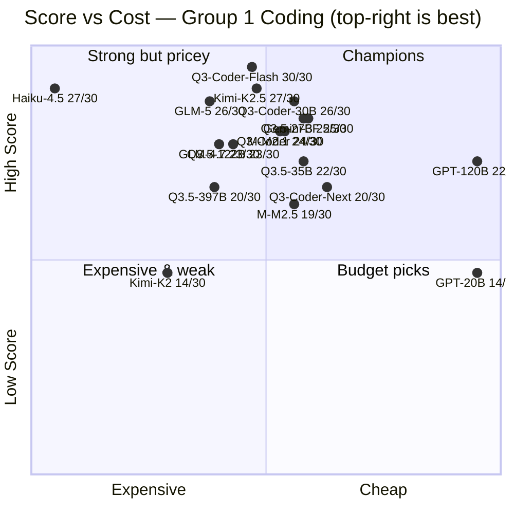
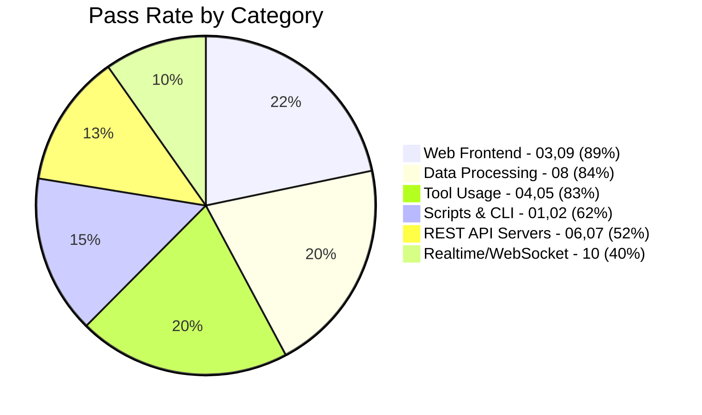

# Agentic Coding Benchmark

[中文版 (Traditional Chinese)](README_zh.md)

[](https://www.largitdata.com/zh-tw/blog_detail/20260320)

An automated benchmark suite for evaluating LLM **agentic coding ability** via OpenRouter tool-use API. Give a model a vague prompt and 4 tools (write_file, read_file, run_command, list_files), see if it builds something that actually works.

> **Why these models?** This benchmark is designed to find the **best bang-for-your-buck** models for agentic coding. We intentionally focus on lightweight and mid-tier models that developers can actually afford to run at scale. Frontier models like Claude Opus/Sonnet 4, GPT-4.5, and Gemini 2.5 Pro are not included — they would likely score well but cost 10-100x more per run, which defeats the purpose. **If you'd like to see specific models added, please [open an issue](https://github.com/ywchiu/local_agentic_llm/issues)!**

---

<details open>
<summary><h2>All Results (Combined G1 + G2)</h2></summary>

### Combined Score (out of 60)



### Leaderboard

| Rank | Model | Open | Arch | Params | Active | G1 | G2 | Total | Est. Cost | $/Pt |
|------|-------|:----:|:----:|-------:|-------:|:--:|:--:|:-----:|----------:|-----:|
| 1 | **qwen/qwen3-coder-flash** | | MoE | ? | ? | 30 | 25 | **55** | $0.26 | $0.005 |
| 2 | moonshotai/kimi-k2.5 | OSS | MoE | 1T | 32B | 27 | 23 | **50** | $0.44 | $0.009 |
| 3 | qwen/qwen3-coder-30b | OSS | MoE | 30.5B | 3.3B | 26 | 23 | **49** | $0.14 | $0.003 |
| 4 | qwen/qwen3-coder | OSS | MoE | 480B | 35B | 24 | 24 | **48** | $0.20 | $0.004 |
| 4 | anthropic/claude-haiku-4.5 | | ? | ? | ? | 27 | 21 | **48** | $8.52 | $0.178 |
| 6 | qwen/qwen3-coder-next | OSS | MoE | 80B | 3B | 20 | 25 | **45** | $0.16 | $0.004 |
| 6 | openai/gpt-oss-120b | OSS | MoE | 117B | 5.1B | 22 | 23 | **45** | $0.02 | $0.000 |
| 6 | qwen/qwen3.5-27b | OSS | Dense | 27B | 27B | 25 | 20 | **45** | $0.26 | $0.006 |
| 9 | minimax/minimax-m2.1 | OSS | MoE | 230B | 10B | 24 | 19 | **43** | $0.30 | $0.007 |
| 9 | qwen/qwen3.5-35b | OSS | MoE | 35B | 3B | 22 | 21 | **43** | $0.15 | $0.003 |
| 11 | z-ai/glm-4.7 | OSS | MoE | 355B | 32B | 23 | 19 | **42** | $0.64 | $0.015 |
| 12 | google/gemini-3-flash | | ? | ? | ? | 25 | 13 | **38** | $0.17 | $0.004 |
| 12 | minimax/minimax-m2.5 | OSS | MoE | 230B | 10B | 19 | 19 | **38** | $0.23 | $0.006 |
| 14 | qwen/qwen3.5-397b | OSS | MoE | 397B | 17B | 20 | 17 | **37** | $0.48 | $0.013 |
| 15 | z-ai/glm-5 | OSS | MoE | 745B | 44B | 26 | 8 | **34** | $0.63 | $0.019 |
| 16 | qwen/qwen3.5-122b | OSS | MoE | 122B | 10B | 23 | 10 | **33** | $0.39 | $0.012 |
| 17 | moonshotai/kimi-k2 | OSS | MoE | 1T | 32B | 14 | 13 | **27** | $1.18 | $0.044 |
| 18 | openai/gpt-oss-20b | OSS | MoE | 21B | 3.6B | 14 | 7 | **21** | $0.02 | $0.001 |

> **Open** = OSS (open weights on HuggingFace). **Arch** = Dense or MoE. **Est. Cost** = estimated total cost for G1+G2 (20 tests) based on OpenRouter pricing. **$/Pt** = cost per point scored.
>
> **qwen3-coder-next (+5)** and **gpt-oss-120b (+1)** are the only models that scored higher on OpenClaw than coding.

### Cost-Performance Quadrant (Group 1)

> Top-right = best value (high score + low cost). Cost estimated from OpenRouter pricing x actual tokens used.



**Best value picks:**
- **Gemini 3 Flash** (25/30, ~$0.09/run) and **qwen3.5-27b** (25/30, ~$0.10/run) — best score-to-cost ratio
- **GPT-OSS-120b** (22/30, ~$0.01/run) — cheapest model that still scores well
- **qwen3-coder-flash** (30/30, ~$0.18/run) — perfect score, moderate cost
- **Claude Haiku** (27/30, ~$2.58/run) — strong but 28x more expensive than Gemini Flash for 2 extra points

### Key Findings

1. **qwen3-coder-flash leads overall (55/60)** — perfect 30/30 on coding, 25/30 on OpenClaw skills
2. **Coding ability ≠ agent skill building** — GLM-5 drops from 26→8, Gemini Flash from 25→13 on OpenClaw
3. **qwen3-coder-next is the adaptation champion** — only model to score significantly higher on OpenClaw (+5)
4. **Open-source dominates** — 15 of 18 models are OSS; only qwen3-coder-flash, Claude Haiku, and Gemini Flash are proprietary

</details>

---

<details>
<summary><h2>Experiment 1: Group 1 — Python Fundamentals</h2></summary>

> 10 tests across 3 difficulty tiers. Mix of pure code generation and agentic tool-usage tasks.
> 18 models tested via agent_harness. March 2026.

### Leaderboard

| Rank | Model | Open | 01 | 02 | 03 | 04 | 05 | 06 | 07 | 08 | 09 | 10 | Total | Time | Tokens | Tok/Pt |
|------|-------|:----:|----|----|----|----|----|----|----|----|----|----|-------|------|--------|--------|
| 1 | **qwen/qwen3-coder-flash** | | 3 | 3 | 3 | 3 | 3 | 3 | 3 | 3 | 3 | 3 | **30/30** | 20m51s | 780K | 26.0K |
| 2 | moonshotai/kimi-k2.5 | OSS | 3 | 3 | 3 | 3 | 3 | 3 | 2 | 3 | 3 | 1 | **27/30** | 15m26s | 258K | 9.6K |
| 3 | anthropic/claude-haiku-4.5 | | 1 | 3 | 3 | 3 | 3 | 3 | 3 | 3 | 3 | 2 | **27/30** | 22m34s | 1955K | 72.4K |
| 4 | z-ai/glm-5 | OSS | 2 | 3 | 3 | 3 | 3 | 3 | 2 | 3 | 3 | 1 | **26/30** | 27m03s | 354K | 13.6K |
| 5 | qwen/qwen3-coder-30b | OSS | 2 | 2 | 3 | 3 | 3 | 3 | 3 | 3 | 3 | 1 | **26/30** | 24m51s | 1420K | 54.6K |
| 6 | google/gemini-3-flash | | 1 | 3 | 3 | 3 | 3 | 3 | 0 | 3 | 3 | 3 | **25/30** | 4m42s | 107K | 4.3K |
| 7 | qwen/qwen3.5-27b | OSS | 1 | 3 | 3 | 3 | 3 | 3 | 2 | 3 | 3 | 1 | **25/30** | 11m01s | 262K | 10.5K |
| 8 | minimax/minimax-m2.1 | OSS | 2 | 3 | 3 | 3 | 3 | 3 | 0 | 3 | 3 | 1 | **24/30** | 23m44s | 368K | 15.3K |
| 9 | qwen/qwen3-coder (480B) | OSS | 1 | 3 | 3 | 3 | 3 | 3 | 1 | 3 | 3 | 1 | **24/30** | 10m19s | 469K | 19.5K |
| 10 | z-ai/glm-4.7 | OSS | 1 | 3 | 3 | 3 | 3 | 3 | 0 | 3 | 3 | 1 | **23/30** | 14m46s | 570K | 24.8K |
| 11 | qwen/qwen3.5-122b | OSS | 1 | 3 | 3 | 3 | 3 | 3 | 0 | 3 | 3 | 1 | **23/30** | 15m25s | 579K | 25.2K |
| 12 | openai/gpt-oss-120b | OSS | 2 | 3 | 3 | 3 | 3 | 0 | 0 | 3 | 3 | 2 | **22/30** | 4m33s | 153K | 7.0K |
| 12 | qwen/qwen3.5-35b | OSS | 3 | 3 | 3 | 1 | 3 | 0 | 2 | 3 | 3 | 1 | **22/30** | 15m58s | 355K | 16.1K |
| 14 | qwen/qwen3-coder-next | OSS | 1 | 3 | 3 | 3 | 3 | 0 | 0 | 3 | 3 | 1 | **20/30** | 16m23s | 467K | 23.4K |
| 14 | qwen/qwen3.5-397b | OSS | 1 | 3 | 3 | 3 | 3 | 0 | 0 | 3 | 3 | 1 | **20/30** | 19m20s | 546K | 27.3K |
| 16 | minimax/minimax-m2.5 | OSS | 1 | 0 | 3 | 3 | 1 | 3 | 1 | 3 | 3 | 1 | **19/30** | 45m05s | 300K | 15.8K |
| 17 | openai/gpt-oss-20b | OSS | 0 | 3 | 3 | 1 | 0 | 0 | 0 | 3 | 3 | 1 | **14/30** | 19m47s | 142K | 10.1K |
| 17 | moonshotai/kimi-k2 | OSS | 1 | 3 | 0 | 1 | 3 | 3 | 3 | 0 | 0 | 0 | **14/30** | 42m04s | 808K | 57.7K |

> Tok/Pt = tokens per point scored (lower = more efficient).

### Per-Test Heatmap

🟩 = 3/3 Pass  🟨 = Partial  🟥 = 0/3 Fail

| Test | Diff. | Q3-CF | Kimi2.5 | Haiku | GLM-5 | Q3-30B | Gem3F | Q3.5-27B | M2.1 | Q3-C | GLM4.7 | Q3.5-122B | GPT-120 | Q3.5-35B | Q3-CN | Q3.5-397B | M2.5 | GPT-20 | Kimi2 |
|------|-------|:-----:|:-------:|:-----:|:-----:|:------:|:-----:|:--------:|:----:|:----:|:------:|:---------:|:-------:|:--------:|:-----:|:---------:|:----:|:------:|:-----:|
| 01 CSV→JSON | Easy | 🟩 | 🟩 | 🟨 | 🟨 | 🟨 | 🟨 | 🟨 | 🟨 | 🟨 | 🟨 | 🟨 | 🟨 | 🟩 | 🟨 | 🟨 | 🟨 | 🟥 | 🟨 |
| 02 Sysinfo | Easy | 🟩 | 🟩 | 🟩 | 🟩 | 🟨 | 🟩 | 🟩 | 🟩 | 🟩 | 🟩 | 🟩 | 🟩 | 🟩 | 🟩 | 🟩 | 🟥 | 🟩 | 🟩 |
| 03 Calculator | Easy | 🟩 | 🟩 | 🟩 | 🟩 | 🟩 | 🟩 | 🟩 | 🟩 | 🟩 | 🟩 | 🟩 | 🟩 | 🟩 | 🟩 | 🟩 | 🟩 | 🟩 | 🟥 |
| 04 Bugfix | Med | 🟩 | 🟩 | 🟩 | 🟩 | 🟩 | 🟩 | 🟩 | 🟩 | 🟩 | 🟩 | 🟩 | 🟩 | 🟨 | 🟩 | 🟩 | 🟩 | 🟨 | 🟨 |
| 05 TDD | Med | 🟩 | 🟩 | 🟩 | 🟩 | 🟩 | 🟩 | 🟩 | 🟩 | 🟩 | 🟩 | 🟩 | 🟩 | 🟩 | 🟩 | 🟩 | 🟨 | 🟥 | 🟩 |
| 06 Expense API | Med | 🟩 | 🟩 | 🟩 | 🟩 | 🟩 | 🟩 | 🟩 | 🟩 | 🟩 | 🟩 | 🟩 | 🟥 | 🟥 | 🟥 | 🟥 | 🟩 | 🟥 | 🟩 |
| 07 URL Short | Med | 🟩 | 🟨 | 🟩 | 🟨 | 🟩 | 🟥 | 🟨 | 🟥 | 🟨 | 🟥 | 🟥 | 🟥 | 🟨 | 🟥 | 🟥 | 🟨 | 🟥 | 🟩 |
| 08 Dashboard | Hard | 🟩 | 🟩 | 🟩 | 🟩 | 🟩 | 🟩 | 🟩 | 🟩 | 🟩 | 🟩 | 🟩 | 🟩 | 🟩 | 🟩 | 🟩 | 🟩 | 🟩 | 🟥 |
| 09 Kanban | Hard | 🟩 | 🟩 | 🟩 | 🟩 | 🟩 | 🟩 | 🟩 | 🟩 | 🟩 | 🟩 | 🟩 | 🟩 | 🟩 | 🟩 | 🟩 | 🟩 | 🟩 | 🟥 |
| 10 Chat (WS) | Hard | 🟩 | 🟨 | 🟨 | 🟨 | 🟨 | 🟩 | 🟨 | 🟨 | 🟨 | 🟨 | 🟨 | 🟨 | 🟨 | 🟨 | 🟨 | 🟨 | 🟨 | 🟥 |

### Category Pass Rates



### Group 1 Tests

| # | Test | Type | Difficulty | What It Tests |
|---|------|------|------------|---------------|
| 01 | CSV to JSON converter | Script | Easy | Basic code generation |
| 02 | System-aware script | Script | Easy | Must use bash to detect OS, Python version, hardware |
| 03 | Calculator web app | Web | Easy | Generate working HTML/JS |
| 04 | Bugfix existing code | Debug | Medium | Must read files, understand bugs, fix them |
| 05 | Pass the tests | TDD | Medium | Must run pytest, iterate on failures until all pass |
| 06 | Expense tracker API | Web | Medium | Build a working REST API server |
| 07 | URL shortener | Web | Medium | Build a web app with redirects |
| 08 | API data dashboard | Script | Hard | Must install pip packages, fetch live API, generate HTML |
| 09 | Kanban task board | Web | Hard | Build web app with drag-and-drop + persistence |
| 10 | Real-time chat | Web | Hard | Build websocket-based chat with multiple users |

</details>

---

<details>
<summary><h2>Experiment 2: Group 2 — OpenClaw Skills</h2></summary>

> 10 tests evaluating whether models can build working OpenClaw agent skills.
> Progressive difficulty from basic SKILL.md to multi-file automations. March 2026.

### Leaderboard

| Rank | Model | Open | 01 | 02 | 03 | 04 | 05 | 06 | 07 | 08 | 09 | 10 | Total |
|------|-------|:----:|----|----|----|----|----|----|----|----|----|----|-------|
| 1 | **qwen/qwen3-coder-flash** | | 3 | 2 | 3 | 2 | 2 | 3 | 3 | 3 | 1 | 3 | **25/30** |
| 1 | qwen/qwen3-coder-next | OSS | 3 | 2 | 3 | 2 | 3 | 3 | 3 | 2 | 2 | 2 | **25/30** |
| 3 | qwen/qwen3-coder | OSS | 2 | 2 | 3 | 2 | 3 | 3 | 3 | 3 | 2 | 1 | **24/30** |
| 4 | moonshotai/kimi-k2.5 | OSS | 0 | 2 | 3 | 3 | 3 | 2 | 3 | 1 | 3 | 3 | **23/30** |
| 4 | qwen/qwen3-coder-30b | OSS | 2 | 2 | 3 | 2 | 2 | 3 | 3 | 1 | 2 | 1 | **23/30** |
| 4 | openai/gpt-oss-120b | OSS | 2 | 2 | 3 | 2 | 2 | 3 | 3 | 3 | 1 | 2 | **23/30** |
| 7 | anthropic/claude-haiku-4.5 | | 2 | 2 | 2 | 2 | 1 | 2 | 3 | 2 | 1 | 2 | **21/30** |
| 7 | qwen/qwen3.5-35b | OSS | 3 | 2 | 3 | 2 | 2 | 3 | 2 | 3 | 1 | 0 | **21/30** |
| 9 | qwen/qwen3.5-27b | OSS | 1 | 2 | 2 | 2 | 2 | 3 | 2 | 3 | 2 | 1 | **20/30** |
| 10 | z-ai/glm-4.7 | OSS | 3 | 2 | 0 | 0 | 3 | 3 | 3 | 0 | 2 | 3 | **19/30** |
| 10 | minimax/minimax-m2.5 | OSS | 3 | 2 | 3 | 0 | 0 | 3 | 3 | 2 | 0 | 3 | **19/30** |
| 10 | minimax/minimax-m2.1 | OSS | 3 | 2 | 0 | 2 | 2 | 3 | 0 | 3 | 3 | 1 | **19/30** |
| 13 | qwen/qwen3.5-397b | OSS | 1 | 2 | 2 | 2 | 2 | 2 | 2 | 0 | 2 | 2 | **17/30** |
| 14 | google/gemini-3-flash | | 1 | 2 | 2 | 1 | 2 | 1 | 2 | 0 | 1 | 1 | **13/30** |
| 14 | moonshotai/kimi-k2 | OSS | 3 | 2 | 0 | 3 | 2 | 1 | 1 | 1 | 0 | 0 | **13/30** |
| 16 | qwen/qwen3.5-122b | OSS | 1 | 1 | 1 | 1 | 2 | 1 | 1 | 0 | 1 | 1 | **10/30** |
| 17 | z-ai/glm-5 | OSS | 0 | 2 | 0 | 0 | 0 | 1 | 0 | 0 | 2 | 3 | **8/30** |
| 18 | openai/gpt-oss-20b | OSS | 0 | 2 | 0 | 0 | 0 | 1 | 1 | 0 | 1 | 2 | **7/30** |

### Key Observations

- **OpenClaw is much harder than coding** — average score drops from 22.8 (G1) to 18.4 (G2)
- **GLM-5 collapses: 26→8** — doesn't produce SKILL.md format at all
- **Gemini 3 Flash drops: 25→13** — struggles with agent framework conventions
- **qwen3-coder-next rises: 20→25** — best at adapting to new framework formats
- **Test 10 (Smart Home)** is the best discriminator — requires config parsing + state management

### Group 2 Tests

| # | Test | Type | Difficulty | What It Tests |
|---|------|------|------------|---------------|
| 01 | Pomodoro Timer | Skill | Easy | Basic SKILL.md structure with YAML frontmatter |
| 02 | Fix Broken Skill | Debug | Easy | Repair malformed SKILL.md and buggy script |
| 03 | Bookmark Manager | Skill | Easy | Skill with companion script and JSON persistence |
| 04 | Weather Lookup | Skill | Medium | Declare env var and binary requirements in frontmatter |
| 05 | GitHub PR Summary | Skill | Medium | Declare multiple dependencies (gh + GITHUB_TOKEN) |
| 06 | File Organizer | Skill | Medium | Companion script that actually executes and organizes files |
| 07 | HackerNews Digest | Skill | Hard | Fetch API data, generate HTML report |
| 08 | Webhook Receiver | Skill | Hard | Build HTTP server that logs POST payloads |
| 09 | Data Pipeline | Skill | Hard | Multi-step pipeline: read, filter, report |
| 10 | Smart Home Controller | Skill | Hard | Config-driven state management with command parsing |

</details>

---

## Architecture

### Agent Harness

The benchmark uses a custom **agent harness** (`agent_harness.py`) instead of vendor-specific agentic tools. This ensures every model gets the same standardized interface:

```
                    ┌─────────────────────┐
                    │   agent_harness.py  │
                    │                     │
   prompt.md ──────►│  OpenRouter API     │
                    │  (tool-use loop)    │
                    │                     │
                    │  4 tools:           │
                    │  - write_file       │
                    │  - read_file        │──────► workspace/
                    │  - run_command      │
                    │  - list_files       │
                    │                     │
                    │  JSON metrics ──────│──────► stdout
                    │  Tool log ──────────│──────► stderr
                    └─────────────────────┘
```

**Why not opencode/cursor/etc?** Vendor tools introduce bias — models that happen to be compatible with a specific tool's interface score higher, regardless of coding ability. Our harness gives every model identical tools via OpenRouter's normalized API.

### Usage

```bash
# Prerequisites: Python 3, requests library, OpenRouter API key

# Setup
git clone <this-repo>
cd agentic_testing
echo 'OPENROUTER_API_KEY="sk-or-..."' > .env
pip install requests

# Run benchmark
./run_benchmark.sh                                    # all models from models.txt
./run_benchmark.sh "openrouter/z-ai/glm-5"           # single model
OPENCODE_GROUP=group2_openclaw_skills ./run_benchmark.sh  # specific group
OPENCODE_TESTS=06_expense_tracker_api ./run_benchmark.sh  # specific tests
OPENCODE_TIMEOUT=600 ./run_benchmark.sh               # custom timeout
```

## Scoring

Each test: 3 checks x 1 point = 3 points. Total per group: 30 points.

| Check | Verifies |
|-------|----------|
| Runs without error | No crashes on execution |
| Core functionality | Main feature works |
| Edge cases | Handles non-trivial inputs |

## Experiments

| Experiment | Date | Tool | Models | Groups | Key Finding |
|-----------|------|------|--------|--------|-------------|
| 1 | 2026-03-18 | opencode | 12 | G1 | Many models produced 0-byte output due to tool incompatibility |
| **2** | **2026-03-19** | **agent_harness** | **18** | **G1+G2** | **Fair comparison — qwen3-coder-flash leads at 55/60** |

## License

MIT
