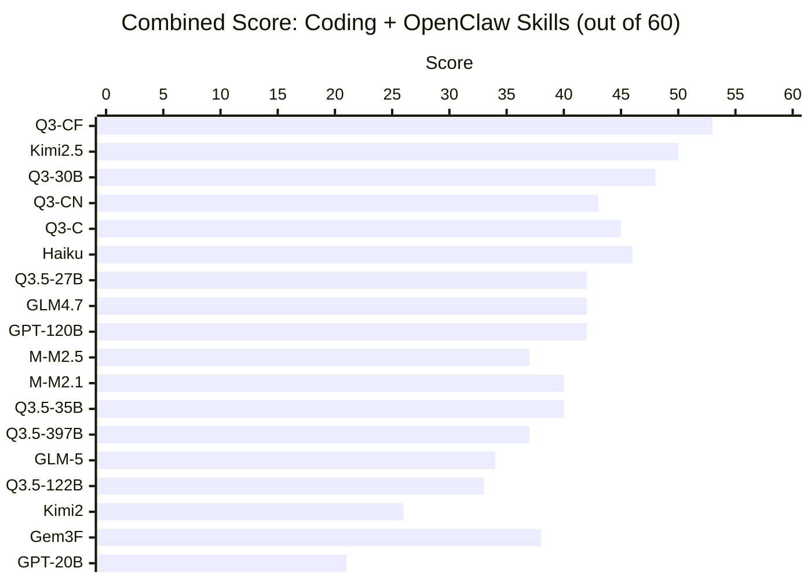
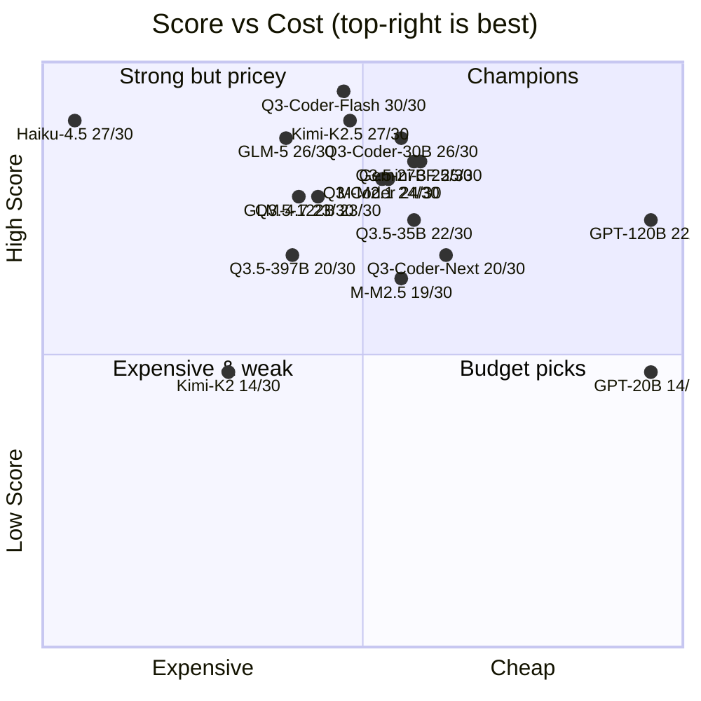
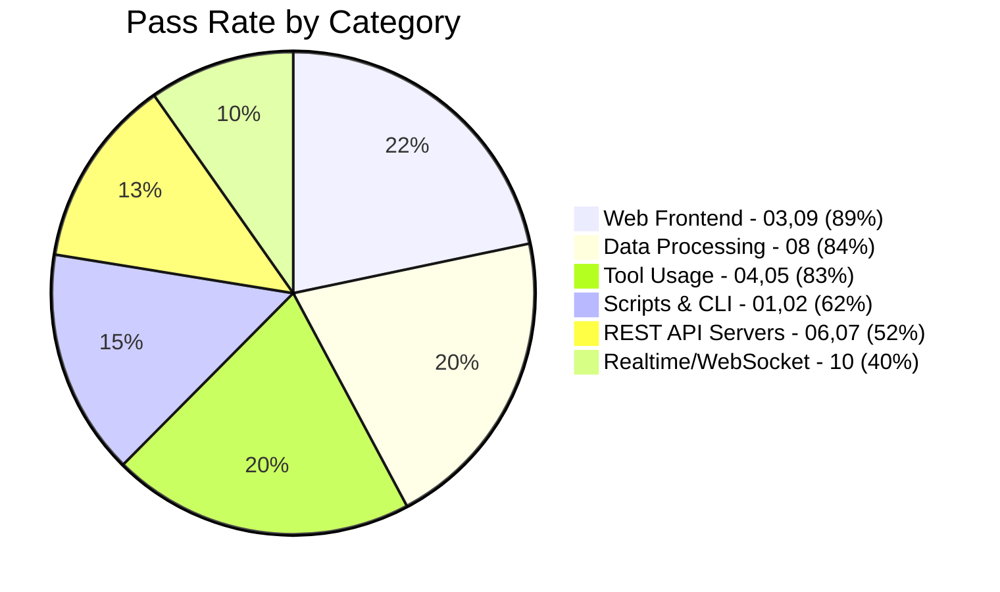

# Agentic Coding Benchmark

[中文版 (Traditional Chinese)](README_zh.md)

An automated benchmark suite for evaluating LLM **agentic coding ability** via OpenRouter tool-use API. Give a model a vague prompt and 4 tools (write_file, read_file, run_command, list_files), see if it builds something that actually works.

## Results Overview (Experiment 2 — agent_harness, March 2026)

### Combined Score (Group 1 + Group 2, out of 60)



### Group 1 vs Group 2 Comparison

| Rank | Model | G1 (Coding) | G2 (OpenClaw) | Combined | Delta |
|------|-------|:-----------:|:-------------:|:--------:|:-----:|
| 1 | **qwen/qwen3-coder-flash** | 30 | 25 | **55** | -5 |
| 2 | qwen/qwen3-coder-30b | 26 | 23 | **49** | -3 |
| 3 | moonshotai/kimi-k2.5 | 27 | 23 | **50** | -4 |
| 3 | qwen/qwen3-coder | 24 | 24 | **48** | 0 |
| 5 | anthropic/claude-haiku-4.5 | 27 | 21 | **48** | -6 |
| 5 | qwen/qwen3-coder-next | 20 | 25 | **45** | +5 |
| 7 | openai/gpt-oss-120b | 22 | 23 | **45** | +1 |
| 8 | qwen/qwen3.5-27b | 25 | 20 | **45** | -5 |
| 9 | minimax/minimax-m2.1 | 24 | 19 | **43** | -5 |
| 9 | qwen/qwen3.5-35b | 22 | 21 | **43** | -1 |
| 11 | z-ai/glm-4.7 | 23 | 19 | **42** | -4 |
| 12 | minimax/minimax-m2.5 | 19 | 19 | **38** | 0 |
| 12 | google/gemini-3-flash | 25 | 13 | **38** | -12 |
| 14 | qwen/qwen3.5-397b | 20 | 17 | **37** | -3 |
| 15 | z-ai/glm-5 | 26 | 8 | **34** | -18 |
| 16 | qwen/qwen3.5-122b | 23 | 10 | **33** | -13 |
| 17 | moonshotai/kimi-k2 | 14 | 13 | **27** | -1 |
| 18 | openai/gpt-oss-20b | 14 | 7 | **21** | -7 |

> **Delta** = G2 - G1 score difference. Negative = model scores lower on OpenClaw skills than pure coding. **qwen3-coder-next (+5) and gpt-oss-120b (+1) are the only models that scored higher on OpenClaw.**

## Group 1: Python Fundamentals

> 10 tests across 3 difficulty tiers. Mix of pure code generation and agentic tool-usage tasks.
> All prompts are in Python. March 2026.

### Leaderboard

| Rank | Model | Open | 01 | 02 | 03 | 04 | 05 | 06 | 07 | 08 | 09 | 10 | Total | Time | Tokens | Tok/Pt |
|------|-------|:----:|----|----|----|----|----|----|----|----|----|----|-------|------|--------|--------|
| 1 | **qwen/qwen3-coder-flash** | | 3 | 3 | 3 | 3 | 3 | 3 | 3 | 3 | 3 | 3 | **30/30** | 20m51s | 780K | 26.0K |
| 2 | moonshotai/kimi-k2.5 | | 3 | 3 | 3 | 3 | 3 | 3 | 2 | 3 | 3 | 1 | **27/30** | 15m26s | 258K | 9.6K |
| 3 | anthropic/claude-haiku-4.5 | | 1 | 3 | 3 | 3 | 3 | 3 | 3 | 3 | 3 | 2 | **27/30** | 22m34s | 1955K | 72.4K |
| 4 | z-ai/glm-5 | | 2 | 3 | 3 | 3 | 3 | 3 | 2 | 3 | 3 | 1 | **26/30** | 27m03s | 354K | 13.6K |
| 5 | qwen/qwen3-coder-30b | OSS | 2 | 2 | 3 | 3 | 3 | 3 | 3 | 3 | 3 | 1 | **26/30** | 24m51s | 1420K | 54.6K |
| 6 | google/gemini-3-flash | | 1 | 3 | 3 | 3 | 3 | 3 | 0 | 3 | 3 | 3 | **25/30** | 4m42s | 107K | 4.3K |
| 7 | qwen/qwen3.5-27b | OSS | 1 | 3 | 3 | 3 | 3 | 3 | 2 | 3 | 3 | 1 | **25/30** | 11m01s | 262K | 10.5K |
| 8 | minimax/minimax-m2.1 | | 2 | 3 | 3 | 3 | 3 | 3 | 0 | 3 | 3 | 1 | **24/30** | 23m44s | 368K | 15.3K |
| 9 | qwen/qwen3-coder (480B) | OSS | 1 | 3 | 3 | 3 | 3 | 3 | 1 | 3 | 3 | 1 | **24/30** | 10m19s | 469K | 19.5K |
| 10 | z-ai/glm-4.7 | OSS | 1 | 3 | 3 | 3 | 3 | 3 | 0 | 3 | 3 | 1 | **23/30** | 14m46s | 570K | 24.8K |
| 11 | qwen/qwen3.5-122b | OSS | 1 | 3 | 3 | 3 | 3 | 3 | 0 | 3 | 3 | 1 | **23/30** | 15m25s | 579K | 25.2K |
| 12 | openai/gpt-oss-120b | OSS | 2 | 3 | 3 | 3 | 3 | 0 | 0 | 3 | 3 | 2 | **22/30** | 4m33s | 153K | 7.0K |
| 12 | qwen/qwen3.5-35b | OSS | 3 | 3 | 3 | 1 | 3 | 0 | 2 | 3 | 3 | 1 | **22/30** | 15m58s | 355K | 16.1K |
| 14 | qwen/qwen3-coder-next | OSS | 1 | 3 | 3 | 3 | 3 | 0 | 0 | 3 | 3 | 1 | **20/30** | 16m23s | 467K | 23.4K |
| 14 | qwen/qwen3.5-397b | OSS | 1 | 3 | 3 | 3 | 3 | 0 | 0 | 3 | 3 | 1 | **20/30** | 19m20s | 546K | 27.3K |
| 16 | minimax/minimax-m2.5 | | 1 | 0 | 3 | 3 | 1 | 3 | 1 | 3 | 3 | 1 | **19/30** | 45m05s | 300K | 15.8K |
| 17 | openai/gpt-oss-20b | OSS | 0 | 3 | 3 | 1 | 0 | 0 | 0 | 3 | 3 | 1 | **14/30** | 19m47s | 142K | 10.1K |
| 17 | moonshotai/kimi-k2 | | 1 | 3 | 0 | 1 | 3 | 3 | 3 | 0 | 0 | 0 | **14/30** | 42m04s | 808K | 57.7K |

> **Open** = OSS means open-weight models with downloadable weights on HuggingFace. Blank = proprietary/API-only.
>
> **Note on scope:** This benchmark focuses on lightweight and mid-tier models suitable for agentic coding. Frontier models like Claude Opus/Sonnet 4, GPT-4.5, and Gemini 2.5 Pro are excluded — they are expected to perform well but at significantly higher cost, making them less relevant for the cost-sensitive agentic coding use cases this benchmark targets.
>
> Tok/Pt = tokens per point scored (lower = more efficient).

### Per-Test Heatmap

| Test | Diff. | Q3-CF | Kimi2.5 | Haiku | GLM-5 | Q3-30B | Gem3F | Q3.5-27B | M2.1 | Q3-C | GLM4.7 | Q3.5-122B | GPT-120 | Q3.5-35B | Q3-CN | Q3.5-397B | M2.5 | GPT-20 | Kimi2 |
|------|-------|:-----:|:-------:|:-----:|:-----:|:------:|:-----:|:--------:|:----:|:----:|:------:|:---------:|:-------:|:--------:|:-----:|:---------:|:----:|:------:|:-----:|
| 01 CSV→JSON | Easy | 🟩 | 🟩 | 🟨 | 🟨 | 🟨 | 🟨 | 🟨 | 🟨 | 🟨 | 🟨 | 🟨 | 🟨 | 🟩 | 🟨 | 🟨 | 🟨 | 🟥 | 🟨 |
| 02 Sysinfo | Easy | 🟩 | 🟩 | 🟩 | 🟩 | 🟨 | 🟩 | 🟩 | 🟩 | 🟩 | 🟩 | 🟩 | 🟩 | 🟩 | 🟩 | 🟩 | 🟥 | 🟩 | 🟩 |
| 03 Calculator | Easy | 🟩 | 🟩 | 🟩 | 🟩 | 🟩 | 🟩 | 🟩 | 🟩 | 🟩 | 🟩 | 🟩 | 🟩 | 🟩 | 🟩 | 🟩 | 🟩 | 🟩 | 🟥 |
| 04 Bugfix | Med | 🟩 | 🟩 | 🟩 | 🟩 | 🟩 | 🟩 | 🟩 | 🟩 | 🟩 | 🟩 | 🟩 | 🟩 | 🟨 | 🟩 | 🟩 | 🟩 | 🟨 | 🟨 |
| 05 TDD | Med | 🟩 | 🟩 | 🟩 | 🟩 | 🟩 | 🟩 | 🟩 | 🟩 | 🟩 | 🟩 | 🟩 | 🟩 | 🟩 | 🟩 | 🟩 | 🟨 | 🟥 | 🟩 |
| 06 Expense API | Med | 🟩 | 🟩 | 🟩 | 🟩 | 🟩 | 🟩 | 🟩 | 🟩 | 🟩 | 🟩 | 🟩 | 🟥 | 🟥 | 🟥 | 🟥 | 🟩 | 🟥 | 🟩 |
| 07 URL Short | Med | 🟩 | 🟨 | 🟩 | 🟨 | 🟩 | 🟥 | 🟨 | 🟥 | 🟨 | 🟥 | 🟥 | 🟥 | 🟨 | 🟥 | 🟥 | 🟨 | 🟥 | 🟩 |
| 08 Dashboard | Hard | 🟩 | 🟩 | 🟩 | 🟩 | 🟩 | 🟩 | 🟩 | 🟩 | 🟩 | 🟩 | 🟩 | 🟩 | 🟩 | 🟩 | 🟩 | 🟩 | 🟩 | 🟥 |
| 09 Kanban | Hard | 🟩 | 🟩 | 🟩 | 🟩 | 🟩 | 🟩 | 🟩 | 🟩 | 🟩 | 🟩 | 🟩 | 🟩 | 🟩 | 🟩 | 🟩 | 🟩 | 🟩 | 🟥 |
| 10 Chat (WS) | Hard | 🟩 | 🟨 | 🟨 | 🟨 | 🟨 | 🟩 | 🟨 | 🟨 | 🟨 | 🟨 | 🟨 | 🟨 | 🟨 | 🟨 | 🟨 | 🟨 | 🟨 | 🟥 |

### Cost-Performance Quadrant

> Top-right = best (high score + low cost). Cost estimated from OpenRouter pricing x actual tokens.



**Champions (top-right):** Gemini 3 Flash ($0.09), qwen3.5-27b ($0.10), and qwen3-coder-30b ($0.11) deliver 25-26/30 at under $0.12. GPT-OSS-120b ($0.01) is the cheapest model that still scores 22+.

**Strong but pricey (top-left):** Claude Haiku scores 27/30 but costs $2.58 — 28x more than Gemini Flash for 2 extra points. GLM-5 scores well but at $0.31.

**The perfect-scorer:** qwen3-coder-flash (30/30) sits right at the boundary — not the cheapest at $0.18, but the only model to ace every test.

### Category Pass Rates



## Key Findings

### 1. Qwen3-Coder-Flash achieves perfect 30/30

The only model to ace every test, including realtime WebSocket chat. At 814K tokens total, it's not the most efficient but gets everything done.

### 2. Tool harness matters enormously

Switching from opencode to a custom agent harness (standardized tool-use API) caused dramatic score improvements:
- **GLM-5**: 18/30 → 26/30 (+44%)
- **Claude Haiku 4.5**: 16/30 → 27/30 (+69%)
- **Gemini 3 Flash**: 15/30 → 25/30 (+67%)

The previous experiment's "0-byte workspace" problem (opencode failing to write files for many models) was entirely a tool-layer bug, not a model capability issue.

### 3. Bigger ≠ better in the Qwen 3.5 series

| Model | Active Params | Score |
|-------|--------------|-------|
| qwen3.5-27b | 27B (dense) | **25/30** |
| qwen3.5-122b-a10b | 10B active | **23/30** |
| qwen3.5-35b-a3b | 3B active | **22/30** |
| qwen3.5-397b-a17b | 17B active | **20/30** |

The dense 27B model outperforms all MoE variants. The 397B model (17B active) scores lowest despite being the largest — more active parameters doesn't help when MoE routing adds overhead to tool-use tasks.

### 4. Token efficiency varies 20x

| Model | Score | Tokens | Tokens/Point |
|-------|-------|--------|-------------|
| gemini-3-flash | 25/30 | 107K | **4.3K** |
| kimi-k2.5 | 27/30 | 258K | **9.6K** |
| claude-haiku-4.5 | 27/30 | 1955K | **72.4K** |

Gemini 3 Flash uses 17x fewer tokens than Claude Haiku for similar scores.

### 5. URL shortener (07) is the hardest discriminator

Only 3 models scored 3/3: qwen3-coder-flash, qwen3-coder-30b, and claude-haiku-4.5. The redirect check requires the model to implement HTTP 3xx redirects correctly — a subtle web development skill.

### 6. Web servers no longer universally broken

In Experiment 1, tests 06 and 09 scored **0 across all models**. After fixing validate.sh port conflicts (macOS AirPlay on port 5000) and adding HTML fallback for Kanban, most models now pass these tests. The failures were environmental, not model-related.

### 7. OpenClaw skills expose a different capability axis

Group 2 (OpenClaw skills) reshuffles the rankings dramatically:
- **GLM-5**: 26/30 on coding → **8/30** on OpenClaw (doesn't produce SKILL.md format at all)
- **Gemini 3 Flash**: 25/30 → **13/30** (struggles with agent framework conventions)
- **qwen3-coder-next**: 20/30 → **23/30** (the only model that *improved* — better at learning new formats)

Models that are great at writing code are not necessarily great at building agent skills. The SKILL.md format + YAML frontmatter conventions are a genuine discriminator.

### 8. Test 08 (Webhook Receiver) is the hardest OpenClaw test

**Zero models** scored 3/3 on test 08. Only a few got the server to actually start. Building a working HTTP server *inside* an OpenClaw skill directory structure is the most challenging task across both groups.

## Test Groups

| Group | Language | Tests | Status |
|-------|----------|-------|--------|
| [Group 1: Python Fundamentals](groups/group1_python_fundamentals/) | Python | 10 | Done |
| [Group 2: OpenClaw Skills](groups/group2_openclaw_skills/) | Python/Bash | 10 | Done |

### Group 1 Tests

| # | Test | Type | Difficulty | What It Tests |
|---|------|------|------------|---------------|
| 01 | CSV to JSON converter | Script | Easy | Basic code generation |
| 02 | System-aware script | Script | Easy | Must use bash to detect OS, Python version, hardware |
| 03 | Calculator web app | Web | Easy | Generate working HTML/JS |
| 04 | Bugfix existing code | Debug | Medium | Must read files, understand bugs, fix them |
| 05 | Pass the tests | TDD | Medium | Must run pytest, iterate on failures until all pass |
| 06 | Expense tracker API | Web | Medium | Build a working REST API server |
| 07 | URL shortener | Web | Medium | Build a web app with redirects |
| 08 | API data dashboard | Script | Hard | Must install pip packages, fetch live API, generate HTML |
| 09 | Kanban task board | Web | Hard | Build web app with drag-and-drop + persistence |
| 10 | Real-time chat | Web | Hard | Build websocket-based chat with multiple users |

### Group 2 Tests

| # | Test | Type | Difficulty | What It Tests |
|---|------|------|------------|---------------|
| 01 | Pomodoro Timer | Skill | Easy | Basic SKILL.md structure with YAML frontmatter |
| 02 | Fix Broken Skill | Debug | Easy | Repair malformed SKILL.md and buggy script |
| 03 | Bookmark Manager | Skill | Easy | Skill with companion script and JSON persistence |
| 04 | Weather Lookup | Skill | Medium | Declare env var and binary requirements in frontmatter |
| 05 | GitHub PR Summary | Skill | Medium | Declare multiple dependencies (gh + GITHUB_TOKEN) |
| 06 | File Organizer | Skill | Medium | Companion script that actually executes and organizes files |
| 07 | HackerNews Digest | Skill | Hard | Fetch API data, generate HTML report |
| 08 | Webhook Receiver | Skill | Hard | Build HTTP server that logs POST payloads |
| 09 | Data Pipeline | Skill | Hard | Multi-step pipeline: read, filter, report |
| 10 | Smart Home Controller | Skill | Hard | Config-driven state management with command parsing |

## Architecture

### Agent Harness

The benchmark uses a custom **agent harness** (`agent_harness.py`) instead of vendor-specific agentic tools. This ensures every model gets the same standardized interface:

```
                    ┌─────────────────────┐
                    │   agent_harness.py  │
                    │                     │
   prompt.md ──────►│  OpenRouter API     │
                    │  (tool-use loop)    │
                    │                     │
                    │  4 tools:           │
                    │  - write_file       │
                    │  - read_file        │──────► workspace/
                    │  - run_command      │
                    │  - list_files       │
                    │                     │
                    │  JSON metrics ──────│──────► stdout
                    │  Tool log ──────────│──────► stderr
                    └─────────────────────┘
```

**Why not opencode/cursor/etc?** Vendor tools introduce bias — models that happen to be compatible with a specific tool's interface score higher, regardless of coding ability. Our harness gives every model identical tools via OpenRouter's normalized API.

### Usage

```bash
# Prerequisites: Python 3, requests library, OpenRouter API key

# Setup
git clone <this-repo>
cd agentic_testing
echo 'OPENROUTER_API_KEY="sk-or-..."' > .env
pip install requests

# Run benchmark
./run_benchmark.sh                                    # all models from models.txt
./run_benchmark.sh "openrouter/z-ai/glm-5"           # single model
OPENCODE_TESTS=06_expense_tracker_api ./run_benchmark.sh  # specific tests
OPENCODE_TIMEOUT=600 ./run_benchmark.sh               # custom timeout

# Run harness directly
python3 agent_harness.py \
    --model "openrouter/qwen/qwen3-coder-flash" \
    --prompt groups/group1_python_fundamentals/01_csv_to_json/prompt.md \
    --workspace /tmp/test_workspace \
    --timeout 300
```

## Scoring

Each test: 3 checks x 1 point = 3 points. Total per group: 30 points.

| Check | Verifies |
|-------|----------|
| Runs without error | No crashes on execution |
| Core functionality | Main feature works |
| Edge cases | Handles non-trivial inputs |

## Experiments

| Experiment | Date | Tool | Models | Key Finding |
|-----------|------|------|--------|-------------|
| 1 | 2026-03-18 | opencode | 12 | Many models produced 0-byte output due to tool incompatibility |
| **2** | **2026-03-19** | **agent_harness** | **18** | **Fair comparison — qwen3-coder-flash achieves perfect 30/30** |

## License

MIT
