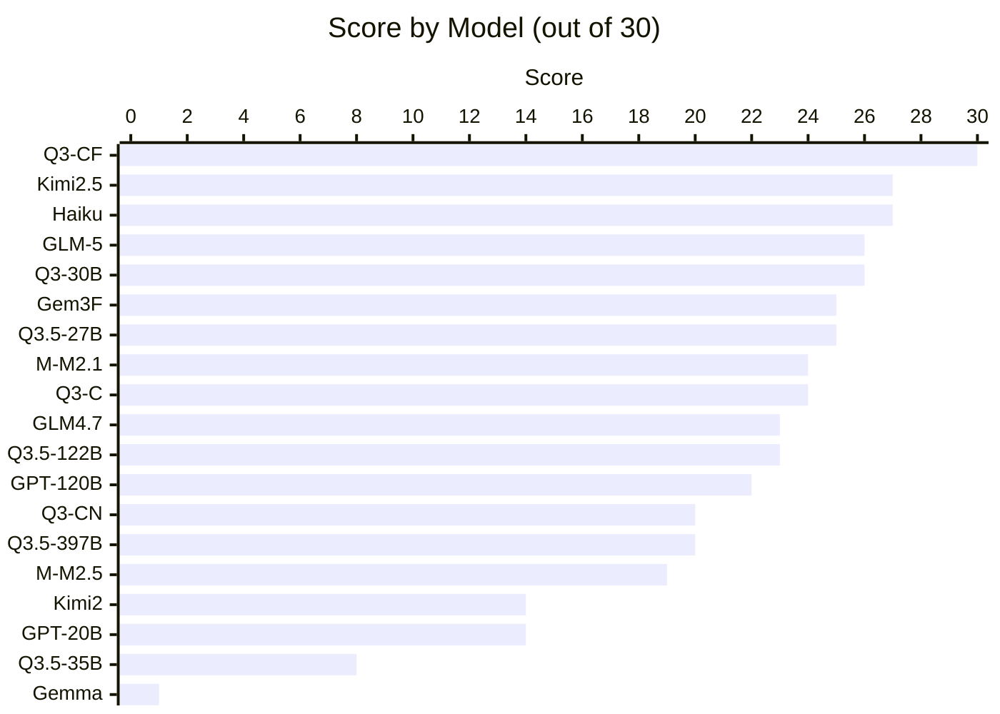
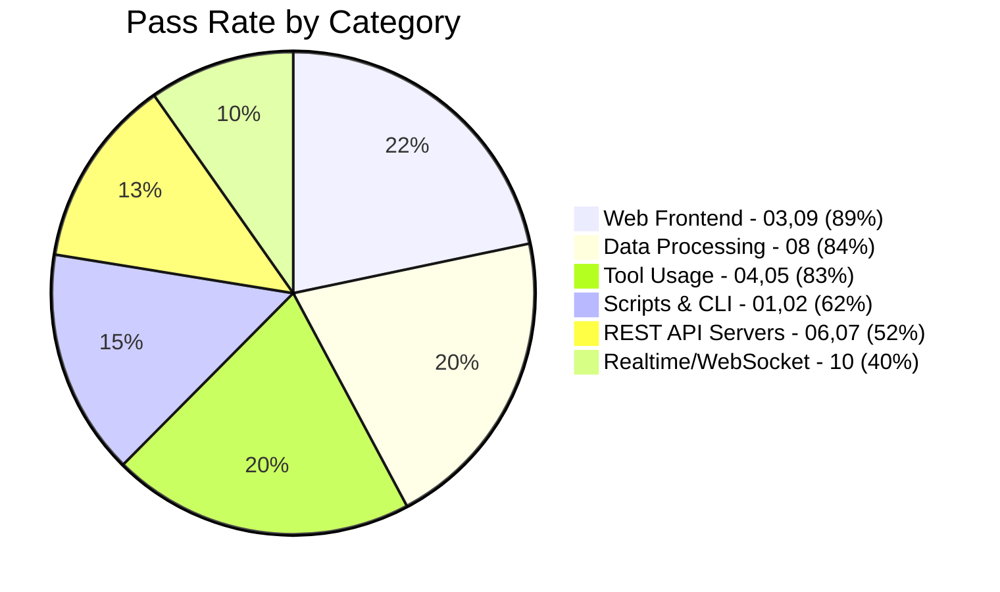

# Agentic Coding Benchmark

[中文版 (Traditional Chinese)](README_zh.md)

An automated benchmark suite for evaluating LLM **agentic coding ability** via OpenRouter tool-use API. Give a model a vague prompt and 4 tools (write_file, read_file, run_command, list_files), see if it builds something that actually works.

## Results Overview (Experiment 2 — agent_harness, March 2026)



## Group 1: Python Fundamentals

> 10 tests across 3 difficulty tiers. Mix of pure code generation and agentic tool-usage tasks.
> All prompts are in Python. March 2026.

### Leaderboard

| Rank | Model | 01 | 02 | 03 | 04 | 05 | 06 | 07 | 08 | 09 | 10 | Total | Tokens |
|------|-------|----|----|----|----|----|----|----|----|----|----|-------|--------|
| 1 | **qwen/qwen3-coder-flash** |  3 |  3 |  3 |  3 |  3 |  3 |  3 |  3 |  3 |  3 | **30/30** | 814K |
| 2 | moonshotai/kimi-k2.5 |  3 |  3 |  3 |  3 |  3 |  3 |  2 |  3 |  3 |  1 | **27/30** | 258K |
| 3 | anthropic/claude-haiku-4.5 |  1 |  3 |  3 |  3 |  3 |  3 |  3 |  3 |  3 |  2 | **27/30** | 1955K |
| 4 | z-ai/glm-5 |  2 |  3 |  3 |  3 |  3 |  3 |  2 |  3 |  3 |  1 | **26/30** | 338K |
| 5 | qwen/qwen3-coder-30b |  2 |  2 |  3 |  3 |  3 |  3 |  3 |  3 |  3 |  1 | **26/30** | 1420K |
| 6 | google/gemini-3-flash |  1 |  3 |  3 |  3 |  3 |  3 |  0 |  3 |  3 |  3 | **25/30** | 107K |
| 7 | qwen/qwen3.5-27b |  1 |  3 |  3 |  3 |  3 |  3 |  2 |  3 |  3 |  1 | **25/30** | 262K |
| 8 | minimax/minimax-m2.1 |  2 |  3 |  3 |  3 |  3 |  3 |  0 |  3 |  3 |  1 | **24/30** | 368K |
| 9 | qwen/qwen3-coder |  1 |  3 |  3 |  3 |  3 |  3 |  1 |  3 |  3 |  1 | **24/30** | 469K |
| 10 | z-ai/glm-4.7 |  1 |  3 |  3 |  3 |  3 |  3 |  0 |  3 |  3 |  1 | **23/30** | 570K |
| 11 | qwen/qwen3.5-122b |  1 |  3 |  3 |  3 |  3 |  3 |  0 |  3 |  3 |  1 | **23/30** | 579K |
| 12 | openai/gpt-oss-120b |  2 |  3 |  3 |  3 |  3 |  0 |  0 |  3 |  3 |  2 | **22/30** | 153K |
| 13 | qwen/qwen3-coder-next |  1 |  3 |  3 |  3 |  3 |  0 |  0 |  3 |  3 |  1 | **20/30** | 467K |
| 14 | qwen/qwen3.5-397b |  1 |  3 |  3 |  3 |  3 |  0 |  0 |  3 |  3 |  1 | **20/30** | 546K |
| 15 | minimax/minimax-m2.5 |  1 |  0 |  3 |  3 |  1 |  3 |  1 |  3 |  3 |  1 | **19/30** | 300K |
| 16 | openai/gpt-oss-20b |  0 |  3 |  3 |  1 |  0 |  0 |  0 |  3 |  3 |  1 | **14/30** | 142K |
| 17 | moonshotai/kimi-k2 |  1 |  3 |  0 |  1 |  3 |  3 |  3 |  0 |  0 |  0 | **14/30** | 808K |
| 18 | qwen/qwen3.5-35b |  0 |  0 |  3 |  1 |  0 |  0 |  0 |  0 |  3 |  1 | **8/30** | 200K |
| 19 | google/gemma-3-27b |  0 |  0 |  0 |  1 |  0 |  0 |  0 |  0 |  0 |  0 | **1/30** | 0K |

### Per-Test Heatmap

| Test | Diff. | Q3-CF | Kimi2.5 | Haiku | GLM-5 | Q3-30B | Gem3F | Q3.5-27B | M2.1 | Q3-C | GLM4.7 | Q3.5-122B | GPT-120 | Q3-CN | Q3.5-397B | M2.5 | GPT-20 | Kimi2 | Q3.5-35B | Gemma |
|------|-------|:-----:|:-------:|:-----:|:-----:|:------:|:-----:|:--------:|:----:|:----:|:------:|:---------:|:-------:|:-----:|:---------:|:----:|:------:|:-----:|:--------:|:-----:|
| 01 CSV→JSON | Easy | 🟩 | 🟩 | 🟨 | 🟨 | 🟨 | 🟨 | 🟨 | 🟨 | 🟨 | 🟨 | 🟨 | 🟨 | 🟨 | 🟨 | 🟨 | 🟥 | 🟨 | 🟥 | 🟥 |
| 02 Sysinfo | Easy | 🟩 | 🟩 | 🟩 | 🟩 | 🟨 | 🟩 | 🟩 | 🟩 | 🟩 | 🟩 | 🟩 | 🟩 | 🟩 | 🟩 | 🟥 | 🟩 | 🟩 | 🟥 | 🟥 |
| 03 Calculator | Easy | 🟩 | 🟩 | 🟩 | 🟩 | 🟩 | 🟩 | 🟩 | 🟩 | 🟩 | 🟩 | 🟩 | 🟩 | 🟩 | 🟩 | 🟩 | 🟩 | 🟥 | 🟩 | 🟥 |
| 04 Bugfix | Med | 🟩 | 🟩 | 🟩 | 🟩 | 🟩 | 🟩 | 🟩 | 🟩 | 🟩 | 🟩 | 🟩 | 🟩 | 🟩 | 🟩 | 🟩 | 🟨 | 🟨 | 🟨 | 🟨 |
| 05 TDD | Med | 🟩 | 🟩 | 🟩 | 🟩 | 🟩 | 🟩 | 🟩 | 🟩 | 🟩 | 🟩 | 🟩 | 🟩 | 🟩 | 🟩 | 🟨 | 🟥 | 🟩 | 🟥 | 🟥 |
| 06 Expense API | Med | 🟩 | 🟩 | 🟩 | 🟩 | 🟩 | 🟩 | 🟩 | 🟩 | 🟩 | 🟩 | 🟩 | 🟥 | 🟥 | 🟥 | 🟩 | 🟥 | 🟩 | 🟥 | 🟥 |
| 07 URL Short | Med | 🟩 | 🟨 | 🟩 | 🟨 | 🟩 | 🟥 | 🟨 | 🟥 | 🟨 | 🟥 | 🟥 | 🟥 | 🟥 | 🟥 | 🟨 | 🟥 | 🟩 | 🟥 | 🟥 |
| 08 Dashboard | Hard | 🟩 | 🟩 | 🟩 | 🟩 | 🟩 | 🟩 | 🟩 | 🟩 | 🟩 | 🟩 | 🟩 | 🟩 | 🟩 | 🟩 | 🟩 | 🟩 | 🟥 | 🟥 | 🟥 |
| 09 Kanban | Hard | 🟩 | 🟩 | 🟩 | 🟩 | 🟩 | 🟩 | 🟩 | 🟩 | 🟩 | 🟩 | 🟩 | 🟩 | 🟩 | 🟩 | 🟩 | 🟩 | 🟥 | 🟩 | 🟥 |
| 10 Chat (WS) | Hard | 🟩 | 🟨 | 🟨 | 🟨 | 🟨 | 🟩 | 🟨 | 🟨 | 🟨 | 🟨 | 🟨 | 🟨 | 🟨 | 🟨 | 🟨 | 🟨 | 🟥 | 🟨 | 🟥 |

### Category Pass Rates



## Key Findings

### 1. Qwen3-Coder-Flash achieves perfect 30/30

The only model to ace every test, including realtime WebSocket chat. At 814K tokens total, it's not the most efficient but gets everything done.

### 2. Tool harness matters enormously

Switching from opencode to a custom agent harness (standardized tool-use API) caused dramatic score improvements:
- **GLM-5**: 18/30 → 26/30 (+44%)
- **Claude Haiku 4.5**: 16/30 → 27/30 (+69%)
- **Gemini 3 Flash**: 15/30 → 25/30 (+67%)

The previous experiment's "0-byte workspace" problem (opencode failing to write files for many models) was entirely a tool-layer bug, not a model capability issue.

### 3. Bigger ≠ better in the Qwen 3.5 series

| Model | Active Params | Score |
|-------|--------------|-------|
| qwen3.5-27b | 27B (dense) | **25/30** |
| qwen3.5-122b-a10b | 10B active | **23/30** |
| qwen3.5-397b-a17b | 17B active | **20/30** |
| qwen3.5-35b-a3b | 3B active | **8/30** |

The dense 27B model outperforms both larger MoE variants. The 3B-active model is essentially non-functional for agentic coding.

### 4. Token efficiency varies 20x

| Model | Score | Tokens | Tokens/Point |
|-------|-------|--------|-------------|
| gemini-3-flash | 25/30 | 107K | **4.3K** |
| kimi-k2.5 | 27/30 | 258K | **9.6K** |
| claude-haiku-4.5 | 27/30 | 1955K | **72.4K** |

Gemini 3 Flash uses 17x fewer tokens than Claude Haiku for similar scores.

### 5. URL shortener (07) is the hardest discriminator

Only 3 models scored 3/3: qwen3-coder-flash, qwen3-coder-30b, and claude-haiku-4.5. The redirect check requires the model to implement HTTP 3xx redirects correctly — a subtle web development skill.

### 6. Web servers no longer universally broken

In Experiment 1, tests 06 and 09 scored **0 across all models**. After fixing validate.sh port conflicts (macOS AirPlay on port 5000) and adding HTML fallback for Kanban, most models now pass these tests. The failures were environmental, not model-related.

## Test Groups

| Group | Language | Tests | Status |
|-------|----------|-------|--------|
| [Group 1: Python Fundamentals](groups/group1_python_fundamentals/) | Python | 10 | Done |
| Group 2: *Coming soon* | — | — | Planned |

### Group 1 Tests

| # | Test | Type | Difficulty | What It Tests |
|---|------|------|------------|---------------|
| 01 | CSV to JSON converter | Script | Easy | Basic code generation |
| 02 | System-aware script | Script | Easy | Must use bash to detect OS, Python version, hardware |
| 03 | Calculator web app | Web | Easy | Generate working HTML/JS |
| 04 | Bugfix existing code | Debug | Medium | Must read files, understand bugs, fix them |
| 05 | Pass the tests | TDD | Medium | Must run pytest, iterate on failures until all pass |
| 06 | Expense tracker API | Web | Medium | Build a working REST API server |
| 07 | URL shortener | Web | Medium | Build a web app with redirects |
| 08 | API data dashboard | Script | Hard | Must install pip packages, fetch live API, generate HTML |
| 09 | Kanban task board | Web | Hard | Build web app with drag-and-drop + persistence |
| 10 | Real-time chat | Web | Hard | Build websocket-based chat with multiple users |

## Architecture

### Agent Harness

The benchmark uses a custom **agent harness** (`agent_harness.py`) instead of vendor-specific agentic tools. This ensures every model gets the same standardized interface:

```
                    ┌─────────────────────┐
                    │   agent_harness.py  │
                    │                     │
   prompt.md ──────►│  OpenRouter API     │
                    │  (tool-use loop)    │
                    │                     │
                    │  4 tools:           │
                    │  - write_file       │
                    │  - read_file        │──────► workspace/
                    │  - run_command      │
                    │  - list_files       │
                    │                     │
                    │  JSON metrics ──────│──────► stdout
                    │  Tool log ──────────│──────► stderr
                    └─────────────────────┘
```

**Why not opencode/cursor/etc?** Vendor tools introduce bias — models that happen to be compatible with a specific tool's interface score higher, regardless of coding ability. Our harness gives every model identical tools via OpenRouter's normalized API.

### Usage

```bash
# Prerequisites: Python 3, requests library, OpenRouter API key

# Setup
git clone <this-repo>
cd agentic_testing
echo 'OPENROUTER_API_KEY="sk-or-..."' > .env
pip install requests

# Run benchmark
./run_benchmark.sh                                    # all models from models.txt
./run_benchmark.sh "openrouter/z-ai/glm-5"           # single model
OPENCODE_TESTS=06_expense_tracker_api ./run_benchmark.sh  # specific tests
OPENCODE_TIMEOUT=600 ./run_benchmark.sh               # custom timeout

# Run harness directly
python3 agent_harness.py \
    --model "openrouter/qwen/qwen3-coder-flash" \
    --prompt groups/group1_python_fundamentals/01_csv_to_json/prompt.md \
    --workspace /tmp/test_workspace \
    --timeout 300
```

## Scoring

Each test: 3 checks x 1 point = 3 points. Total per group: 30 points.

| Check | Verifies |
|-------|----------|
| Runs without error | No crashes on execution |
| Core functionality | Main feature works |
| Edge cases | Handles non-trivial inputs |

## Experiments

| Experiment | Date | Tool | Models | Key Finding |
|-----------|------|------|--------|-------------|
| 1 | 2026-03-18 | opencode | 12 | Many models produced 0-byte output due to tool incompatibility |
| **2** | **2026-03-19** | **agent_harness** | **19** | **Fair comparison — qwen3-coder-flash achieves perfect 30/30** |

## License

MIT
