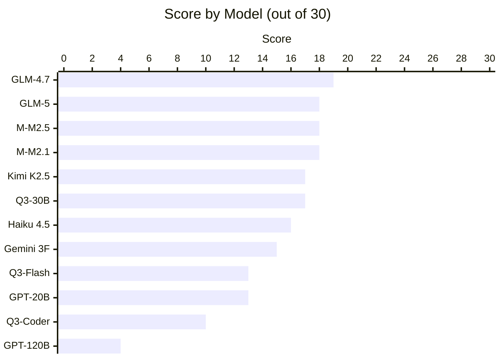
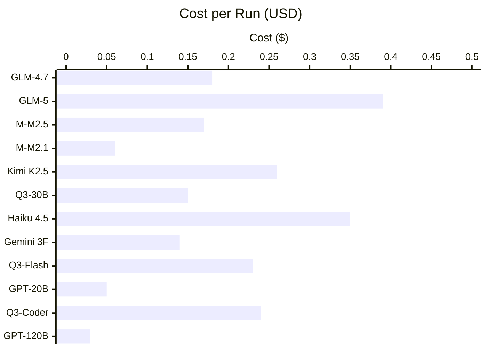
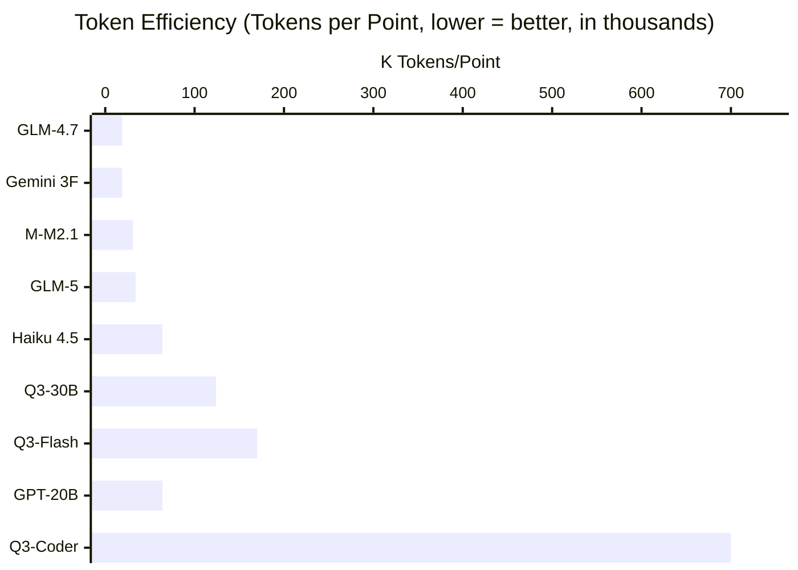
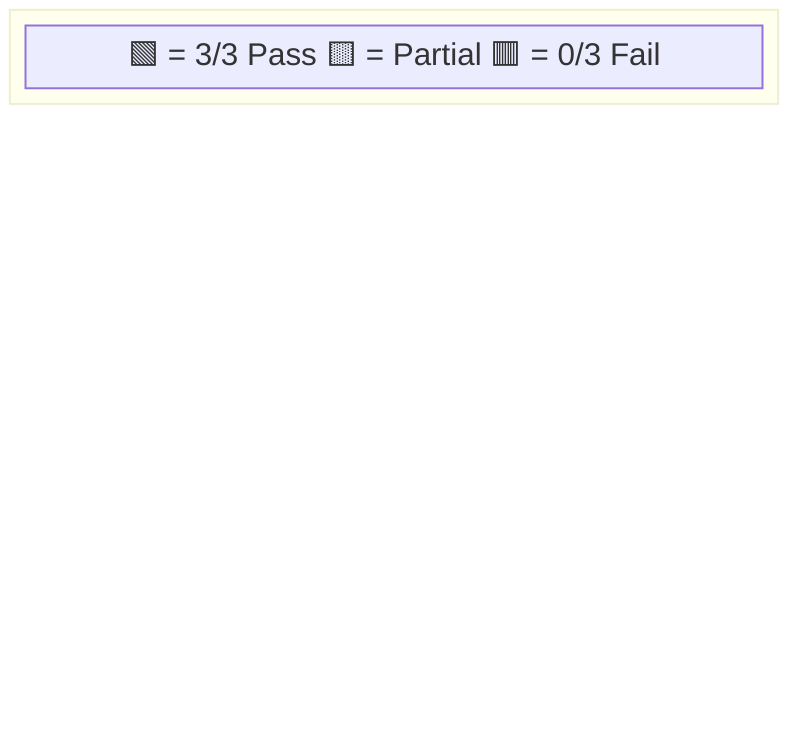
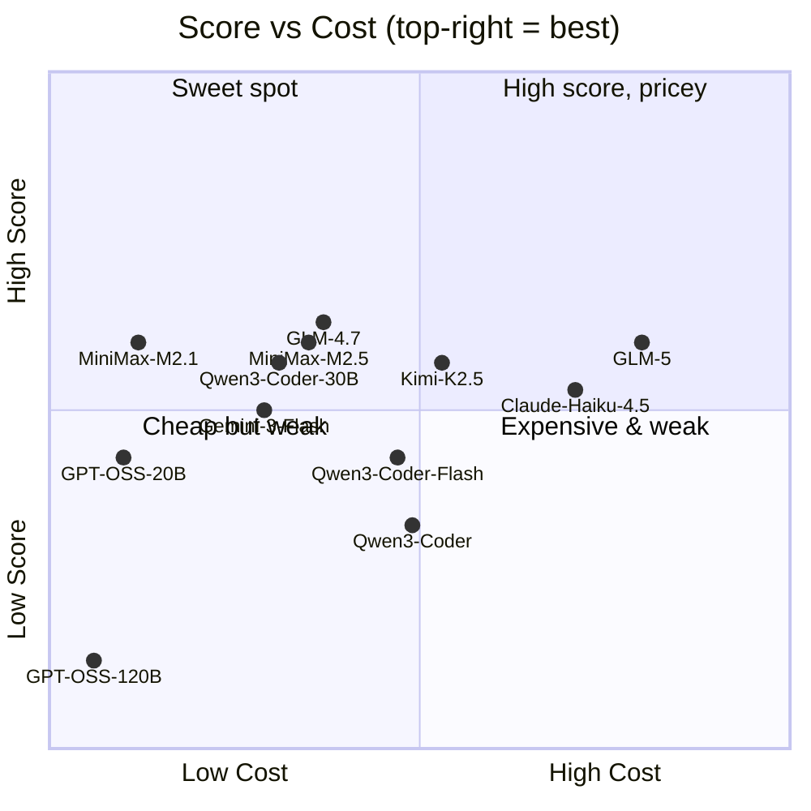
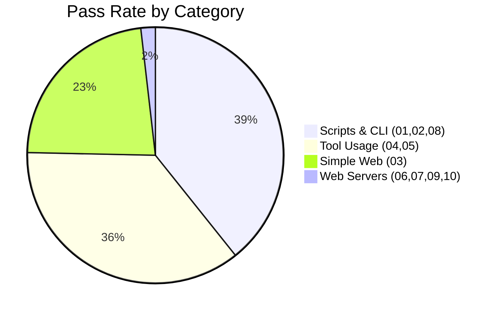
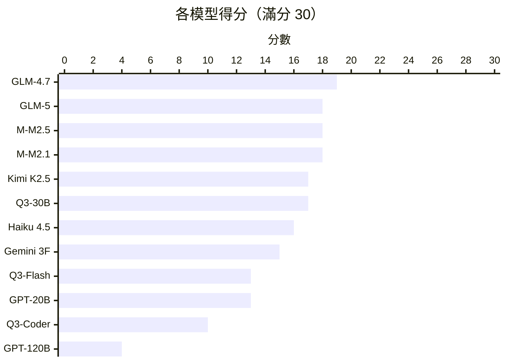
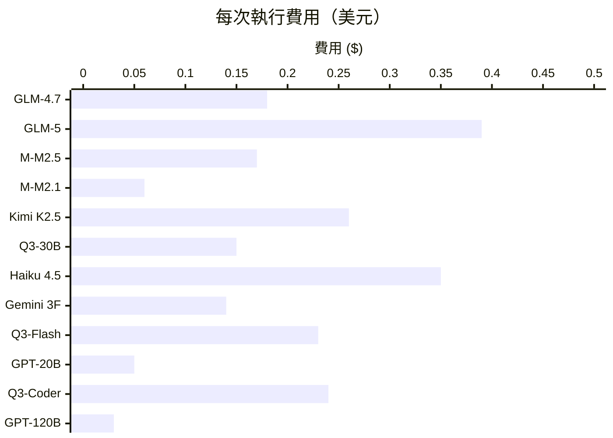
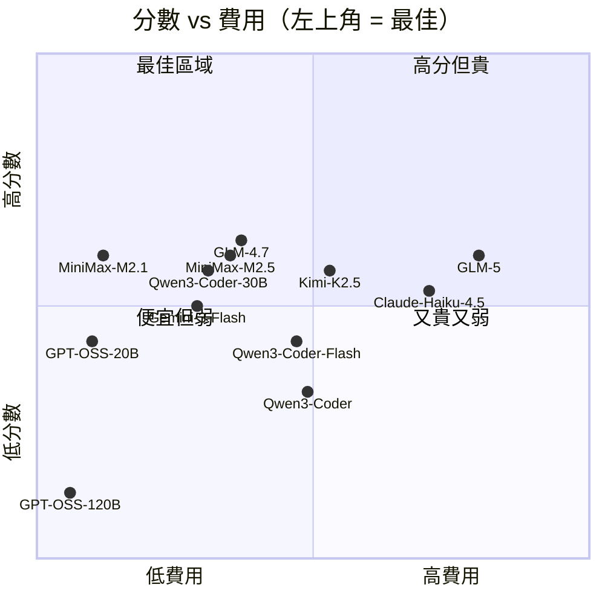
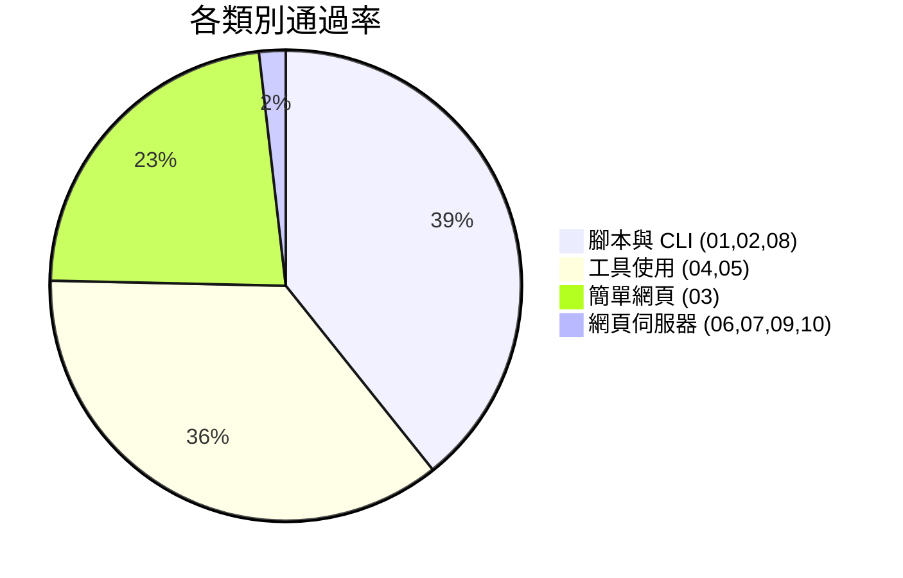

# Agentic Vibe-Coding Benchmark

[中文版 (Traditional Chinese)](#中文版)

An automated benchmark suite for evaluating LLM **vibe-coding ability** through [OpenCode](https://opencode.ai/). Give a model a vague prompt, see if it builds something that actually works.

## Results Overview







## Group 1: Python Fundamentals

> 10 tests across 3 difficulty tiers. Mix of pure code generation and agentic tool-usage tasks.
> All prompts are in Python. March 2026.

### Leaderboard

| Rank | Model | Score | Cost | Time | Tokens | Cost/Pt |
|------|-------|-------|------|------|--------|---------|
| 🥇 | z-ai/glm-4.7 | **19/30** | $0.18 | 12m | 357K | $0.009 |
| 🥈 | z-ai/glm-5 | 18/30 | $0.39 | 17m | 610K | $0.022 |
| 🥈 | minimax/minimax-m2.5 | 18/30 | $0.17 | 25m | 1.46M | $0.009 |
| 🥈 | minimax/minimax-m2.1 | 18/30 | $0.06 | 11m | 555K | $0.003 |
| 5 | moonshotai/kimi-k2.5 | 17/30 | $0.26 | 11m | 868K | $0.015 |
| 5 | qwen/qwen3-coder-30b | 17/30 | $0.15 | 32m | 2.1M | $0.009 |
| 7 | anthropic/claude-haiku-4.5 | 16/30 | $0.35 | 13m | 1.03M | $0.022 |
| 8 | google/gemini-3-flash | 15/30 | $0.14 | 5m | 287K | $0.009 |
| 9 | qwen/qwen3-coder-flash | 13/30 | $0.23 | 14m | 2.2M | $0.018 |
| 9 | openai/gpt-oss-20b | 13/30 | $0.05 | 13m | 838K | $0.004 |
| 11 | qwen/qwen3-coder | 10/30 | $0.24 | 32m | 7.0M | $0.024 |
| 12 | openai/gpt-oss-120b | 4/30 | $0.03 | 2m | 388K | $0.008 |

### Per-Test Heatmap



| Test | Diff. | Tool | GLM-4.7 | GLM-5 | M2.5 | M2.1 | Kimi | Q3-30B | Haiku | Gemini | Q3-Fl | GPT-20 | Q3-C | GPT-120 |
|------|-------|------|:-------:|:-----:|:----:|:----:|:----:|:------:|:-----:|:------:|:-----:|:------:|:----:|:-------:|
| 01 CSV→JSON | Easy | Gen | 🟩 | 🟩 | 🟨 | 🟩 | 🟨 | 🟨 | 🟩 | 🟩 | 🟥 | 🟥 | 🟨 | 🟥 |
| 02 Sysinfo | Easy | Bash | 🟩 | 🟩 | 🟩 | 🟩 | 🟩 | 🟩 | 🟩 | 🟩 | 🟩 | 🟩 | 🟩 | 🟩 |
| 03 Calculator | Easy | Web | 🟩 | 🟩 | 🟩 | 🟩 | 🟩 | 🟩 | 🟥 | 🟥 | 🟥 | 🟩 | 🟥 | 🟥 |
| 04 Bugfix | Med | Read | 🟩 | 🟩 | 🟩 | 🟨 | 🟩 | 🟩 | 🟩 | 🟩 | 🟩 | 🟨 | 🟨 | 🟨 |
| 05 TDD | Med | Iter | 🟩 | 🟩 | 🟩 | 🟩 | 🟩 | 🟨 | 🟩 | 🟩 | 🟩 | 🟩 | 🟨 | 🟥 |
| 06 Expense API | Med | Srv | 🟥 | 🟥 | 🟥 | 🟥 | 🟥 | 🟥 | 🟥 | 🟥 | 🟥 | 🟥 | 🟥 | 🟥 |
| 07 URL Short | Med | Srv | 🟥 | 🟥 | 🟥 | 🟥 | 🟥 | 🟨 | 🟥 | 🟥 | 🟥 | 🟥 | 🟥 | 🟥 |
| 08 Dashboard | Hard | Deps | 🟩 | 🟩 | 🟩 | 🟩 | 🟩 | 🟩 | 🟩 | 🟩 | 🟩 | 🟩 | 🟩 | 🟥 |
| 09 Kanban | Hard | Srv | 🟥 | 🟥 | 🟥 | 🟥 | 🟥 | 🟥 | 🟥 | 🟥 | 🟥 | 🟥 | 🟥 | 🟥 |
| 10 Chat | Hard | WS | 🟨 | 🟥 | 🟨 | 🟨 | 🟨 | 🟨 | 🟨 | 🟥 | 🟨 | 🟥 | 🟨 | 🟥 |

### Score vs Cost



### Test Categories



## Key Findings

### 1. Open-source beats proprietary

GLM-4.7 ($0.18) and MiniMax M2.1 ($0.06) both outscored Claude Haiku 4.5 ($0.35) and Gemini 3 Flash ($0.14). For agentic vibe coding, open-source wins.

### 2. Web servers are universally broken

Tests 06 and 09 scored **0 across all 12 models**. No model can reliably build a working web server through an agentic coding tool.

### 3. Bigger ≠ better

GPT-OSS-20B crushed 120B. MiniMax M2.1 matched M2.5 at 3x less cost. GLM-4.7 beat GLM-5. Qwen3-Coder-30B far outperformed full Qwen3-Coder.

### 4. Token efficiency matters most

Qwen3-Coder burns 700K tokens per point (loops without converging). GLM-4.7 uses just 19K — a 37x difference.

## Test Groups

The benchmark is organized into groups. Each group tests a different dimension of agentic coding ability.

| Group | Language | Tests | Status |
|-------|----------|-------|--------|
| [Group 1: Python Fundamentals](groups/group1_python_fundamentals/) | Python | 10 | Done |
| Group 2: *Coming soon* | — | — | Planned |
| Group 3: *Coming soon* | — | — | Planned |

### Group 1 Tests

| # | Test | Type | Difficulty | What It Tests |
|---|------|------|------------|---------------|
| 01 | CSV to JSON converter | Script | Easy | Basic code generation |
| 02 | System-aware script | Script | Easy | Must use bash to detect OS, Python version, hardware |
| 03 | Calculator web app | Web | Easy | Generate working HTML/JS |
| 04 | Bugfix existing code | Debug | Medium | Must read files, understand bugs, fix them |
| 05 | Pass the tests | TDD | Medium | Must run pytest, iterate on failures until all pass |
| 06 | Expense tracker API | Web | Medium | Build a working REST API server |
| 07 | URL shortener | Web | Medium | Build a web app with redirects |
| 08 | API data dashboard | Script | Hard | Must install pip packages, fetch live API, generate HTML |
| 09 | Kanban task board | Web | Hard | Build web app with drag-and-drop + persistence |
| 10 | Real-time chat | Web | Hard | Build websocket-based chat with multiple users |

## Usage

### Prerequisites

- [OpenCode](https://opencode.ai/) (`brew install opencode`)
- [OpenRouter](https://openrouter.ai/) API key
- Python 3.x

### Setup

```bash
git clone <this-repo>
cd agentic_testing
echo 'OPENROUTER_API_KEY="sk-or-..."' > .env
```

### Run benchmark

```bash
# Single model
./run_benchmark.sh "openrouter/z-ai/glm-4.7"

# All models from models.txt
./run_benchmark.sh

# Specific group only
OPENCODE_GROUP=group1_python_fundamentals ./run_benchmark.sh

# Custom timeout (10 min instead of 5)
OPENCODE_TIMEOUT=600 ./run_benchmark.sh
```

### Manual testing

```bash
cd groups/group1_python_fundamentals/01_csv_to_json/workspace
opencode run -m "openrouter/z-ai/glm-4.7" "$(cat ../prompt.md)"
cd .. && ./validate.sh
```

## Project Structure

```
agentic_testing/
├── .env                          # API key (not committed)
├── models.txt                    # Models to test
├── run_benchmark.sh              # Automated runner
├── run_all_validations.sh        # Manual validator
├── groups/
│   ├── group1_python_fundamentals/
│   │   ├── 01_csv_to_json/
│   │   │   ├── prompt.md         # Vibe-coding prompt
│   │   │   ├── validate.sh       # 3 automated checks
│   │   │   ├── fixtures/         # Test data
│   │   │   └── workspace/        # Model output
│   │   ├── 02_system_aware_script/
│   │   └── ...
│   ├── group2_<future>/          # Future test groups
│   └── ...
└── results/
    ├── group1_python_fundamentals/
    │   ├── full-comparison-report.md
    │   └── <model>_<timestamp>/
    └── ...
```

## Adding Test Groups

Create a new directory under `groups/`:

```bash
mkdir -p groups/group2_javascript_basics
```

Each test inside needs:
- `prompt.md` — vague natural prompt
- `validate.sh` — outputs exactly 3 lines: `TEST_ID|check_name|PASS` or `FAIL`
- `fixtures/` — optional test data
- `setup.sh` — optional pre-test setup

## Scoring

Each test: 3 checks x 1 point = 3 points. Total per group: tests x 3.

| Check | Verifies |
|-------|----------|
| Runs without error | No crashes on execution |
| Core functionality | Main feature works |
| Edge cases | Handles non-trivial inputs |

Tracking: cost (USD), time, input/output/total tokens via OpenCode session exports.

## Limitations

- Web server tests may reflect OpenCode limitations, not just model capability
- Single run per model; multiple runs needed for statistical significance
- Token tracking depends on OpenCode session export availability
- Currently Python-only (more languages planned)

## License

MIT

---

# 中文版

# 代理式氛圍編程基準測試

透過 [OpenCode](https://opencode.ai/) 自動化評估大型語言模型的**氛圍編程能力** — 給模型一個模糊提示，看它能否構建出可用的成品。

## 結果總覽





## 第一組：Python 基礎

> 10 個測試，3 個難度等級。混合純程式碼生成與代理式工具使用任務。2026 年 3 月。

### 排行榜

| 排名 | 模型 | 分數 | 費用 | 時間 | Token 數 | 每分費用 |
|------|------|------|------|------|---------|---------|
| 🥇 | z-ai/glm-4.7 | **19/30** | $0.18 | 12 分鐘 | 357K | $0.009 |
| 🥈 | z-ai/glm-5 | 18/30 | $0.39 | 17 分鐘 | 610K | $0.022 |
| 🥈 | minimax/minimax-m2.5 | 18/30 | $0.17 | 25 分鐘 | 1.46M | $0.009 |
| 🥈 | minimax/minimax-m2.1 | 18/30 | $0.06 | 11 分鐘 | 555K | $0.003 |
| 5 | moonshotai/kimi-k2.5 | 17/30 | $0.26 | 11 分鐘 | 868K | $0.015 |
| 5 | qwen/qwen3-coder-30b | 17/30 | $0.15 | 32 分鐘 | 2.1M | $0.009 |
| 7 | anthropic/claude-haiku-4.5 | 16/30 | $0.35 | 13 分鐘 | 1.03M | $0.022 |
| 8 | google/gemini-3-flash | 15/30 | $0.14 | 5 分鐘 | 287K | $0.009 |
| 9 | qwen/qwen3-coder-flash | 13/30 | $0.23 | 14 分鐘 | 2.2M | $0.018 |
| 9 | openai/gpt-oss-20b | 13/30 | $0.05 | 13 分鐘 | 838K | $0.004 |
| 11 | qwen/qwen3-coder | 10/30 | $0.24 | 32 分鐘 | 7.0M | $0.024 |
| 12 | openai/gpt-oss-120b | 4/30 | $0.03 | 2 分鐘 | 388K | $0.008 |

### 逐項測試結果

| 測試 | 難度 | 工具 | GLM-4.7 | GLM-5 | M2.5 | M2.1 | Kimi | Q3-30B | Haiku | Gemini | Q3-Fl | GPT-20 | Q3-C | GPT-120 |
|------|------|------|:-------:|:-----:|:----:|:----:|:----:|:------:|:-----:|:------:|:-----:|:------:|:----:|:-------:|
| 01 CSV→JSON | 簡單 | 生成 | 🟩 | 🟩 | 🟨 | 🟩 | 🟨 | 🟨 | 🟩 | 🟩 | 🟥 | 🟥 | 🟨 | 🟥 |
| 02 系統資訊 | 簡單 | Bash | 🟩 | 🟩 | 🟩 | 🟩 | 🟩 | 🟩 | 🟩 | 🟩 | 🟩 | 🟩 | 🟩 | 🟩 |
| 03 計算機 | 簡單 | 網頁 | 🟩 | 🟩 | 🟩 | 🟩 | 🟩 | 🟩 | 🟥 | 🟥 | 🟥 | 🟩 | 🟥 | 🟥 |
| 04 修 Bug | 中等 | 讀檔 | 🟩 | 🟩 | 🟩 | 🟨 | 🟩 | 🟩 | 🟩 | 🟩 | 🟩 | 🟨 | 🟨 | 🟨 |
| 05 通過測試 | 中等 | 迭代 | 🟩 | 🟩 | 🟩 | 🟩 | 🟩 | 🟨 | 🟩 | 🟩 | 🟩 | 🟩 | 🟨 | 🟥 |
| 06 費用 API | 中等 | 伺服器 | 🟥 | 🟥 | 🟥 | 🟥 | 🟥 | 🟥 | 🟥 | 🟥 | 🟥 | 🟥 | 🟥 | 🟥 |
| 07 短網址 | 中等 | 伺服器 | 🟥 | 🟥 | 🟥 | 🟥 | 🟥 | 🟨 | 🟥 | 🟥 | 🟥 | 🟥 | 🟥 | 🟥 |
| 08 儀表板 | 困難 | 安裝 | 🟩 | 🟩 | 🟩 | 🟩 | 🟩 | 🟩 | 🟩 | 🟩 | 🟩 | 🟩 | 🟩 | 🟥 |
| 09 看板 | 困難 | 伺服器 | 🟥 | 🟥 | 🟥 | 🟥 | 🟥 | 🟥 | 🟥 | 🟥 | 🟥 | 🟥 | 🟥 | 🟥 |
| 10 聊天 | 困難 | WS | 🟨 | 🟥 | 🟨 | 🟨 | 🟨 | 🟨 | 🟨 | 🟥 | 🟨 | 🟥 | 🟨 | 🟥 |

### 分數與費用對照





## 主要發現

### 1. 開源模型勝過商業模型

GLM-4.7（$0.18）和 MiniMax M2.1（$0.06）得分均高於 Claude Haiku 4.5（$0.35）和 Gemini 3 Flash（$0.14）。在代理式氛圍編程領域，開源模型更勝一籌。

### 2. 網頁伺服器測試全面失敗

測試 06 和 09 在所有 12 個模型中得分為 **0**。無論開源或商業模型，都無法透過代理式編程工具可靠地構建可運行的網頁伺服器。

### 3. 更大 ≠ 更好

GPT-OSS-20B 大幅超越 120B。MiniMax M2.1 以三分之一的費用匹配 M2.5。GLM-4.7 超越 GLM-5。Qwen3-Coder-30B 遠超完整版 Qwen3-Coder。

### 4. Token 效率最為關鍵

Qwen3-Coder 每分消耗 700K Token（陷入迴圈）。GLM-4.7 僅用 19K — 相差 37 倍。

## 測試分組

基準測試按分組組織。每個分組測試代理式編程能力的不同面向。

| 分組 | 語言 | 測試數 | 狀態 |
|------|------|--------|------|
| [第一組：Python 基礎](groups/group1_python_fundamentals/) | Python | 10 | 完成 |
| 第二組：*即將推出* | — | — | 計劃中 |
| 第三組：*即將推出* | — | — | 計劃中 |

## 使用方式

### 前置需求

- [OpenCode](https://opencode.ai/)（`brew install opencode`）
- [OpenRouter](https://openrouter.ai/) API 金鑰
- Python 3.x

### 設定

```bash
git clone <此儲存庫>
cd agentic_testing
echo 'OPENROUTER_API_KEY="sk-or-..."' > .env
```

### 執行基準測試

```bash
# 單一模型
./run_benchmark.sh "openrouter/z-ai/glm-4.7"

# models.txt 中的所有模型
./run_benchmark.sh

# 僅執行特定分組
OPENCODE_GROUP=group1_python_fundamentals ./run_benchmark.sh

# 自訂逾時（10 分鐘）
OPENCODE_TIMEOUT=600 ./run_benchmark.sh
```

## 專案結構

```
agentic_testing/
├── .env                          # API 金鑰（不提交）
├── models.txt                    # 要測試的模型
├── run_benchmark.sh              # 自動化執行器
├── groups/
│   ├── group1_python_fundamentals/
│   │   ├── 01_csv_to_json/
│   │   │   ├── prompt.md         # 氛圍編程提示詞
│   │   │   ├── validate.sh       # 3 項自動檢查
│   │   │   ├── fixtures/         # 測試資料
│   │   │   └── workspace/        # 模型輸出
│   │   └── ...
│   └── group2_<未來>/
└── results/
```

## 新增測試分組

在 `groups/` 下建立新目錄，每個測試需包含：
- `prompt.md` — 自然、模糊的提示詞
- `validate.sh` — 輸出剛好 3 行：`TEST_ID|check_name|PASS` 或 `FAIL`
- `fixtures/` — 選用測試資料
- `setup.sh` — 選用前置設定

## 評分方法

每個測試 3 項檢查 x 1 分。追蹤指標：費用、時間、Token 數。

## 限制

- 網頁伺服器測試可能反映 OpenCode 限制而非純粹模型能力
- 單次執行；需多次執行才有統計顯著性
- 目前僅 Python（更多語言規劃中）

## 授權

MIT
