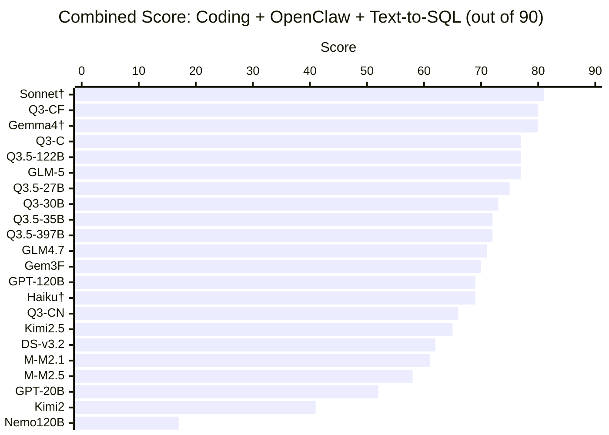
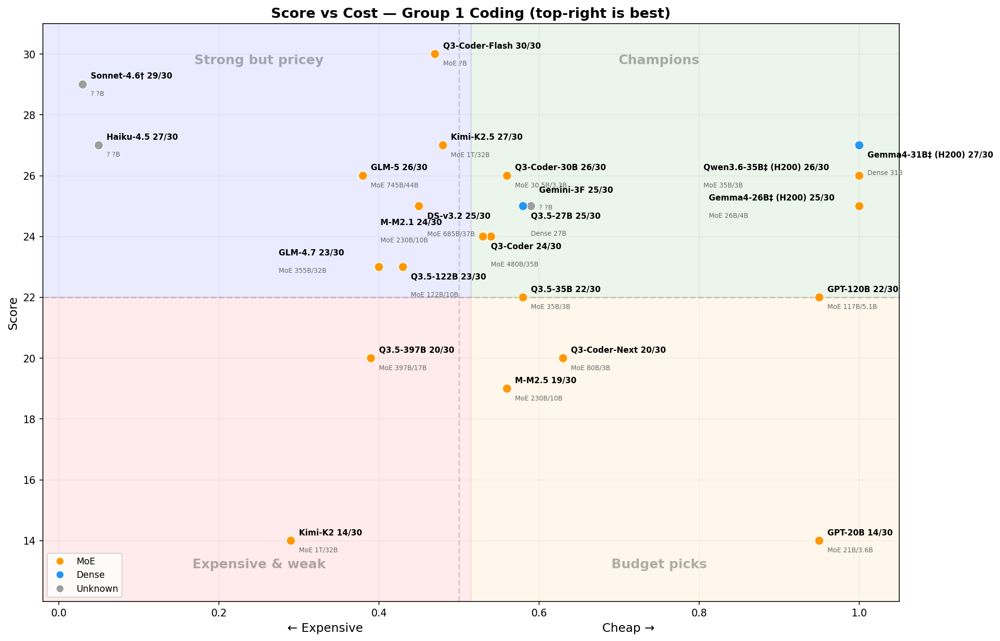
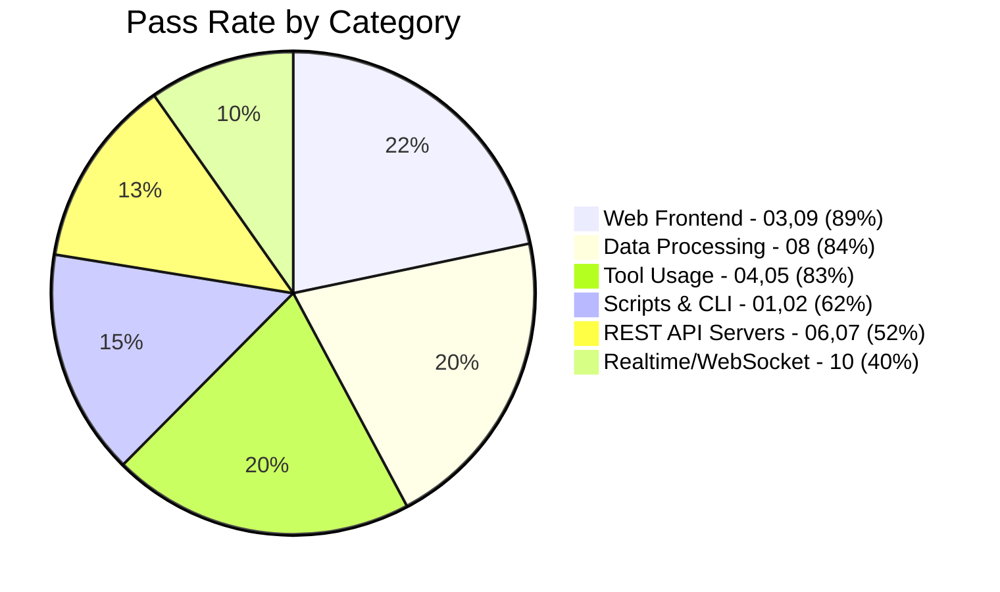

# Agentic Coding Benchmark

[中文版 (Traditional Chinese)](README_zh.md)

[](https://www.largitdata.com/zh-tw/blog_detail/20260320)

An automated benchmark suite for evaluating LLM **agentic coding ability** via OpenRouter tool-use API. Give a model a vague prompt and 4 tools (write_file, read_file, run_command, list_files), see if it builds something that actually works. Claude models are tested via Claude Code (native API); Gemma 4 is tested via Google's Gemini native API.

> **Why these models?** This benchmark is designed to find the **best bang-for-your-buck** models for agentic coding. We intentionally focus on lightweight and mid-tier models that developers can actually afford to run at scale. Frontier models like Claude Opus/Sonnet 4, GPT-4.5, and Gemini 2.5 Pro are not included — they would likely score well but cost 10-100x more per run, which defeats the purpose. **If you'd like to see specific models added, please [open an issue](https://github.com/ywchiu/local_agentic_llm/issues)!**

---

<details open>
<summary><h2>All Results (Combined G1 + G2 + G3)</h2></summary>

### Combined Score (out of 90)



### Leaderboard

| Rank | Model | Open | Arch | Params | Active | G1 | G2 | G3 | Total |
|------|-------|:----:|:----:|-------:|-------:|:--:|:--:|:--:|:-----:|
| 1 | **anthropic/claude-sonnet-4.6** (Claude Code) | | ? | ? | ? | 29 | 26 | 26 | **81** |
| 2 | qwen/qwen3-coder-flash (OpenRouter) | | MoE | ? | ? | 30 | 25 | 25 | **80** |
| 2 | google/gemma-4-31b-it† (Gemini API) | OSS | Dense | 31B | 31B | 27 | 26 | 27 | **80** |
| 4 | qwen/qwen3-coder | OSS | MoE | 480B | 35B | 24 | 24 | 29 | **77** |
| 4 | qwen/qwen3.5-122b | OSS | MoE | 122B | 10B | 23 | 27 | 27 | **77** |
| 4 | z-ai/glm-5 | OSS | MoE | 745B | 44B | 26 | 24 | 27 | **77** |
| 7 | qwen/qwen3.5-27b | OSS | Dense | 27B | 27B | 25 | 26 | 24 | **75** |
| 8 | qwen/qwen3-coder-30b | OSS | MoE | 30.5B | 3.3B | 26 | 23 | 24 | **73** |
| 9 | qwen/qwen3.5-35b | OSS | MoE | 35B | 3B | 22 | 27 | 23 | **72** |
| 9 | qwen/qwen3.5-397b | OSS | MoE | 397B | 17B | 20 | 26 | 26 | **72** |
| 11 | z-ai/glm-4.7 | OSS | MoE | 355B | 32B | 23 | 23 | 25 | **71** |
| 12 | google/gemini-3-flash | | ? | ? | ? | 25 | 20 | 25 | **70** |
| 13 | openai/gpt-oss-120b | OSS | MoE | 117B | 5.1B | 22 | 23 | 24 | **69** |
| 13 | anthropic/claude-haiku-4.5† | | ? | ? | ? | 30 | 20 | 19 | **69** |
| 15 | qwen/qwen3-coder-next | OSS | MoE | 80B | 3B | 20 | 24 | 22 | **66** |
| 16 | moonshotai/kimi-k2.5 | OSS | MoE | 1T | 32B | 27 | 23 | 15 | **65** |
| 17 | deepseek/deepseek-v3.2 | OSS | MoE | 685B | 37B | 25 | 21 | 16 | **62** |
| 18 | minimax/minimax-m2.1 | OSS | MoE | 230B | 10B | 24 | 19 | 18 | **61** |
| 19 | minimax/minimax-m2.5 | OSS | MoE | 230B | 10B | 19 | 19 | 20 | **58** |
| 20 | openai/gpt-oss-20b | OSS | MoE | 21B | 3.6B | 14 | 23 | 15 | **52** |
| 21 | moonshotai/kimi-k2 | OSS | MoE | 1T | 32B | 14 | 13 | 14 | **41** |
| 22 | nvidia/nemotron-3-super | OSS | MoE | 120B | 12B | 5 | 12 | 0 | **17** |

> **Open** = OSS (open weights on HuggingFace). **Arch** = Dense or MoE. G1 = Python Fundamentals, G2 = OpenClaw Skills, G3 = Text-to-SQL. 22 models tested, March 2026. **†** Claude models tested via Claude Code (native API); Gemma 4 tested via Gemini native API; all other models tested via OpenRouter.
>
> **G2 scores updated 2026-03-21:** Validation scripts were fixed to accept SKILL.md placed in subdirectories. Biggest improvements: **qwen3.5-122b** (+17), **gpt-oss-20b** (+16), **GLM-5** (+16).
>
> **G3 scores updated 2026-03-22:** Validation scripts were fixed to prefer `text_to_sql.py` over helper scripts (test/setup files). Models that generated correct scripts alongside test helpers were previously penalized.

### Cost-Performance Quadrant (Group 1)

> Top-right = best value (high score + low cost). Cost estimated from OpenRouter pricing x actual tokens used.



**Best value picks:**
- **Gemini 3 Flash** (25/30, ~$0.09/run) and **qwen3.5-27b** (25/30, ~$0.10/run) — best score-to-cost ratio
- **GPT-OSS-120b** (22/30, ~$0.01/run) — cheapest model that still scores well
- **qwen3-coder-flash** (30/30, ~$0.18/run) — perfect score, moderate cost
- **Claude Haiku** (27/30, ~$2.58/run) — strong but 28x more expensive than Gemini Flash for 2 extra points

### Key Findings

1. **qwen3-coder-flash and Gemma 4 31B tie at 80/90** — qwen3-coder-flash via OpenRouter, Gemma 4 via Gemini native API; both consistently strong across all 3 groups
2. **Gemma 4 31B is the smallest model to hit 80/90** — at 31B Dense parameters, it outperforms models 5-20x its size; thinking mode adds zero benefit (identical scores)
3. **3-way tie for #4 at 77/90** — qwen3-coder (G3 champion at 29/30), qwen3.5-122b, and GLM-5
4. **Text-to-SQL reshuffles rankings** — kimi-k2.5 drops from top 3 to #16 due to intermittent tool-use failures on G3; GLM-5 rises thanks to strong G3 performance (27/30)
5. **Validation quality matters** — two bugs in our validators (G2 subdirectory detection, G3 script selection) were artificially depressing scores; fixing them revealed the models' true capabilities
6. **Open-source dominates** — 18 of 22 models are OSS; only qwen3-coder-flash, Claude Haiku, and Gemini Flash are proprietary

### Claude Models: OpenRouter vs Native API (Claude Code)

We retested Claude Sonnet 4.6 and Haiku 4.5 using **Claude Code subagents** (Anthropic's native tool-use API) instead of OpenRouter. The results show a significant performance gap:

| Model | OpenRouter | Claude Code | Delta |
|-------|:---------:|:-----------:|:-----:|
| **Sonnet 4.6** | 71/90 | **81/90** | **+10** |
| **Haiku 4.5** | 68/90 | **69/90** | +1 |

**Sonnet 4.6 via Claude Code scores 81/90 — the highest score in the benchmark**, surpassing qwen3-coder-flash (80/90). Haiku achieves a **perfect 30/30 on G1** via native API (vs 27/30 via OpenRouter).

**Why the gap?** This benchmark routes all models through OpenRouter's OpenAI-compatible tool-use API. For non-OpenAI models, this adds a translation layer that can degrade tool-use quality. Claude models use a different native tool-use format (XML-based tool blocks vs OpenAI's function-calling JSON), so the translation introduces friction — malformed arguments, missed tool calls, and suboptimal file placement. When tested via their native API, Claude models perform significantly better.

**Implication for the leaderboard:** The OpenRouter scores represent a level playing field where every model uses the same API format. The Claude Code scores show what these models can achieve with their native tooling. Other models (Gemini, GPT, etc.) would likely also score higher through their native APIs. The benchmark measures **tool-use via OpenRouter**, not raw model capability — keep this in mind when interpreting results.

### Gemma 4 31B: OpenRouter vs Gemini Native API

We tested google/gemma-4-31b-it using **Google's Gemini native API** with function calling support. On OpenRouter, the model's provider (Novita) does not support native tool calling, requiring a prompt-based workaround. The Gemini API provides proper function calling, yielding much better results.

| Mode | G1 | G2 | G3 | Total |
|------|:--:|:--:|:--:|:-----:|
| **Gemini API (no thinking)** | 27 | 26 | 27 | **80/90** |
| **Gemini API (thinking=HIGH)** | 27 | 26 | 27 | **80/90** |

**Key finding:** Thinking/reasoning mode adds zero benefit — identical scores on every single test. At 31B parameters (Dense), this is the smallest model to achieve 80/90, and it's completely free via Google's API.

</details>

---

<details>
<summary><h2>Experiment 1: Group 1 — Python Fundamentals</h2></summary>

> 10 tests across 3 difficulty tiers. Mix of pure code generation and agentic tool-usage tasks.
> 21 models tested via agent_harness. March-April 2026.

### Leaderboard

| Rank | Model | Open | 01 | 02 | 03 | 04 | 05 | 06 | 07 | 08 | 09 | 10 | Total | Time | Tokens | Tok/Pt |
|------|-------|:----:|----|----|----|----|----|----|----|----|----|----|-------|------|--------|--------|
| 1 | **qwen/qwen3-coder-flash** | | 3 | 3 | 3 | 3 | 3 | 3 | 3 | 3 | 3 | 3 | **30/30** | 20m51s | 780K | 26.0K |
| 1 | anthropic/claude-haiku-4.5† | | 3 | 3 | 3 | 3 | 3 | 3 | 3 | 3 | 3 | 3 | **30/30** | — | — | — |
| 3 | anthropic/claude-sonnet-4.6† | | 3 | 3 | 3 | 3 | 3 | 3 | 2 | 3 | 3 | 3 | **29/30** | — | — | — |
| 4 | moonshotai/kimi-k2.5 | OSS | 3 | 3 | 3 | 3 | 3 | 3 | 2 | 3 | 3 | 1 | **27/30** | 15m26s | 258K | 9.6K |
| 4 | google/gemma-4-31b-it† | OSS | 2 | 3 | 3 | 3 | 3 | 3 | 2 | 3 | 3 | 2 | **27/30** | ~2h | ~1.2M | — |
| 6 | z-ai/glm-5 | OSS | 2 | 3 | 3 | 3 | 3 | 3 | 2 | 3 | 3 | 1 | **26/30** | 27m03s | 354K | 13.6K |
| 6 | qwen/qwen3-coder-30b | OSS | 2 | 2 | 3 | 3 | 3 | 3 | 3 | 3 | 3 | 1 | **26/30** | 24m51s | 1420K | 54.6K |
| 8 | deepseek/deepseek-v3.2 | OSS | 2 | 3 | 3 | 3 | 3 | 3 | 2 | 3 | 3 | 1 | **25/30** | — | — | — |
| 8 | google/gemini-3-flash | | 1 | 3 | 3 | 3 | 3 | 3 | 0 | 3 | 3 | 3 | **25/30** | 4m42s | 107K | 4.3K |
| 8 | qwen/qwen3.5-27b | OSS | 1 | 3 | 3 | 3 | 3 | 3 | 2 | 3 | 3 | 1 | **25/30** | 11m01s | 262K | 10.5K |
| 11 | minimax/minimax-m2.1 | OSS | 2 | 3 | 3 | 3 | 3 | 3 | 0 | 3 | 3 | 1 | **24/30** | 23m44s | 368K | 15.3K |
| 11 | qwen/qwen3-coder (480B) | OSS | 1 | 3 | 3 | 3 | 3 | 3 | 1 | 3 | 3 | 1 | **24/30** | 10m19s | 469K | 19.5K |
| 13 | z-ai/glm-4.7 | OSS | 1 | 3 | 3 | 3 | 3 | 3 | 0 | 3 | 3 | 1 | **23/30** | 14m46s | 570K | 24.8K |
| 13 | qwen/qwen3.5-122b | OSS | 1 | 3 | 3 | 3 | 3 | 3 | 0 | 3 | 3 | 1 | **23/30** | 15m25s | 579K | 25.2K |
| 15 | openai/gpt-oss-120b | OSS | 2 | 3 | 3 | 3 | 3 | 0 | 0 | 3 | 3 | 2 | **22/30** | 4m33s | 153K | 7.0K |
| 15 | qwen/qwen3.5-35b | OSS | 3 | 3 | 3 | 1 | 3 | 0 | 2 | 3 | 3 | 1 | **22/30** | 15m58s | 355K | 16.1K |
| 17 | qwen/qwen3-coder-next | OSS | 1 | 3 | 3 | 3 | 3 | 0 | 0 | 3 | 3 | 1 | **20/30** | 16m23s | 467K | 23.4K |
| 17 | qwen/qwen3.5-397b | OSS | 1 | 3 | 3 | 3 | 3 | 0 | 0 | 3 | 3 | 1 | **20/30** | 19m20s | 546K | 27.3K |
| 19 | minimax/minimax-m2.5 | OSS | 1 | 0 | 3 | 3 | 1 | 3 | 1 | 3 | 3 | 1 | **19/30** | 45m05s | 300K | 15.8K |
| 20 | openai/gpt-oss-20b | OSS | 0 | 3 | 3 | 1 | 0 | 0 | 0 | 3 | 3 | 1 | **14/30** | 19m47s | 142K | 10.1K |
| 20 | moonshotai/kimi-k2 | OSS | 1 | 3 | 0 | 1 | 3 | 3 | 3 | 0 | 0 | 0 | **14/30** | 42m04s | 808K | 57.7K |
| 22 | nvidia/nemotron-3-super | OSS | 0 | 0 | 0 | 1 | 0 | 0 | 0 | 1 | 3 | 0 | **5/30** | 2m53s | 120K | 24.0K |

> Tok/Pt = tokens per point scored (lower = more efficient).

### Per-Test Heatmap

🟩 = 3/3 Pass  🟨 = Partial  🟥 = 0/3 Fail

| Test | Diff. | Q3-CF | Kimi2.5 | Gemma4 | Haiku | GLM-5 | Q3-30B | Gem3F | Q3.5-27B | M2.1 | Q3-C | GLM4.7 | Q3.5-122B | GPT-120 | Q3.5-35B | Q3-CN | Q3.5-397B | M2.5 | GPT-20 | Kimi2 |
|------|-------|:-----:|:-------:|:------:|:-----:|:-----:|:------:|:-----:|:--------:|:----:|:----:|:------:|:---------:|:-------:|:--------:|:-----:|:---------:|:----:|:------:|:-----:|
| 01 CSV→JSON | Easy | 🟩 | 🟩 | 🟨 | 🟨 | 🟨 | 🟨 | 🟨 | 🟨 | 🟨 | 🟨 | 🟨 | 🟨 | 🟨 | 🟩 | 🟨 | 🟨 | 🟨 | 🟥 | 🟨 |
| 02 Sysinfo | Easy | 🟩 | 🟩 | 🟩 | 🟩 | 🟩 | 🟨 | 🟩 | 🟩 | 🟩 | 🟩 | 🟩 | 🟩 | 🟩 | 🟩 | 🟩 | 🟩 | 🟥 | 🟩 | 🟩 |
| 03 Calculator | Easy | 🟩 | 🟩 | 🟩 | 🟩 | 🟩 | 🟩 | 🟩 | 🟩 | 🟩 | 🟩 | 🟩 | 🟩 | 🟩 | 🟩 | 🟩 | 🟩 | 🟩 | 🟩 | 🟥 |
| 04 Bugfix | Med | 🟩 | 🟩 | 🟩 | 🟩 | 🟩 | 🟩 | 🟩 | 🟩 | 🟩 | 🟩 | 🟩 | 🟩 | 🟩 | 🟨 | 🟩 | 🟩 | 🟩 | 🟨 | 🟨 |
| 05 TDD | Med | 🟩 | 🟩 | 🟩 | 🟩 | 🟩 | 🟩 | 🟩 | 🟩 | 🟩 | 🟩 | 🟩 | 🟩 | 🟩 | 🟩 | 🟩 | 🟩 | 🟨 | 🟥 | 🟩 |
| 06 Expense API | Med | 🟩 | 🟩 | 🟩 | 🟩 | 🟩 | 🟩 | 🟩 | 🟩 | 🟩 | 🟩 | 🟩 | 🟩 | 🟥 | 🟥 | 🟥 | 🟥 | 🟩 | 🟥 | 🟩 |
| 07 URL Short | Med | 🟩 | 🟨 | 🟨 | 🟩 | 🟨 | 🟩 | 🟥 | 🟨 | 🟥 | 🟨 | 🟥 | 🟥 | 🟥 | 🟨 | 🟥 | 🟥 | 🟨 | 🟥 | 🟩 |
| 08 Dashboard | Hard | 🟩 | 🟩 | 🟩 | 🟩 | 🟩 | 🟩 | 🟩 | 🟩 | 🟩 | 🟩 | 🟩 | 🟩 | 🟩 | 🟩 | 🟩 | 🟩 | 🟩 | 🟩 | 🟥 |
| 09 Kanban | Hard | 🟩 | 🟩 | 🟩 | 🟩 | 🟩 | 🟩 | 🟩 | 🟩 | 🟩 | 🟩 | 🟩 | 🟩 | 🟩 | 🟩 | 🟩 | 🟩 | 🟩 | 🟩 | 🟥 |
| 10 Chat (WS) | Hard | 🟩 | 🟨 | 🟨 | 🟨 | 🟨 | 🟨 | 🟩 | 🟨 | 🟨 | 🟨 | 🟨 | 🟨 | 🟨 | 🟨 | 🟨 | 🟨 | 🟨 | 🟨 | 🟥 |

### Category Pass Rates



### Group 1 Tests

| # | Test | Type | Difficulty | What It Tests |
|---|------|------|------------|---------------|
| 01 | CSV to JSON converter | Script | Easy | Basic code generation |
| 02 | System-aware script | Script | Easy | Must use bash to detect OS, Python version, hardware |
| 03 | Calculator web app | Web | Easy | Generate working HTML/JS |
| 04 | Bugfix existing code | Debug | Medium | Must read files, understand bugs, fix them |
| 05 | Pass the tests | TDD | Medium | Must run pytest, iterate on failures until all pass |
| 06 | Expense tracker API | Web | Medium | Build a working REST API server |
| 07 | URL shortener | Web | Medium | Build a web app with redirects |
| 08 | API data dashboard | Script | Hard | Must install pip packages, fetch live API, generate HTML |
| 09 | Kanban task board | Web | Hard | Build web app with drag-and-drop + persistence |
| 10 | Real-time chat | Web | Hard | Build websocket-based chat with multiple users |

</details>

---

<details>
<summary><h2>Experiment 2: Group 2 — OpenClaw Skills</h2></summary>

> 10 tests evaluating whether models can build working OpenClaw agent skills.
> Progressive difficulty from basic SKILL.md to multi-file automations. March 2026.

### Leaderboard

| Rank | Model | Open | 01 | 02 | 03 | 04 | 05 | 06 | 07 | 08 | 09 | 10 | Total |
|------|-------|:----:|----|----|----|----|----|----|----|----|----|----|-------|
| 1 | **qwen/qwen3.5-122b** | OSS | 3 | 2 | 3 | 2 | 3 | 3 | 3 | 3 | 2 | 3 | **27/30** |
| 1 | qwen/qwen3.5-35b | OSS | 3 | 2 | 3 | 2 | 3 | 3 | 3 | 3 | 2 | 3 | **27/30** |
| 3 | google/gemma-4-31b-it† | OSS | 3 | 2 | 3 | 3 | 3 | 1 | 3 | 3 | 2 | 3 | **26/30** |
| 3 | anthropic/claude-sonnet-4.6† | | 3 | 2 | 3 | 3 | 3 | 2 | 1 | 3 | 3 | 3 | **26/30** |
| 3 | qwen/qwen3.5-27b | OSS | 3 | 2 | 3 | 2 | 3 | 2 | 3 | 3 | 2 | 3 | **26/30** |
| 3 | qwen/qwen3.5-397b | OSS | 3 | 2 | 3 | 2 | 3 | 3 | 3 | 2 | 2 | 3 | **26/30** |
| 7 | qwen/qwen3-coder-flash | | 3 | 2 | 3 | 2 | 2 | 3 | 3 | 3 | 1 | 3 | **25/30** |
| 8 | z-ai/glm-5 | OSS | 3 | 2 | 3 | 2 | 3 | 3 | 2 | 1 | 2 | 3 | **24/30** |
| 8 | qwen/qwen3-coder | OSS | 2 | 2 | 3 | 2 | 3 | 3 | 3 | 3 | 2 | 1 | **24/30** |
| 8 | qwen/qwen3-coder-next | OSS | 3 | 2 | 3 | 3 | 3 | 2 | 3 | 2 | 2 | 1 | **24/30** |
| 11 | moonshotai/kimi-k2.5 | OSS | 3 | 2 | 3 | 2 | 3 | 1 | 2 | 2 | 2 | 3 | **23/30** |
| 11 | openai/gpt-oss-120b | OSS | 2 | 2 | 3 | 2 | 2 | 3 | 3 | 3 | 1 | 2 | **23/30** |
| 11 | qwen/qwen3-coder-30b | OSS | 2 | 2 | 3 | 2 | 2 | 3 | 3 | 1 | 2 | 1 | **23/30** |
| 11 | z-ai/glm-4.7 | OSS | 3 | 1 | 3 | 2 | 3 | 3 | 2 | 1 | 2 | 3 | **23/30** |
| 11 | openai/gpt-oss-20b | OSS | 3 | 1 | 3 | 2 | 3 | 2 | 1 | 3 | 2 | 3 | **23/30** |
| 16 | anthropic/claude-haiku-4.5† | | 3 | 3 | 3 | 3 | 3 | 2 | 1 | 0 | 0 | 2 | **20/30** |
| 16 | google/gemini-3-flash | | 3 | 1 | 3 | 2 | 2 | 1 | 2 | 3 | 2 | 1 | **20/30** |
| 18 | minimax/minimax-m2.1 | OSS | 3 | 2 | 0 | 2 | 2 | 3 | 0 | 3 | 3 | 1 | **19/30** |
| 18 | minimax/minimax-m2.5 | OSS | 3 | 2 | 3 | 0 | 0 | 3 | 3 | 2 | 0 | 3 | **19/30** |
| 20 | moonshotai/kimi-k2 | OSS | 3 | 2 | 0 | 3 | 2 | 1 | 1 | 1 | 0 | 0 | **13/30** |
| 21 | nvidia/nemotron-3-super | OSS | 0 | 1 | 3 | 2 | 2 | 1 | 0 | 1 | 1 | 1 | **12/30** |

### Key Observations

- **Validation fix dramatically changed rankings** — the original validators only checked `$WORKSPACE/SKILL.md`, penalizing models that placed files in subdirectories (e.g. `pomodoro/SKILL.md`). After fixing this, 10 models saw score increases of +4 to +17 points. The generated SKILL.md content was correct all along.
- **qwen3.5 family dominates OpenClaw** — all four qwen3.5 variants now rank in the top 4, scoring 26-27/30
- **GLM-5 recovers: 8→24** — the original 8/30 was entirely due to file placement, not coding ability
- **gpt-oss-20b biggest surprise: 7→23** — went from last place to mid-pack after the fix
- **Test 10 (Smart Home)** is the best discriminator — requires config parsing + state management

### Group 2 Tests

| # | Test | Type | Difficulty | What It Tests |
|---|------|------|------------|---------------|
| 01 | Pomodoro Timer | Skill | Easy | Basic SKILL.md structure with YAML frontmatter |
| 02 | Fix Broken Skill | Debug | Easy | Repair malformed SKILL.md and buggy script |
| 03 | Bookmark Manager | Skill | Easy | Skill with companion script and JSON persistence |
| 04 | Weather Lookup | Skill | Medium | Declare env var and binary requirements in frontmatter |
| 05 | GitHub PR Summary | Skill | Medium | Declare multiple dependencies (gh + GITHUB_TOKEN) |
| 06 | File Organizer | Skill | Medium | Companion script that actually executes and organizes files |
| 07 | HackerNews Digest | Skill | Hard | Fetch API data, generate HTML report |
| 08 | Webhook Receiver | Skill | Hard | Build HTTP server that logs POST payloads |
| 09 | Data Pipeline | Skill | Hard | Multi-step pipeline: read, filter, report |
| 10 | Smart Home Controller | Skill | Hard | Config-driven state management with command parsing |

</details>

---

<details>
<summary><h2>Experiment 3: Group 3 — Text-to-SQL</h2></summary>

> 10 tests evaluating whether models can build a heuristic text-to-SQL translator.
> Each test provides a SQLite schema and natural language questions; the model must build a Python script that translates questions to SQL and returns correct results — without using any LLM API calls. March 2026.

### Leaderboard

| Rank | Model | Open | 01 | 02 | 03 | 04 | 05 | 06 | 07 | 08 | 09 | 10 | Total |
|------|-------|:----:|----|----|----|----|----|----|----|----|----|----|-------|
| 1 | **qwen/qwen3-coder** | OSS | 3 | 3 | 2 | 3 | 3 | 3 | 3 | 3 | 3 | 3 | **29/30** |
| 2 | google/gemma-4-31b-it† | OSS | 3 | 3 | 0 | 3 | 3 | 3 | 3 | 3 | 3 | 3 | **27/30** |
| 2 | z-ai/glm-5 | OSS | 2 | 3 | 1 | 3 | 3 | 3 | 3 | 3 | 3 | 3 | **27/30** |
| 2 | qwen/qwen3.5-122b | OSS | 3 | 3 | 1 | 3 | 3 | 3 | 2 | 3 | 3 | 3 | **27/30** |
| 5 | qwen/qwen3.5-397b | OSS | 3 | 3 | 0 | 2 | 3 | 3 | 3 | 3 | 3 | 3 | **26/30** |
| 5 | anthropic/claude-sonnet-4.6† | | 2 | 2 | 2 | 2 | 3 | 3 | 3 | 3 | 3 | 3 | **26/30** |
| 7 | z-ai/glm-4.7 | OSS | 3 | 3 | 2 | 3 | 3 | 2 | 3 | 3 | 0 | 3 | **25/30** |
| 7 | qwen/qwen3-coder-flash | | 2 | 2 | 3 | 3 | 2 | 2 | 2 | 3 | 3 | 3 | **25/30** |
| 7 | google/gemini-3-flash | | 3 | 3 | 0 | 3 | 3 | 3 | 2 | 3 | 2 | 3 | **25/30** |
| 10 | qwen/qwen3-coder-30b | OSS | 3 | 3 | 2 | 3 | 3 | 3 | 2 | 2 | 0 | 3 | **24/30** |
| 10 | qwen/qwen3.5-27b | OSS | 2 | 3 | 1 | 3 | 3 | 3 | 3 | 1 | 3 | 2 | **24/30** |
| 10 | openai/gpt-oss-120b | OSS | 3 | 3 | 3 | 2 | 3 | 2 | 2 | 2 | 1 | 3 | **24/30** |
| 13 | qwen/qwen3.5-35b | OSS | 2 | 3 | 2 | 3 | 3 | 1 | 1 | 2 | 3 | 3 | **23/30** |
| 14 | qwen/qwen3-coder-next | OSS | 3 | 3 | 0 | 3 | 3 | 0 | 3 | 3 | 3 | 1 | **22/30** |
| 15 | minimax/minimax-m2.5 | OSS | 2 | 2 | 3 | 0 | 2 | 0 | 2 | 3 | 3 | 3 | **20/30** |
| 16 | anthropic/claude-haiku-4.5† | | 2 | 2 | 0 | 1 | 1 | 1 | 3 | 3 | 3 | 3 | **19/30** |
| 17 | minimax/minimax-m2.1 | OSS | 3 | 3 | 1 | 2 | 3 | 2 | 0 | 0 | 1 | 3 | **18/30** |
| 18 | deepseek/deepseek-v3.2 | OSS | 3 | 3 | 0 | 1 | 3 | 0 | 2 | 1 | 3 | 0 | **16/30** |
| 19 | moonshotai/kimi-k2.5 | OSS | 3 | 0 | 0 | 1 | 3 | 2 | 2 | 0 | 3 | 1 | **15/30** |
| 19 | openai/gpt-oss-20b | OSS | 2 | 2 | 0 | 1 | 2 | 1 | 3 | 1 | 2 | 1 | **15/30** |
| 21 | moonshotai/kimi-k2 | OSS | 2 | 3 | 0 | 3 | 0 | 2 | 1 | 2 | 0 | 1 | **14/30** |
| 22 | nvidia/nemotron-3-super | OSS | 0 | 0 | 0 | 0 | 0 | 0 | 0 | 0 | 0 | 0 | **0/30** |

### Key Observations

- **qwen3-coder dominates (29/30)** — near-perfect heuristic SQL translator, only missed one join_with_agg check
- **GLM-5 strong at 27/30** — proves its coding ability after G2 validation fix restored its reputation
- **Kimi-K2.5 drops sharply (15/30)** — intermittent tool-use failures: sometimes skips tool calls entirely, sometimes produces malformed path/content arguments (e.g. `write_file(path='.', content='text_to_sql.py')`)
- **Claude Haiku collapses on tests 08-10 (0/30)** — strong on simple queries but fails on ordering, null handling, and complex analytics
- **Nemotron-3-super scores 0/30** — poor tool-use API conformance, rarely invokes tools or produces garbled arguments
- **Test 03 (JOINs) is the hardest** — 8 models scored 0-1/3; heuristic JOIN detection is genuinely difficult

### Group 3 Tests

| # | Test | SQL Concept | Difficulty | What It Tests |
|---|------|------------|------------|---------------|
| 01 | Simple SELECT | SELECT, WHERE | Easy | Basic query generation from natural language |
| 02 | Aggregation | COUNT, SUM, AVG | Easy | Aggregate function detection |
| 03 | JOIN Queries | JOIN, multi-table | Medium | Multi-table relationship understanding |
| 04 | GROUP BY | GROUP BY, HAVING | Medium | Grouping and filtering aggregates |
| 05 | Date Queries | Date filtering | Medium | Date range and comparison parsing |
| 06 | Subqueries | Nested SELECT | Medium | Subquery pattern recognition |
| 07 | String Operations | LIKE, string matching | Medium | Pattern matching from natural language |
| 08 | Ordering & Limits | ORDER BY, LIMIT | Medium | Sort direction and limit extraction |
| 09 | NULL Handling | IS NULL, COALESCE | Hard | Null-aware query construction |
| 10 | Complex Analytics | Multi-join + aggregation | Hard | Combined analytical query building |

</details>

---

## Architecture

### Agent Harness

The benchmark uses a custom **agent harness** (`agent_harness.py`) instead of vendor-specific agentic tools. This ensures every model gets the same standardized interface:

```
                    ┌─────────────────────┐
                    │   agent_harness.py  │
                    │                     │
   prompt.md ──────►│  OpenRouter API     │
                    │  (tool-use loop)    │
                    │                     │
                    │  4 tools:           │
                    │  - write_file       │
                    │  - read_file        │──────► workspace/
                    │  - run_command      │
                    │  - list_files       │
                    │                     │
                    │  JSON metrics ──────│──────► stdout
                    │  Tool log ──────────│──────► stderr
                    └─────────────────────┘
```

**Why not opencode/cursor/etc?** Vendor tools introduce bias — models that happen to be compatible with a specific tool's interface score higher, regardless of coding ability. Our harness gives every model identical tools via OpenRouter's normalized API. For Gemma models, `agent_harness_gemini.py` provides the same 4 tools via Google's Gemini native API with function calling support.

### Usage

```bash
# Prerequisites: Python 3, requests library, OpenRouter API key

# Setup
git clone <this-repo>
cd agentic_testing
echo 'OPENROUTER_API_KEY="sk-or-..."' > .env
pip install requests

# Run benchmark
./run_benchmark.sh                                    # all models from models.txt
./run_benchmark.sh "openrouter/z-ai/glm-5"           # single model
OPENCODE_GROUP=group2_openclaw_skills ./run_benchmark.sh  # specific group
OPENCODE_TESTS=06_expense_tracker_api ./run_benchmark.sh  # specific tests
OPENCODE_TIMEOUT=600 ./run_benchmark.sh               # custom timeout
```

## Scoring

Each test: 3 checks x 1 point = 3 points. Total per group: 30 points.

| Check | Verifies |
|-------|----------|
| Runs without error | No crashes on execution |
| Core functionality | Main feature works |
| Edge cases | Handles non-trivial inputs |

## Experiments

| Experiment | Date | Tool | Models | Groups | Key Finding |
|-----------|------|------|--------|--------|-------------|
| 1 | 2026-03-18 | opencode | 12 | G1 | Many models produced 0-byte output due to tool incompatibility |
| 2 | 2026-03-19 | agent_harness | 18 | G1+G2 | Fair comparison — qwen3-coder-flash leads at 55/60 |
| 3 | 2026-03-22 | agent_harness | 20 | G1+G2+G3 | Text-to-SQL added — qwen3-coder-flash leads at 80/90 |
| **4** | **2026-04-03** | **agent_harness_gemini** | **22** | **G1+G2+G3** | **Gemma 4 31B ties for #2 at 80/90 — smallest model to hit 80, thinking adds zero benefit** |

## License

MIT
