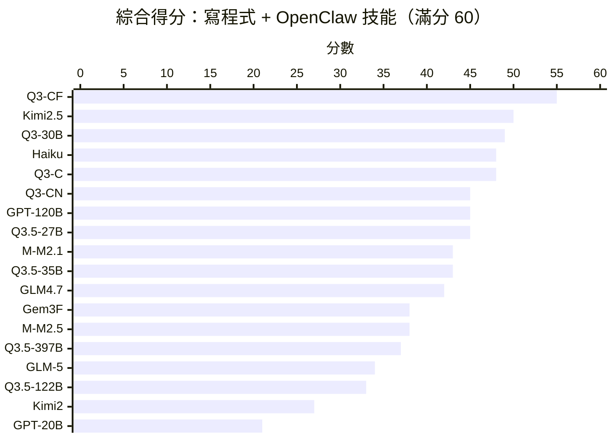
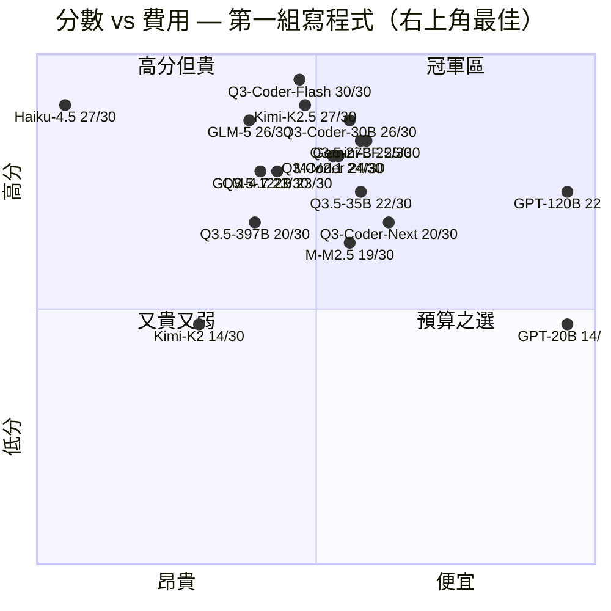
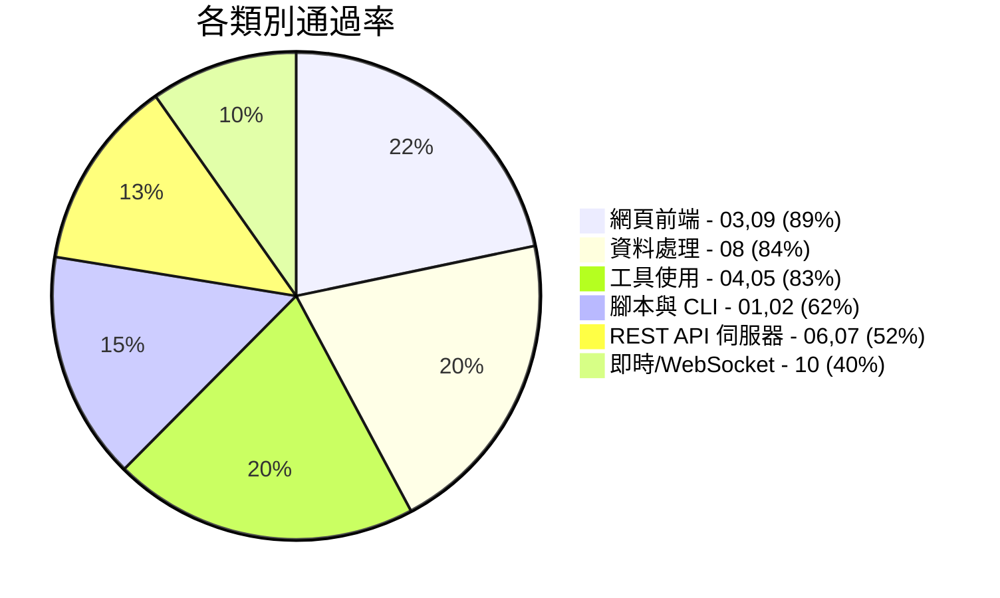

# Agentic Coding 基準測試

[English Version](README.md)

[](https://www.largitdata.com/zh-tw/blog_detail/20260320)

透過 OpenRouter Tool-Use API 自動化評估大型語言模型的 **Agentic Coding 能力** — 給模型一個模糊提示和 4 個工具（write_file、read_file、run_command、list_files），看它能否構建出可用的成品。

> **為什麼選這些模型？** 本基準測試旨在找出 **性價比最高** 的 Agentic Coding 模型。我們刻意聚焦於開發者實際負擔得起大規模使用的輕量級與中階模型。旗艦模型如 Claude Opus/Sonnet 4、GPT-4.5、Gemini 2.5 Pro 等未納入 — 它們可能表現優異，但每次執行費用高出 10-100 倍，這違背了測試的初衷。**如果您希望測試特定模型，請 [開 Issue](https://github.com/ywchiu/local_agentic_llm/issues)！**

---

<details open>
<summary><h2>全部結果（G1 + G2 綜合）</h2></summary>

### 綜合得分（滿分 60）



### 排行榜

| 排名 | 模型 | 開源 | 架構 | 參數 | 活躍 | G1 | G2 | 綜合 | 估算費用 | $/分 |
|------|------|:----:|:----:|-----:|-----:|:--:|:--:|:----:|--------:|-----:|
| 1 | **qwen/qwen3-coder-flash** | | MoE | ? | ? | 30 | 25 | **55** | $0.26 | $0.005 |
| 2 | moonshotai/kimi-k2.5 | OSS | MoE | 1T | 32B | 27 | 23 | **50** | $0.44 | $0.009 |
| 3 | qwen/qwen3-coder-30b | OSS | MoE | 30.5B | 3.3B | 26 | 23 | **49** | $0.14 | $0.003 |
| 4 | qwen/qwen3-coder | OSS | MoE | 480B | 35B | 24 | 24 | **48** | $0.20 | $0.004 |
| 4 | anthropic/claude-haiku-4.5 | | ? | ? | ? | 27 | 21 | **48** | $8.52 | $0.178 |
| 6 | qwen/qwen3-coder-next | OSS | MoE | 80B | 3B | 20 | 25 | **45** | $0.16 | $0.004 |
| 6 | openai/gpt-oss-120b | OSS | MoE | 117B | 5.1B | 22 | 23 | **45** | $0.02 | $0.000 |
| 6 | qwen/qwen3.5-27b | OSS | Dense | 27B | 27B | 25 | 20 | **45** | $0.26 | $0.006 |
| 9 | minimax/minimax-m2.1 | OSS | MoE | 230B | 10B | 24 | 19 | **43** | $0.30 | $0.007 |
| 9 | qwen/qwen3.5-35b | OSS | MoE | 35B | 3B | 22 | 21 | **43** | $0.15 | $0.003 |
| 11 | z-ai/glm-4.7 | OSS | MoE | 355B | 32B | 23 | 19 | **42** | $0.64 | $0.015 |
| 12 | google/gemini-3-flash | | ? | ? | ? | 25 | 13 | **38** | $0.17 | $0.004 |
| 12 | minimax/minimax-m2.5 | OSS | MoE | 230B | 10B | 19 | 19 | **38** | $0.23 | $0.006 |
| 14 | qwen/qwen3.5-397b | OSS | MoE | 397B | 17B | 20 | 17 | **37** | $0.48 | $0.013 |
| 15 | z-ai/glm-5 | OSS | MoE | 745B | 44B | 26 | 8 | **34** | $0.63 | $0.019 |
| 16 | qwen/qwen3.5-122b | OSS | MoE | 122B | 10B | 23 | 10 | **33** | $0.39 | $0.012 |
| 17 | moonshotai/kimi-k2 | OSS | MoE | 1T | 32B | 14 | 13 | **27** | $1.18 | $0.044 |
| 18 | openai/gpt-oss-20b | OSS | MoE | 21B | 3.6B | 14 | 7 | **21** | $0.02 | $0.001 |

> **開源** = OSS（HuggingFace 開放權重）。**架構** = Dense 或 MoE。**估算費用** = G1+G2 共 20 個測試的估算總費用（基於 OpenRouter 定價）。**$/分** = 每得一分所需費用。
>
> **qwen3-coder-next（+5）**和 **gpt-oss-120b（+1）**是唯一在 OpenClaw 上得分更高的模型。

### 性價比象限圖（第一組）

> 右上角 = 最佳性價比（高分 + 低費用）。費用基於 OpenRouter 定價 x 實際 Token 消耗估算。



**最佳性價比推薦：**
- **Gemini 3 Flash**（25/30，~$0.09/次）和 **qwen3.5-27b**（25/30，~$0.10/次）— 最佳分數費用比
- **GPT-OSS-120b**（22/30，~$0.01/次）— 最便宜且仍有不錯表現
- **qwen3-coder-flash**（30/30，~$0.18/次）— 滿分，費用適中
- **Claude Haiku**（27/30，~$2.58/次）— 表現強但比 Gemini Flash 貴 28 倍，卻只多 2 分

### 主要發現

1. **qwen3-coder-flash 綜合領先（55/60）** — 寫程式滿分 30/30，OpenClaw 技能 25/30
2. **寫程式能力 ≠ Agent 技能構建能力** — GLM-5 從 26 跌至 8，Gemini Flash 從 25 跌至 13
3. **qwen3-coder-next 是適應力冠軍** — 唯一在 OpenClaw 上顯著提升的模型（+5）
4. **開源主導** — 18 個模型中有 15 個是開源的；僅 qwen3-coder-flash、Claude Haiku 和 Gemini Flash 為閉源

</details>

---

<details>
<summary><h2>實驗 1：第一組 — Python 基礎</h2></summary>

> 10 個測試，3 個難度等級。混合純程式碼生成與代理式工具使用任務。
> 18 個模型透過 agent_harness 測試。2026 年 3 月。

### 排行榜

| 排名 | 模型 | 開源 | 01 | 02 | 03 | 04 | 05 | 06 | 07 | 08 | 09 | 10 | 總分 | 時間 | Token 數 | Tok/分 |
|------|------|:----:|----|----|----|----|----|----|----|----|----|----|------|------|---------|--------|
| 1 | **qwen/qwen3-coder-flash** | | 3 | 3 | 3 | 3 | 3 | 3 | 3 | 3 | 3 | 3 | **30/30** | 20m51s | 780K | 26.0K |
| 2 | moonshotai/kimi-k2.5 | OSS | 3 | 3 | 3 | 3 | 3 | 3 | 2 | 3 | 3 | 1 | **27/30** | 15m26s | 258K | 9.6K |
| 3 | anthropic/claude-haiku-4.5 | | 1 | 3 | 3 | 3 | 3 | 3 | 3 | 3 | 3 | 2 | **27/30** | 22m34s | 1955K | 72.4K |
| 4 | z-ai/glm-5 | OSS | 2 | 3 | 3 | 3 | 3 | 3 | 2 | 3 | 3 | 1 | **26/30** | 27m03s | 354K | 13.6K |
| 5 | qwen/qwen3-coder-30b | OSS | 2 | 2 | 3 | 3 | 3 | 3 | 3 | 3 | 3 | 1 | **26/30** | 24m51s | 1420K | 54.6K |
| 6 | google/gemini-3-flash | | 1 | 3 | 3 | 3 | 3 | 3 | 0 | 3 | 3 | 3 | **25/30** | 4m42s | 107K | 4.3K |
| 7 | qwen/qwen3.5-27b | OSS | 1 | 3 | 3 | 3 | 3 | 3 | 2 | 3 | 3 | 1 | **25/30** | 11m01s | 262K | 10.5K |
| 8 | minimax/minimax-m2.1 | OSS | 2 | 3 | 3 | 3 | 3 | 3 | 0 | 3 | 3 | 1 | **24/30** | 23m44s | 368K | 15.3K |
| 9 | qwen/qwen3-coder (480B) | OSS | 1 | 3 | 3 | 3 | 3 | 3 | 1 | 3 | 3 | 1 | **24/30** | 10m19s | 469K | 19.5K |
| 10 | z-ai/glm-4.7 | OSS | 1 | 3 | 3 | 3 | 3 | 3 | 0 | 3 | 3 | 1 | **23/30** | 14m46s | 570K | 24.8K |
| 11 | qwen/qwen3.5-122b | OSS | 1 | 3 | 3 | 3 | 3 | 3 | 0 | 3 | 3 | 1 | **23/30** | 15m25s | 579K | 25.2K |
| 12 | openai/gpt-oss-120b | OSS | 2 | 3 | 3 | 3 | 3 | 0 | 0 | 3 | 3 | 2 | **22/30** | 4m33s | 153K | 7.0K |
| 12 | qwen/qwen3.5-35b | OSS | 3 | 3 | 3 | 1 | 3 | 0 | 2 | 3 | 3 | 1 | **22/30** | 15m58s | 355K | 16.1K |
| 14 | qwen/qwen3-coder-next | OSS | 1 | 3 | 3 | 3 | 3 | 0 | 0 | 3 | 3 | 1 | **20/30** | 16m23s | 467K | 23.4K |
| 14 | qwen/qwen3.5-397b | OSS | 1 | 3 | 3 | 3 | 3 | 0 | 0 | 3 | 3 | 1 | **20/30** | 19m20s | 546K | 27.3K |
| 16 | minimax/minimax-m2.5 | OSS | 1 | 0 | 3 | 3 | 1 | 3 | 1 | 3 | 3 | 1 | **19/30** | 45m05s | 300K | 15.8K |
| 17 | openai/gpt-oss-20b | OSS | 0 | 3 | 3 | 1 | 0 | 0 | 0 | 3 | 3 | 1 | **14/30** | 19m47s | 142K | 10.1K |
| 17 | moonshotai/kimi-k2 | OSS | 1 | 3 | 0 | 1 | 3 | 3 | 3 | 0 | 0 | 0 | **14/30** | 42m04s | 808K | 57.7K |

> Tok/分 = 每得一分所消耗的 Token 數（越低越高效）。

### 各測試熱力圖

🟩 = 3/3 通過  🟨 = 部分通過  🟥 = 0/3 失敗

| 測試 | 難度 | Q3-CF | Kimi2.5 | Haiku | GLM-5 | Q3-30B | Gem3F | Q3.5-27B | M2.1 | Q3-C | GLM4.7 | Q3.5-122B | GPT-120 | Q3.5-35B | Q3-CN | Q3.5-397B | M2.5 | GPT-20 | Kimi2 |
|------|------|:-----:|:-------:|:-----:|:-----:|:------:|:-----:|:--------:|:----:|:----:|:------:|:---------:|:-------:|:--------:|:-----:|:---------:|:----:|:------:|:-----:|
| 01 CSV→JSON | 簡單 | 🟩 | 🟩 | 🟨 | 🟨 | 🟨 | 🟨 | 🟨 | 🟨 | 🟨 | 🟨 | 🟨 | 🟨 | 🟩 | 🟨 | 🟨 | 🟨 | 🟥 | 🟨 |
| 02 系統資訊 | 簡單 | 🟩 | 🟩 | 🟩 | 🟩 | 🟨 | 🟩 | 🟩 | 🟩 | 🟩 | 🟩 | 🟩 | 🟩 | 🟩 | 🟩 | 🟩 | 🟥 | 🟩 | 🟩 |
| 03 計算機 | 簡單 | 🟩 | 🟩 | 🟩 | 🟩 | 🟩 | 🟩 | 🟩 | 🟩 | 🟩 | 🟩 | 🟩 | 🟩 | 🟩 | 🟩 | 🟩 | 🟩 | 🟩 | 🟥 |
| 04 修復 Bug | 中等 | 🟩 | 🟩 | 🟩 | 🟩 | 🟩 | 🟩 | 🟩 | 🟩 | 🟩 | 🟩 | 🟩 | 🟩 | 🟨 | 🟩 | 🟩 | 🟩 | 🟨 | 🟨 |
| 05 TDD | 中等 | 🟩 | 🟩 | 🟩 | 🟩 | 🟩 | 🟩 | 🟩 | 🟩 | 🟩 | 🟩 | 🟩 | 🟩 | 🟩 | 🟩 | 🟩 | 🟨 | 🟥 | 🟩 |
| 06 費用 API | 中等 | 🟩 | 🟩 | 🟩 | 🟩 | 🟩 | 🟩 | 🟩 | 🟩 | 🟩 | 🟩 | 🟩 | 🟥 | 🟥 | 🟥 | 🟥 | 🟩 | 🟥 | 🟩 |
| 07 短網址 | 中等 | 🟩 | 🟨 | 🟩 | 🟨 | 🟩 | 🟥 | 🟨 | 🟥 | 🟨 | 🟥 | 🟥 | 🟥 | 🟨 | 🟥 | 🟥 | 🟨 | 🟥 | 🟩 |
| 08 儀表板 | 困難 | 🟩 | 🟩 | 🟩 | 🟩 | 🟩 | 🟩 | 🟩 | 🟩 | 🟩 | 🟩 | 🟩 | 🟩 | 🟩 | 🟩 | 🟩 | 🟩 | 🟩 | 🟥 |
| 09 看板 | 困難 | 🟩 | 🟩 | 🟩 | 🟩 | 🟩 | 🟩 | 🟩 | 🟩 | 🟩 | 🟩 | 🟩 | 🟩 | 🟩 | 🟩 | 🟩 | 🟩 | 🟩 | 🟥 |
| 10 聊天 (WS) | 困難 | 🟩 | 🟨 | 🟨 | 🟨 | 🟨 | 🟩 | 🟨 | 🟨 | 🟨 | 🟨 | 🟨 | 🟨 | 🟨 | 🟨 | 🟨 | 🟨 | 🟨 | 🟥 |

### 各類別通過率



### 第一組測試項目

| # | 測試 | 類型 | 難度 | 測試重點 |
|---|------|------|------|---------|
| 01 | CSV 轉 JSON | 腳本 | 簡單 | 基本程式碼生成 |
| 02 | 系統感知腳本 | 腳本 | 簡單 | 必須使用 bash 偵測作業系統、Python 版本、硬體資訊 |
| 03 | 計算機網頁應用 | 網頁 | 簡單 | 生成可運行的 HTML/JS |
| 04 | 修復現有程式碼 | 除錯 | 中等 | 必須讀取檔案、理解 Bug、修復問題 |
| 05 | 通過測試 | TDD | 中等 | 必須執行 pytest、根據失敗結果迭代直到全部通過 |
| 06 | 費用追蹤 API | 網頁 | 中等 | 構建可運行的 REST API 伺服器 |
| 07 | 短網址服務 | 網頁 | 中等 | 構建具有重定向功能的網頁應用 |
| 08 | API 資料儀表板 | 腳本 | 困難 | 必須安裝 pip 套件、呼叫即時 API、生成 HTML |
| 09 | 看板任務板 | 網頁 | 困難 | 構建具有拖放功能和持久化的網頁應用 |
| 10 | 即時聊天 | 網頁 | 困難 | 構建基於 WebSocket 的多人聊天應用 |

</details>

---

<details>
<summary><h2>實驗 2：第二組 — OpenClaw 技能</h2></summary>

> 10 個測試，評估模型能否構建可運行的 OpenClaw Agent 技能。
> 從基本 SKILL.md 到多檔案自動化，難度遞進。2026 年 3 月。

### 排行榜

| 排名 | 模型 | 開源 | 01 | 02 | 03 | 04 | 05 | 06 | 07 | 08 | 09 | 10 | 總分 |
|------|------|:----:|----|----|----|----|----|----|----|----|----|----|------|
| 1 | **qwen/qwen3-coder-flash** | | 3 | 2 | 3 | 2 | 2 | 3 | 3 | 3 | 1 | 3 | **25/30** |
| 1 | qwen/qwen3-coder-next | OSS | 3 | 2 | 3 | 2 | 3 | 3 | 3 | 2 | 2 | 2 | **25/30** |
| 3 | qwen/qwen3-coder | OSS | 2 | 2 | 3 | 2 | 3 | 3 | 3 | 3 | 2 | 1 | **24/30** |
| 4 | moonshotai/kimi-k2.5 | OSS | 0 | 2 | 3 | 3 | 3 | 2 | 3 | 1 | 3 | 3 | **23/30** |
| 4 | qwen/qwen3-coder-30b | OSS | 2 | 2 | 3 | 2 | 2 | 3 | 3 | 1 | 2 | 1 | **23/30** |
| 4 | openai/gpt-oss-120b | OSS | 2 | 2 | 3 | 2 | 2 | 3 | 3 | 3 | 1 | 2 | **23/30** |
| 7 | anthropic/claude-haiku-4.5 | | 2 | 2 | 2 | 2 | 1 | 2 | 3 | 2 | 1 | 2 | **21/30** |
| 7 | qwen/qwen3.5-35b | OSS | 3 | 2 | 3 | 2 | 2 | 3 | 2 | 3 | 1 | 0 | **21/30** |
| 9 | qwen/qwen3.5-27b | OSS | 1 | 2 | 2 | 2 | 2 | 3 | 2 | 3 | 2 | 1 | **20/30** |
| 10 | z-ai/glm-4.7 | OSS | 3 | 2 | 0 | 0 | 3 | 3 | 3 | 0 | 2 | 3 | **19/30** |
| 10 | minimax/minimax-m2.5 | OSS | 3 | 2 | 3 | 0 | 0 | 3 | 3 | 2 | 0 | 3 | **19/30** |
| 10 | minimax/minimax-m2.1 | OSS | 3 | 2 | 0 | 2 | 2 | 3 | 0 | 3 | 3 | 1 | **19/30** |
| 13 | qwen/qwen3.5-397b | OSS | 1 | 2 | 2 | 2 | 2 | 2 | 2 | 0 | 2 | 2 | **17/30** |
| 14 | google/gemini-3-flash | | 1 | 2 | 2 | 1 | 2 | 1 | 2 | 0 | 1 | 1 | **13/30** |
| 14 | moonshotai/kimi-k2 | OSS | 3 | 2 | 0 | 3 | 2 | 1 | 1 | 1 | 0 | 0 | **13/30** |
| 16 | qwen/qwen3.5-122b | OSS | 1 | 1 | 1 | 1 | 2 | 1 | 1 | 0 | 1 | 1 | **10/30** |
| 17 | z-ai/glm-5 | OSS | 0 | 2 | 0 | 0 | 0 | 1 | 0 | 0 | 2 | 3 | **8/30** |
| 18 | openai/gpt-oss-20b | OSS | 0 | 2 | 0 | 0 | 0 | 1 | 1 | 0 | 1 | 2 | **7/30** |

### 主要觀察

- **OpenClaw 比純寫程式難得多** — 平均分從 22.8（G1）下降到 18.4（G2）
- **GLM-5 崩潰：26→8** — 完全無法產生 SKILL.md 格式
- **Gemini 3 Flash 下跌：25→13** — 難以適應 Agent 框架慣例
- **qwen3-coder-next 上升：20→25** — 最擅長適應新框架格式
- **測試 10（智慧家庭）**是最佳區分測試 — 需要配置解析 + 狀態管理

### 第二組測試項目

| # | 測試 | 類型 | 難度 | 測試重點 |
|---|------|------|------|---------|
| 01 | 番茄鐘計時器 | 技能 | 簡單 | 基本 SKILL.md 結構與 YAML frontmatter |
| 02 | 修復損壞技能 | 除錯 | 簡單 | 修復格式錯誤的 SKILL.md 和有 Bug 的腳本 |
| 03 | 書籤管理器 | 技能 | 簡單 | 帶有附屬腳本和 JSON 持久化的技能 |
| 04 | 天氣查詢 | 技能 | 中等 | 在 frontmatter 中宣告環境變數和二進位檔需求 |
| 05 | GitHub PR 摘要 | 技能 | 中等 | 宣告多個依賴項（gh + GITHUB_TOKEN）|
| 06 | 檔案整理器 | 技能 | 中等 | 附屬腳本實際執行並整理檔案 |
| 07 | HackerNews 摘要 | 技能 | 困難 | 取得 API 資料，生成 HTML 報告 |
| 08 | Webhook 接收器 | 技能 | 困難 | 構建記錄 POST 請求的 HTTP 伺服器 |
| 09 | 資料管線 | 技能 | 困難 | 多步驟管線：讀取、過濾、報告 |
| 10 | 智慧家庭控制器 | 技能 | 困難 | 配置驅動的狀態管理與命令解析 |

</details>

---

## 架構

### Agent Harness

基準測試使用自製 **agent harness**（`agent_harness.py`），而非特定廠商的 Agentic 工具。確保每個模型獲得相同的標準化介面：

```
                    ┌─────────────────────┐
                    │   agent_harness.py  │
                    │                     │
   prompt.md ──────►│  OpenRouter API     │
                    │  (tool-use loop)    │
                    │                     │
                    │  4 個工具：          │
                    │  - write_file       │
                    │  - read_file        │──────► workspace/
                    │  - run_command      │
                    │  - list_files       │
                    │                     │
                    │  JSON 指標 ─────────│──────► stdout
                    │  工具日誌 ──────────│──────► stderr
                    └─────────────────────┘
```

**為什麼不用 opencode/cursor 等工具？** 廠商工具會引入偏差 — 恰好與特定工具介面相容的模型會獲得更高分，而非反映真實寫程式能力。我們的 harness 透過 OpenRouter 的標準化 API 給予每個模型相同的工具。

### 使用方式

```bash
# 前置需求：Python 3、requests 套件、OpenRouter API 金鑰

# 設定
git clone <此儲存庫>
cd agentic_testing
echo 'OPENROUTER_API_KEY="sk-or-..."' > .env
pip install requests

# 執行基準測試
./run_benchmark.sh                                          # models.txt 中的所有模型
./run_benchmark.sh "openrouter/z-ai/glm-5"                 # 單一模型
OPENCODE_GROUP=group2_openclaw_skills ./run_benchmark.sh    # 特定分組
OPENCODE_TESTS=06_expense_tracker_api ./run_benchmark.sh    # 特定測試
OPENCODE_TIMEOUT=600 ./run_benchmark.sh                     # 自訂超時時間
```

## 評分方法

每個測試 3 項檢查 x 1 分 = 3 分。每組總分：30 分。

| 檢查項目 | 驗證內容 |
|---------|---------|
| 無錯誤執行 | 執行時不會崩潰 |
| 核心功能 | 主要功能正常運作 |
| 邊界情況 | 能處理非一般性輸入 |

## 實驗記錄

| 實驗 | 日期 | 工具 | 模型數 | 分組 | 主要發現 |
|------|------|------|--------|------|---------|
| 1 | 2026-03-18 | opencode | 12 | G1 | 許多模型因工具不相容而產生 0 位元組輸出 |
| **2** | **2026-03-19** | **agent_harness** | **18** | **G1+G2** | **公平比較 — qwen3-coder-flash 以 55/60 領先** |

## 授權

MIT
