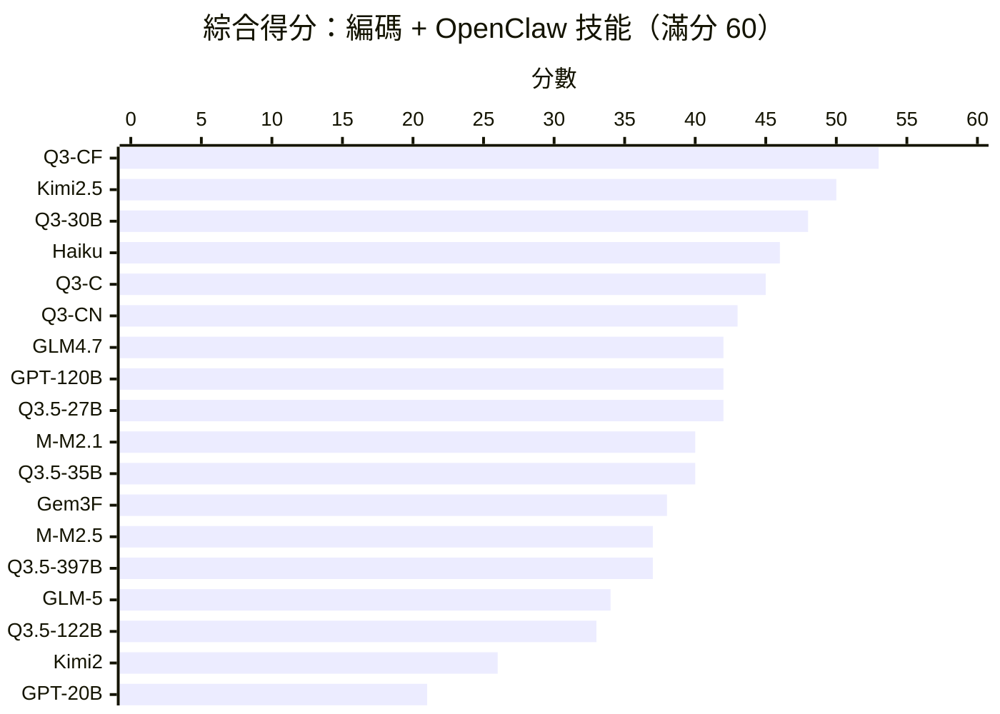
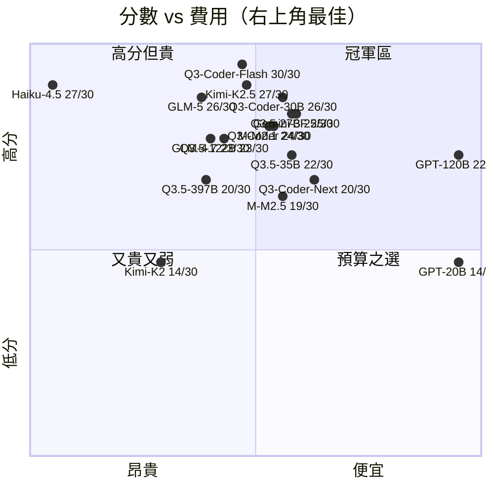
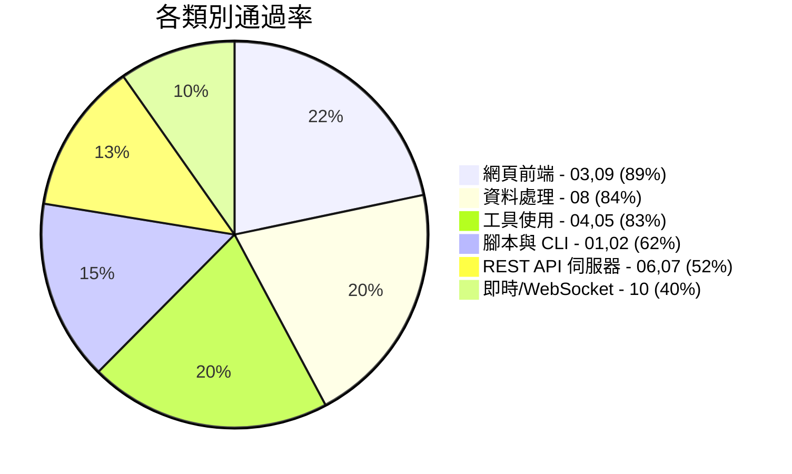

# Agentic Coding 基準測試

[English Version](README.md)

透過 OpenRouter Tool-Use API 自動化評估大型語言模型的 **Agentic Coding 能力** — 給模型一個模糊提示和 4 個工具（write_file、read_file、run_command、list_files），看它能否構建出可用的成品。

## 結果總覽（實驗 2 — agent_harness，2026 年 3 月）

### 綜合得分（第一組 + 第二組，滿分 60）



### 第一組 vs 第二組對照

| 排名 | 模型 | G1（編碼）| G2（OpenClaw）| 綜合 | 差異 |
|------|------|:---------:|:------------:|:----:|:----:|
| 1 | **qwen/qwen3-coder-flash** | 30 | 25 | **55** | -5 |
| 2 | moonshotai/kimi-k2.5 | 27 | 23 | **50** | -4 |
| 3 | qwen/qwen3-coder-30b | 26 | 23 | **49** | -3 |
| 4 | qwen/qwen3-coder | 24 | 24 | **48** | 0 |
| 4 | anthropic/claude-haiku-4.5 | 27 | 21 | **48** | -6 |
| 6 | qwen/qwen3-coder-next | 20 | 25 | **45** | +5 |
| 6 | openai/gpt-oss-120b | 22 | 23 | **45** | +1 |
| 6 | qwen/qwen3.5-27b | 25 | 20 | **45** | -5 |
| 9 | minimax/minimax-m2.1 | 24 | 19 | **43** | -5 |
| 9 | qwen/qwen3.5-35b | 22 | 21 | **43** | -1 |
| 11 | z-ai/glm-4.7 | 23 | 19 | **42** | -4 |
| 12 | minimax/minimax-m2.5 | 19 | 19 | **38** | 0 |
| 12 | google/gemini-3-flash | 25 | 13 | **38** | -12 |
| 14 | qwen/qwen3.5-397b | 20 | 17 | **37** | -3 |
| 15 | z-ai/glm-5 | 26 | 8 | **34** | -18 |
| 16 | qwen/qwen3.5-122b | 23 | 10 | **33** | -13 |
| 17 | moonshotai/kimi-k2 | 14 | 13 | **27** | -1 |
| 18 | openai/gpt-oss-20b | 14 | 7 | **21** | -7 |

> **差異** = G2 - G1 分數差。負值代表模型在 OpenClaw 技能上比純編碼弱。**qwen3-coder-next（+5）和 gpt-oss-120b（+1）是唯一在 OpenClaw 上得分更高的模型。**

## 第一組：Python 基礎

> 10 個測試，3 個難度等級。混合純程式碼生成與代理式工具使用任務。2026 年 3 月。

### 排行榜

| 排名 | 模型 | 開源 | 01 | 02 | 03 | 04 | 05 | 06 | 07 | 08 | 09 | 10 | 總分 | 時間 | Token 數 | Tok/分 |
|------|------|:----:|----|----|----|----|----|----|----|----|----|----|------|------|---------|--------|
| 1 | **qwen/qwen3-coder-flash** | | 3 | 3 | 3 | 3 | 3 | 3 | 3 | 3 | 3 | 3 | **30/30** | 20m51s | 780K | 26.0K |
| 2 | moonshotai/kimi-k2.5 | | 3 | 3 | 3 | 3 | 3 | 3 | 2 | 3 | 3 | 1 | **27/30** | 15m26s | 258K | 9.6K |
| 3 | anthropic/claude-haiku-4.5 | | 1 | 3 | 3 | 3 | 3 | 3 | 3 | 3 | 3 | 2 | **27/30** | 22m34s | 1955K | 72.4K |
| 4 | z-ai/glm-5 | | 2 | 3 | 3 | 3 | 3 | 3 | 2 | 3 | 3 | 1 | **26/30** | 27m03s | 354K | 13.6K |
| 5 | qwen/qwen3-coder-30b | OSS | 2 | 2 | 3 | 3 | 3 | 3 | 3 | 3 | 3 | 1 | **26/30** | 24m51s | 1420K | 54.6K |
| 6 | google/gemini-3-flash | | 1 | 3 | 3 | 3 | 3 | 3 | 0 | 3 | 3 | 3 | **25/30** | 4m42s | 107K | 4.3K |
| 7 | qwen/qwen3.5-27b | OSS | 1 | 3 | 3 | 3 | 3 | 3 | 2 | 3 | 3 | 1 | **25/30** | 11m01s | 262K | 10.5K |
| 8 | minimax/minimax-m2.1 | | 2 | 3 | 3 | 3 | 3 | 3 | 0 | 3 | 3 | 1 | **24/30** | 23m44s | 368K | 15.3K |
| 9 | qwen/qwen3-coder (480B) | OSS | 1 | 3 | 3 | 3 | 3 | 3 | 1 | 3 | 3 | 1 | **24/30** | 10m19s | 469K | 19.5K |
| 10 | z-ai/glm-4.7 | OSS | 1 | 3 | 3 | 3 | 3 | 3 | 0 | 3 | 3 | 1 | **23/30** | 14m46s | 570K | 24.8K |
| 11 | qwen/qwen3.5-122b | OSS | 1 | 3 | 3 | 3 | 3 | 3 | 0 | 3 | 3 | 1 | **23/30** | 15m25s | 579K | 25.2K |
| 12 | openai/gpt-oss-120b | OSS | 2 | 3 | 3 | 3 | 3 | 0 | 0 | 3 | 3 | 2 | **22/30** | 4m33s | 153K | 7.0K |
| 12 | qwen/qwen3.5-35b | OSS | 3 | 3 | 3 | 1 | 3 | 0 | 2 | 3 | 3 | 1 | **22/30** | 15m58s | 355K | 16.1K |
| 14 | qwen/qwen3-coder-next | OSS | 1 | 3 | 3 | 3 | 3 | 0 | 0 | 3 | 3 | 1 | **20/30** | 16m23s | 467K | 23.4K |
| 14 | qwen/qwen3.5-397b | OSS | 1 | 3 | 3 | 3 | 3 | 0 | 0 | 3 | 3 | 1 | **20/30** | 19m20s | 546K | 27.3K |
| 16 | minimax/minimax-m2.5 | | 1 | 0 | 3 | 3 | 1 | 3 | 1 | 3 | 3 | 1 | **19/30** | 45m05s | 300K | 15.8K |
| 17 | openai/gpt-oss-20b | OSS | 0 | 3 | 3 | 1 | 0 | 0 | 0 | 3 | 3 | 1 | **14/30** | 19m47s | 142K | 10.1K |
| 17 | moonshotai/kimi-k2 | | 1 | 3 | 0 | 1 | 3 | 3 | 3 | 0 | 0 | 0 | **14/30** | 42m04s | 808K | 57.7K |

> **開源** = OSS 表示開放權重模型，可從 HuggingFace 下載。空白 = 閉源/僅限 API 使用。
>
> **測試範圍說明：** 本基準測試聚焦於適合 Agentic Coding 的輕量級與中階模型。旗艦模型如 Claude Opus/Sonnet 4、GPT-4.5、Gemini 2.5 Pro 等未納入測試 — 這些模型預期表現優異，但費用顯著較高，與本基準測試著重的高性價比 Agentic Coding 場景較不相關。
>
> Tok/分 = 每得一分所需 Token 數（越低越高效）。

### 逐項測試結果

🟩 = 3/3 通過　🟨 = 部分通過　🟥 = 0/3 失敗

| 測試 | 難度 | Q3-CF | Kimi2.5 | Haiku | GLM-5 | Q3-30B | Gem3F | Q3.5-27B | M2.1 | Q3-C | GLM4.7 | Q3.5-122B | GPT-120 | Q3.5-35B | Q3-CN | Q3.5-397B | M2.5 | GPT-20 | Kimi2 |
|------|------|:-----:|:-------:|:-----:|:-----:|:------:|:-----:|:--------:|:----:|:----:|:------:|:---------:|:-------:|:--------:|:-----:|:---------:|:----:|:------:|:-----:|
| 01 CSV→JSON | 簡單 | 🟩 | 🟩 | 🟨 | 🟨 | 🟨 | 🟨 | 🟨 | 🟨 | 🟨 | 🟨 | 🟨 | 🟨 | 🟩 | 🟨 | 🟨 | 🟨 | 🟥 | 🟨 |
| 02 系統資訊 | 簡單 | 🟩 | 🟩 | 🟩 | 🟩 | 🟨 | 🟩 | 🟩 | 🟩 | 🟩 | 🟩 | 🟩 | 🟩 | 🟩 | 🟩 | 🟩 | 🟥 | 🟩 | 🟩 |
| 03 計算機 | 簡單 | 🟩 | 🟩 | 🟩 | 🟩 | 🟩 | 🟩 | 🟩 | 🟩 | 🟩 | 🟩 | 🟩 | 🟩 | 🟩 | 🟩 | 🟩 | 🟩 | 🟩 | 🟥 |
| 04 修 Bug | 中等 | 🟩 | 🟩 | 🟩 | 🟩 | 🟩 | 🟩 | 🟩 | 🟩 | 🟩 | 🟩 | 🟩 | 🟩 | 🟨 | 🟩 | 🟩 | 🟩 | 🟨 | 🟨 |
| 05 通過測試 | 中等 | 🟩 | 🟩 | 🟩 | 🟩 | 🟩 | 🟩 | 🟩 | 🟩 | 🟩 | 🟩 | 🟩 | 🟩 | 🟩 | 🟩 | 🟩 | 🟨 | 🟥 | 🟩 |
| 06 費用 API | 中等 | 🟩 | 🟩 | 🟩 | 🟩 | 🟩 | 🟩 | 🟩 | 🟩 | 🟩 | 🟩 | 🟩 | 🟥 | 🟥 | 🟥 | 🟥 | 🟩 | 🟥 | 🟩 |
| 07 短網址 | 中等 | 🟩 | 🟨 | 🟩 | 🟨 | 🟩 | 🟥 | 🟨 | 🟥 | 🟨 | 🟥 | 🟥 | 🟥 | 🟨 | 🟥 | 🟥 | 🟨 | 🟥 | 🟩 |
| 08 儀表板 | 困難 | 🟩 | 🟩 | 🟩 | 🟩 | 🟩 | 🟩 | 🟩 | 🟩 | 🟩 | 🟩 | 🟩 | 🟩 | 🟩 | 🟩 | 🟩 | 🟩 | 🟩 | 🟥 |
| 09 看板 | 困難 | 🟩 | 🟩 | 🟩 | 🟩 | 🟩 | 🟩 | 🟩 | 🟩 | 🟩 | 🟩 | 🟩 | 🟩 | 🟩 | 🟩 | 🟩 | 🟩 | 🟩 | 🟥 |
| 10 聊天（WS）| 困難 | 🟩 | 🟨 | 🟨 | 🟨 | 🟨 | 🟩 | 🟨 | 🟨 | 🟨 | 🟨 | 🟨 | 🟨 | 🟨 | 🟨 | 🟨 | 🟨 | 🟨 | 🟥 |

### 性價比象限圖

> 右上角 = 最佳（高分 + 低費用）。費用基於 OpenRouter 定價 x 實際 Token 消耗估算。



**冠軍區（右上角）：** Gemini 3 Flash（$0.09）、qwen3.5-27b（$0.10）和 qwen3-coder-30b（$0.11）以不到 $0.12 的費用達到 25-26/30 分。GPT-OSS-120b（$0.01）是最便宜且仍能得到 22+ 分的模型。

**高分但貴（左上角）：** Claude Haiku 得分 27/30 但費用 $2.58 — 比 Gemini Flash 貴 28 倍，卻只多 2 分。GLM-5 表現不錯但每次 $0.31。

**滿分之王：** qwen3-coder-flash（30/30）位於分界線上 — $0.18 不算最便宜，但它是唯一在所有測試中得滿分的模型。

### 各類別通過率



## 主要發現

### 1. Qwen3-Coder-Flash 達成滿分 30/30

唯一在所有測試中滿分的模型，包括即時 WebSocket 聊天。以 780K Token 總量，並非最高效但能完成一切任務。

### 2. 工具層介面影響巨大

從 opencode 切換到自製 agent harness（標準化 Tool-Use API）後，分數大幅提升：
- **GLM-5**：18/30 → 26/30（+44%）
- **Claude Haiku 4.5**：16/30 → 27/30（+69%）
- **Gemini 3 Flash**：15/30 → 25/30（+67%）

前一次實驗的「0 位元組工作區」問題（opencode 對許多模型無法寫入檔案）完全是工具層的 Bug，而非模型能力問題。

### 3. Qwen 3.5 系列：更大 ≠ 更好

| 模型 | 活躍參數 | 分數 |
|------|---------|------|
| qwen3.5-27b | 27B（密集） | **25/30** |
| qwen3.5-122b-a10b | 10B 活躍 | **23/30** |
| qwen3.5-35b-a3b | 3B 活躍 | **22/30** |
| qwen3.5-397b-a17b | 17B 活躍 | **20/30** |

密集 27B 模型優於所有 MoE 變體。397B 模型（17B 活躍）儘管是最大的模型，但得分最低 — 更多活躍參數在 MoE 路由增加工具使用任務開銷時並無幫助。

### 4. Token 效率相差 20 倍

| 模型 | 分數 | Token 數 | 每分 Token |
|------|------|---------|-----------|
| gemini-3-flash | 25/30 | 107K | **4.3K** |
| kimi-k2.5 | 27/30 | 258K | **9.6K** |
| claude-haiku-4.5 | 27/30 | 1955K | **72.4K** |

Gemini 3 Flash 在相似分數下，Token 消耗僅為 Claude Haiku 的 1/17。

### 5. 短網址（07）是最佳區分測試

僅 3 個模型獲得 3/3：qwen3-coder-flash、qwen3-coder-30b 和 claude-haiku-4.5。重定向檢查要求模型正確實作 HTTP 3xx 重定向 — 這是一項精細的網頁開發技能。

### 6. 網頁伺服器測試不再全面失敗

實驗 1 中，測試 06 和 09 在所有模型中得分為 **0**。修復 validate.sh 的連接埠衝突問題（macOS AirPlay 佔用 5000 埠）和新增看板 HTML 備援方案後，大多數模型現在都能通過這些測試。之前的失敗是環境問題，非模型能力問題。

## 架構

### Agent Harness

基準測試使用自製 **agent harness**（`agent_harness.py`），而非特定廠商的 Agentic 工具。確保每個模型獲得相同的標準化介面：

```
                    ┌─────────────────────┐
                    │   agent_harness.py  │
                    │                     │
   prompt.md ──────►│  OpenRouter API     │
                    │  (tool-use loop)    │
                    │                     │
                    │  4 個工具：          │
                    │  - write_file       │
                    │  - read_file        │──────► workspace/
                    │  - run_command      │
                    │  - list_files       │
                    │                     │
                    │  JSON 指標 ─────────│──────► stdout
                    │  工具日誌 ──────────│──────► stderr
                    └─────────────────────┘
```

**為什麼不用 opencode/cursor 等工具？** 廠商工具會引入偏差 — 恰好與特定工具介面相容的模型會獲得更高分，而非反映真實編碼能力。我們的 harness 透過 OpenRouter 標準化 API 給每個模型完全相同的工具。

### 使用方式

```bash
# 前置需求：Python 3、requests 函式庫、OpenRouter API 金鑰

# 設定
git clone <此儲存庫>
cd agentic_testing
echo 'OPENROUTER_API_KEY="sk-or-..."' > .env
pip install requests

# 執行基準測試
./run_benchmark.sh                                    # models.txt 中的所有模型
./run_benchmark.sh "openrouter/z-ai/glm-5"           # 單一模型
OPENCODE_TESTS=06_expense_tracker_api ./run_benchmark.sh  # 特定測試
OPENCODE_TIMEOUT=600 ./run_benchmark.sh               # 自訂逾時
```

## 測試分組

| 分組 | 語言 | 測試數 | 狀態 |
|------|------|--------|------|
| [第一組：Python 基礎](groups/group1_python_fundamentals/) | Python | 10 | 完成 |
| [第二組：OpenClaw 技能](groups/group2_openclaw_skills/) | Python/Bash | 10 | 完成 |

### 第一組測試項目

| # | 測試 | 類型 | 難度 | 測試重點 |
|---|------|------|------|---------|
| 01 | CSV 轉 JSON | 腳本 | 簡單 | 基本程式碼生成 |
| 02 | 系統感知腳本 | 腳本 | 簡單 | 必須使用 bash 偵測作業系統、Python 版本、硬體資訊 |
| 03 | 計算機網頁應用 | 網頁 | 簡單 | 生成可運行的 HTML/JS |
| 04 | 修復現有程式碼 | 除錯 | 中等 | 必須讀取檔案、理解 Bug、修復問題 |
| 05 | 通過測試 | TDD | 中等 | 必須執行 pytest、根據失敗結果迭代直到全部通過 |
| 06 | 費用追蹤 API | 網頁 | 中等 | 構建可運行的 REST API 伺服器 |
| 07 | 短網址服務 | 網頁 | 中等 | 構建具有重定向功能的網頁應用 |
| 08 | API 資料儀表板 | 腳本 | 困難 | 必須安裝 pip 套件、呼叫即時 API、生成 HTML |
| 09 | 看板任務板 | 網頁 | 困難 | 構建具有拖放功能和持久化的網頁應用 |
| 10 | 即時聊天 | 網頁 | 困難 | 構建基於 WebSocket 的多人聊天應用 |

### 第二組測試項目

| # | 測試 | 類型 | 難度 | 測試重點 |
|---|------|------|------|---------|
| 01 | 番茄鐘計時器 | 技能 | 簡單 | 基本 SKILL.md 結構與 YAML frontmatter |
| 02 | 修復損壞技能 | 除錯 | 簡單 | 修復格式錯誤的 SKILL.md 和有 Bug 的腳本 |
| 03 | 書籤管理器 | 技能 | 簡單 | 帶有附屬腳本和 JSON 持久化的技能 |
| 04 | 天氣查詢 | 技能 | 中等 | 在 frontmatter 中宣告環境變數和二進位檔需求 |
| 05 | GitHub PR 摘要 | 技能 | 中等 | 宣告多個依賴項（gh + GITHUB_TOKEN）|
| 06 | 檔案整理器 | 技能 | 中等 | 附屬腳本實際執行並整理檔案 |
| 07 | HackerNews 摘要 | 技能 | 困難 | 取得 API 資料，生成 HTML 報告 |
| 08 | Webhook 接收器 | 技能 | 困難 | 構建記錄 POST 請求的 HTTP 伺服器 |
| 09 | 資料管線 | 技能 | 困難 | 多步驟管線：讀取、過濾、報告 |
| 10 | 智慧家庭控制器 | 技能 | 困難 | 配置驅動的狀態管理與命令解析 |

## 評分方法

每個測試 3 項檢查 x 1 分 = 3 分。每組總分：30 分。

| 檢查項目 | 驗證內容 |
|---------|---------|
| 無錯誤執行 | 腳本/伺服器執行時不會崩潰 |
| 核心功能 | 主要功能如預期運作 |
| 邊界情況 | 能處理非典型輸入和特殊條件 |

## 實驗記錄

| 實驗 | 日期 | 工具 | 模型數 | 主要發現 |
|------|------|------|--------|---------|
| 1 | 2026-03-18 | opencode | 12 | 許多模型因工具不相容而產生 0 位元組輸出 |
| **2** | **2026-03-19** | **agent_harness** | **18** | **公平比較 — qwen3-coder-flash 達成滿分 30/30** |

## 授權

MIT
