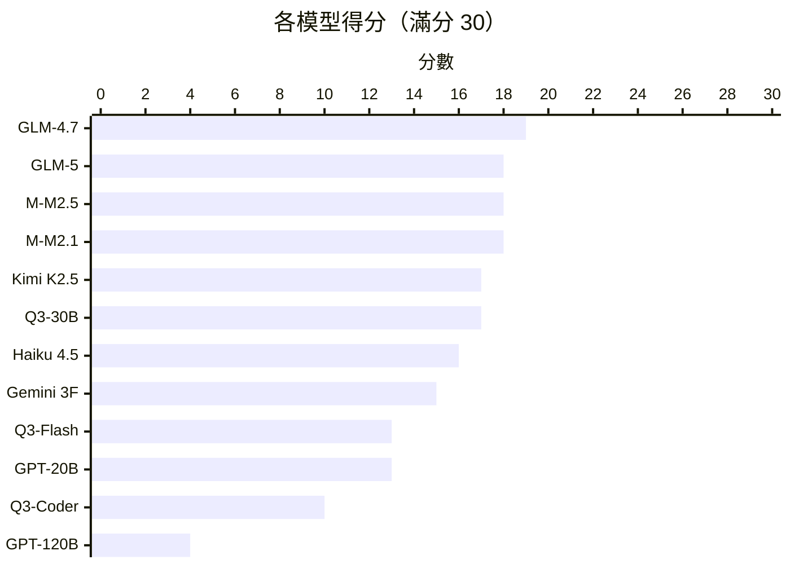
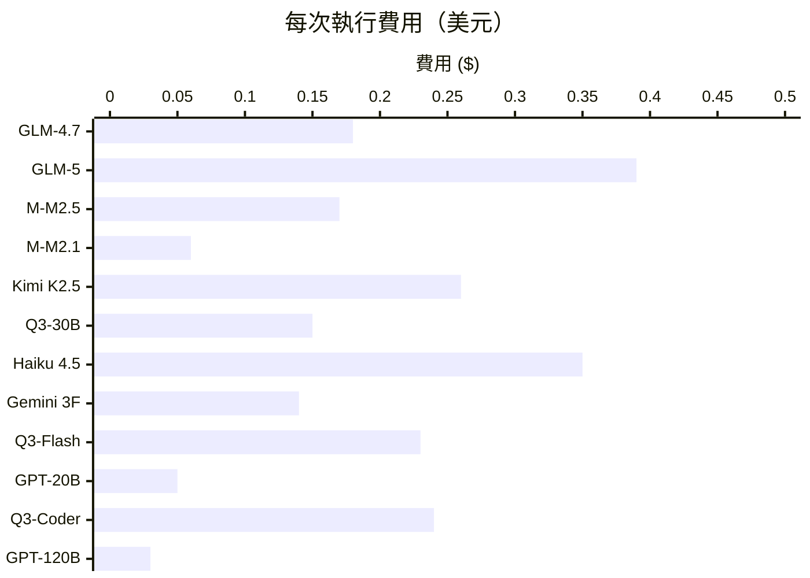
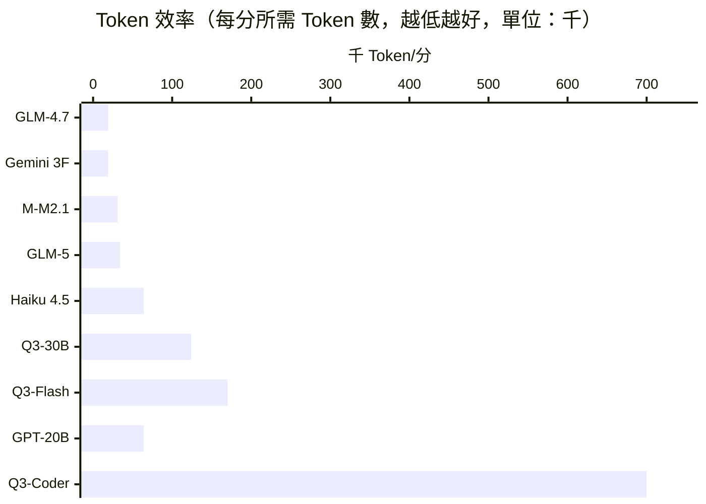
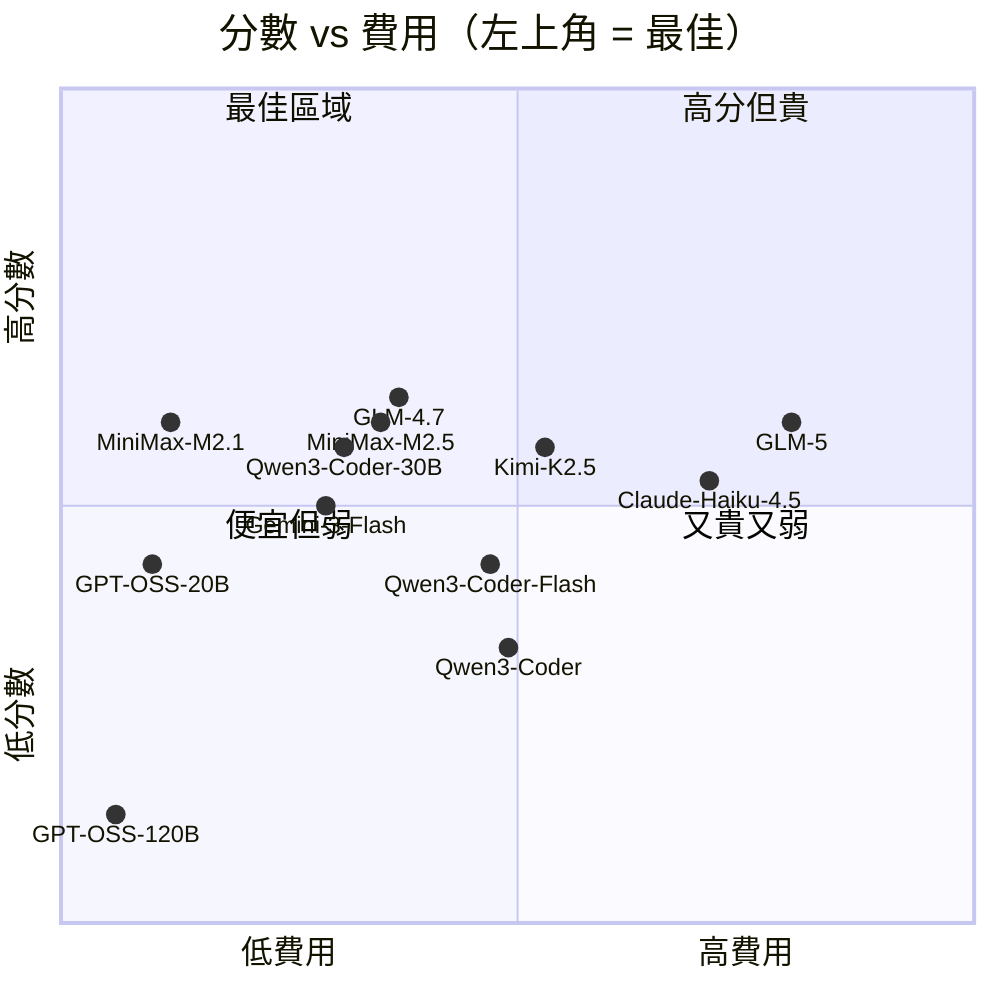
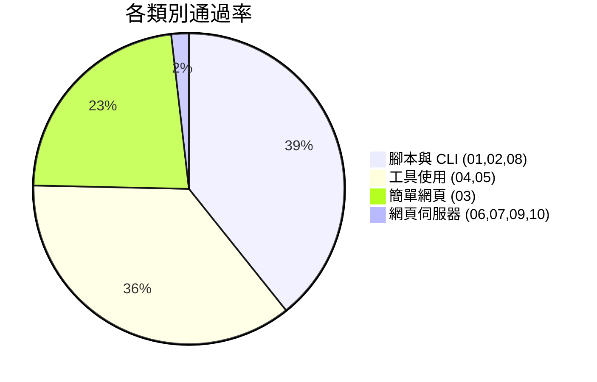

# Agentic Vibe Coding 基準測試

[English Version](README.md)

透過 [OpenCode](https://opencode.ai/) 自動化評估大型語言模型的 **Agentic Vibe Coding 能力** — 給模型一個模糊提示，看它能否構建出可用的成品。

## 結果總覽







## 第一組：Python 基礎

> 10 個測試，3 個難度等級。混合純程式碼生成與代理式工具使用任務。2026 年 3 月。

### 排行榜

| 排名 | 模型 | 分數 | 費用 | 時間 | Token 數 | 每分費用 |
|------|------|------|------|------|---------|---------|
| 🥇 | z-ai/glm-4.7 | **19/30** | $0.18 | 12 分鐘 | 357K | $0.009 |
| 🥈 | z-ai/glm-5 | 18/30 | $0.39 | 17 分鐘 | 610K | $0.022 |
| 🥈 | minimax/minimax-m2.5 | 18/30 | $0.17 | 25 分鐘 | 1.46M | $0.009 |
| 🥈 | minimax/minimax-m2.1 | 18/30 | $0.06 | 11 分鐘 | 555K | $0.003 |
| 5 | moonshotai/kimi-k2.5 | 17/30 | $0.26 | 11 分鐘 | 868K | $0.015 |
| 5 | qwen/qwen3-coder-30b | 17/30 | $0.15 | 32 分鐘 | 2.1M | $0.009 |
| 7 | anthropic/claude-haiku-4.5 | 16/30 | $0.35 | 13 分鐘 | 1.03M | $0.022 |
| 8 | google/gemini-3-flash | 15/30 | $0.14 | 5 分鐘 | 287K | $0.009 |
| 9 | qwen/qwen3-coder-flash | 13/30 | $0.23 | 14 分鐘 | 2.2M | $0.018 |
| 9 | openai/gpt-oss-20b | 13/30 | $0.05 | 13 分鐘 | 838K | $0.004 |
| 11 | qwen/qwen3-coder | 10/30 | $0.24 | 32 分鐘 | 7.0M | $0.024 |
| 12 | openai/gpt-oss-120b | 4/30 | $0.03 | 2 分鐘 | 388K | $0.008 |

### 逐項測試結果

🟩 = 3/3 通過　🟨 = 部分通過　🟥 = 0/3 失敗

| 測試 | 難度 | 工具 | GLM-4.7 | GLM-5 | M2.5 | M2.1 | Kimi | Q3-30B | Haiku | Gemini | Q3-Fl | GPT-20 | Q3-C | GPT-120 |
|------|------|------|:-------:|:-----:|:----:|:----:|:----:|:------:|:-----:|:------:|:-----:|:------:|:----:|:-------:|
| 01 CSV→JSON | 簡單 | 生成 | 🟩 | 🟩 | 🟨 | 🟩 | 🟨 | 🟨 | 🟩 | 🟩 | 🟥 | 🟥 | 🟨 | 🟥 |
| 02 系統資訊 | 簡單 | Bash | 🟩 | 🟩 | 🟩 | 🟩 | 🟩 | 🟩 | 🟩 | 🟩 | 🟩 | 🟩 | 🟩 | 🟩 |
| 03 計算機 | 簡單 | 網頁 | 🟩 | 🟩 | 🟩 | 🟩 | 🟩 | 🟩 | 🟥 | 🟥 | 🟥 | 🟩 | 🟥 | 🟥 |
| 04 修 Bug | 中等 | 讀檔 | 🟩 | 🟩 | 🟩 | 🟨 | 🟩 | 🟩 | 🟩 | 🟩 | 🟩 | 🟨 | 🟨 | 🟨 |
| 05 通過測試 | 中等 | 迭代 | 🟩 | 🟩 | 🟩 | 🟩 | 🟩 | 🟨 | 🟩 | 🟩 | 🟩 | 🟩 | 🟨 | 🟥 |
| 06 費用 API | 中等 | 伺服器 | 🟥 | 🟥 | 🟥 | 🟥 | 🟥 | 🟥 | 🟥 | 🟥 | 🟥 | 🟥 | 🟥 | 🟥 |
| 07 短網址 | 中等 | 伺服器 | 🟥 | 🟥 | 🟥 | 🟥 | 🟥 | 🟨 | 🟥 | 🟥 | 🟥 | 🟥 | 🟥 | 🟥 |
| 08 儀表板 | 困難 | 安裝 | 🟩 | 🟩 | 🟩 | 🟩 | 🟩 | 🟩 | 🟩 | 🟩 | 🟩 | 🟩 | 🟩 | 🟥 |
| 09 看板 | 困難 | 伺服器 | 🟥 | 🟥 | 🟥 | 🟥 | 🟥 | 🟥 | 🟥 | 🟥 | 🟥 | 🟥 | 🟥 | 🟥 |
| 10 聊天 | 困難 | WS | 🟨 | 🟥 | 🟨 | 🟨 | 🟨 | 🟨 | 🟨 | 🟥 | 🟨 | 🟥 | 🟨 | 🟥 |

### 分數與費用對照





## 主要發現

### 1. 開源模型勝過商業模型

GLM-4.7（$0.18）和 MiniMax M2.1（$0.06）得分均高於 Claude Haiku 4.5（$0.35）和 Gemini 3 Flash（$0.14）。在 Agentic Vibe Coding 領域，開源模型更勝一籌。

### 2. 網頁伺服器測試全面失敗

測試 06 和 09 在所有 12 個模型中得分為 **0**。無論開源或商業模型，都無法透過 Agentic Coding 工具可靠地構建可運行的網頁伺服器。

### 3. 更大 ≠ 更好

GPT-OSS-20B 大幅超越 120B。MiniMax M2.1 以三分之一的費用匹配 M2.5。GLM-4.7 超越 GLM-5。Qwen3-Coder-30B 遠超完整版 Qwen3-Coder。

### 4. Token 效率最為關鍵

Qwen3-Coder 每分消耗 700K Token（陷入迴圈）。GLM-4.7 僅用 19K — 相差 37 倍。

## 測試分組

基準測試按分組組織。每個分組測試 Agentic Coding 能力的不同面向。

| 分組 | 語言 | 測試數 | 狀態 |
|------|------|--------|------|
| [第一組：Python 基礎](groups/group1_python_fundamentals/) | Python | 10 | 完成 |
| 第二組：*即將推出* | — | — | 計劃中 |
| 第三組：*即將推出* | — | — | 計劃中 |

### 第一組測試項目

| # | 測試 | 類型 | 難度 | 測試重點 |
|---|------|------|------|---------|
| 01 | CSV 轉 JSON | 腳本 | 簡單 | 基本程式碼生成 |
| 02 | 系統感知腳本 | 腳本 | 簡單 | 必須使用 bash 偵測作業系統、Python 版本、硬體資訊 |
| 03 | 計算機網頁應用 | 網頁 | 簡單 | 生成可運行的 HTML/JS |
| 04 | 修復現有程式碼 | 除錯 | 中等 | 必須讀取檔案、理解 Bug、修復問題 |
| 05 | 通過測試 | TDD | 中等 | 必須執行 pytest、根據失敗結果迭代直到全部通過 |
| 06 | 費用追蹤 API | 網頁 | 中等 | 構建可運行的 REST API 伺服器 |
| 07 | 短網址服務 | 網頁 | 中等 | 構建具有重定向功能的網頁應用 |
| 08 | API 資料儀表板 | 腳本 | 困難 | 必須安裝 pip 套件、呼叫即時 API、生成 HTML |
| 09 | 看板任務板 | 網頁 | 困難 | 構建具有拖放功能和持久化的網頁應用 |
| 10 | 即時聊天 | 網頁 | 困難 | 構建基於 WebSocket 的多人聊天應用 |

## 使用方式

### 前置需求

- [OpenCode](https://opencode.ai/)（`brew install opencode`）
- [OpenRouter](https://openrouter.ai/) API 金鑰
- Python 3.x

### 設定

```bash
git clone <此儲存庫>
cd agentic_testing
echo 'OPENROUTER_API_KEY="sk-or-..."' > .env
```

### 執行基準測試

```bash
# 單一模型
./run_benchmark.sh "openrouter/z-ai/glm-4.7"

# models.txt 中的所有模型
./run_benchmark.sh

# 僅執行特定分組
OPENCODE_GROUP=group1_python_fundamentals ./run_benchmark.sh

# 自訂逾時（10 分鐘）
OPENCODE_TIMEOUT=600 ./run_benchmark.sh
```

## 專案結構

```
agentic_testing/
├── .env                          # API 金鑰（不提交）
├── models.txt                    # 要測試的模型
├── run_benchmark.sh              # 自動化執行器
├── groups/
│   ├── group1_python_fundamentals/
│   │   ├── 01_csv_to_json/
│   │   │   ├── prompt.md         # Vibe Coding 提示詞
│   │   │   ├── validate.sh       # 3 項自動檢查
│   │   │   ├── fixtures/         # 測試資料
│   │   │   └── workspace/        # 模型輸出
│   │   └── ...
│   └── group2_<未來>/
└── results/
    └── experiments/              # 實驗結果
```

## 新增測試分組

在 `groups/` 下建立新目錄，每個測試需包含：
- `prompt.md` — 自然、模糊的提示詞
- `validate.sh` — 輸出剛好 3 行：`TEST_ID|check_name|PASS` 或 `FAIL`
- `fixtures/` — 選用測試資料
- `setup.sh` — 選用前置設定

## 評分方法

每個測試 3 項檢查 x 1 分。追蹤指標：費用、時間、Token 數。

| 檢查項目 | 驗證內容 |
|---------|---------|
| 無錯誤執行 | 腳本/伺服器執行時不會崩潰 |
| 核心功能 | 主要功能如預期運作 |
| 邊界情況 | 能處理非典型輸入和特殊條件 |

## 限制

- 網頁伺服器測試可能反映 OpenCode 限制而非純粹模型能力
- 單次執行；需多次執行才有統計顯著性
- 目前僅 Python（更多語言規劃中）

## 授權

MIT
