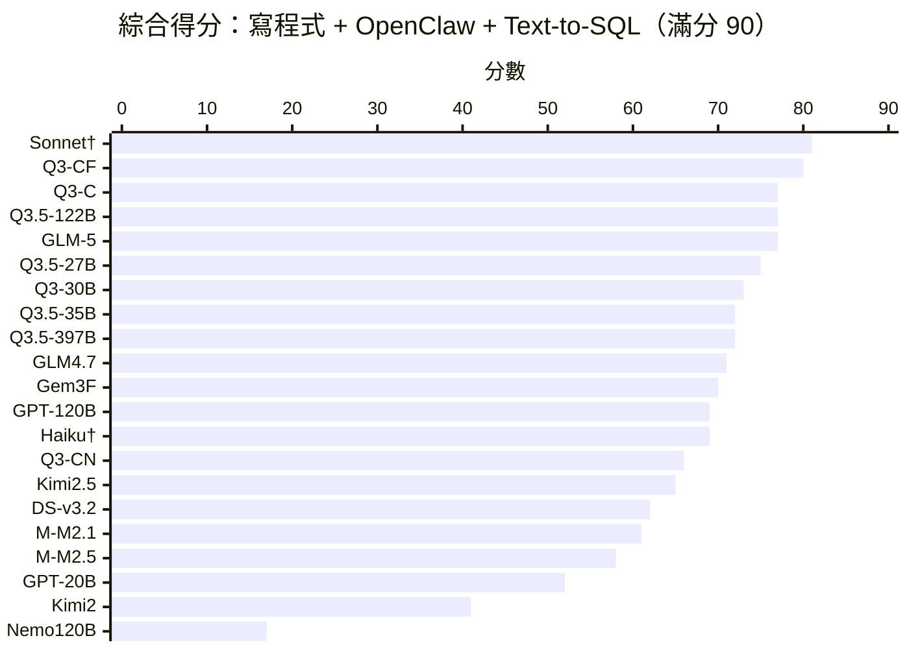
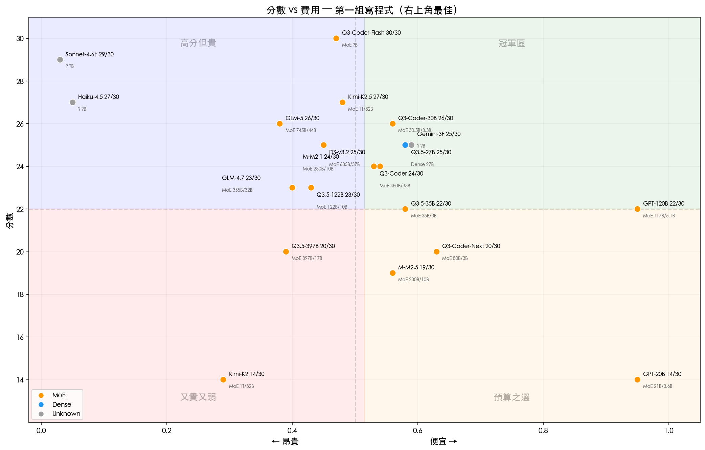
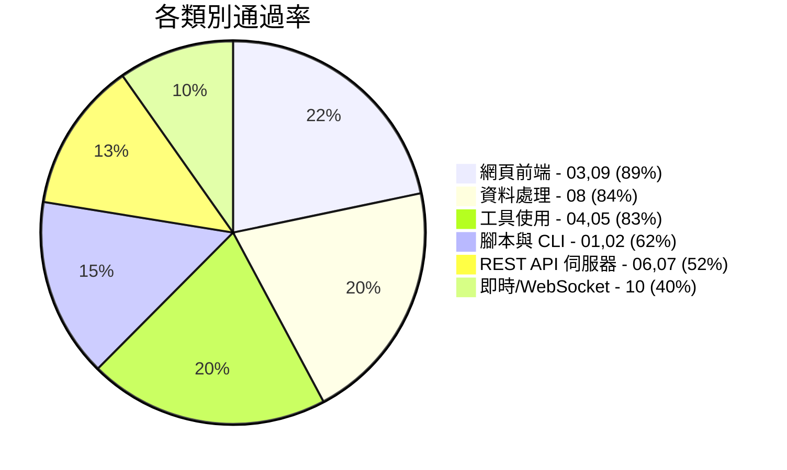

# Agentic Coding 基準測試

[English Version](README.md)

[](https://www.largitdata.com/zh-tw/blog_detail/20260320)

透過 OpenRouter Tool-Use API 自動化評估大型語言模型的 **Agentic Coding 能力** — 給模型一個模糊提示和 4 個工具（write_file、read_file、run_command、list_files），看它能否構建出可用的成品。

> **為什麼選這些模型？** 本基準測試旨在找出 **性價比最高** 的 Agentic Coding 模型。我們刻意聚焦於開發者實際負擔得起大規模使用的輕量級與中階模型。旗艦模型如 Claude Opus/Sonnet 4、GPT-4.5、Gemini 2.5 Pro 等未納入 — 它們可能表現優異，但每次執行費用高出 10-100 倍，這違背了測試的初衷。**如果您希望測試特定模型，請 [開 Issue](https://github.com/ywchiu/local_agentic_llm/issues)！**

---

<details open>
<summary><h2>全部結果（G1 + G2 + G3 綜合）</h2></summary>

### 綜合得分（滿分 90）



### 排行榜

| 排名 | 模型 | 開源 | 架構 | 參數 | 活躍 | G1 | G2 | G3 | 綜合 |
|------|------|:----:|:----:|-----:|-----:|:--:|:--:|:--:|:----:|
| 1 | **anthropic/claude-sonnet-4.6** (Claude Code) | | ? | ? | ? | 29 | 26 | 26 | **81** |
| 2 | qwen/qwen3-coder-flash (OpenRouter) | | MoE | ? | ? | 30 | 25 | 25 | **80** |
| 3 | qwen/qwen3-coder | OSS | MoE | 480B | 35B | 24 | 24 | 29 | **77** |
| 2 | qwen/qwen3.5-122b | OSS | MoE | 122B | 10B | 23 | 27 | 27 | **77** |
| 2 | z-ai/glm-5 | OSS | MoE | 745B | 44B | 26 | 24 | 27 | **77** |
| 5 | qwen/qwen3.5-27b | OSS | Dense | 27B | 27B | 25 | 26 | 24 | **75** |
| 6 | qwen/qwen3-coder-30b | OSS | MoE | 30.5B | 3.3B | 26 | 23 | 24 | **73** |
| 7 | qwen/qwen3.5-35b | OSS | MoE | 35B | 3B | 22 | 27 | 23 | **72** |
| 7 | qwen/qwen3.5-397b | OSS | MoE | 397B | 17B | 20 | 26 | 26 | **72** |
| 9 | z-ai/glm-4.7 | OSS | MoE | 355B | 32B | 23 | 23 | 25 | **71** |
| 10 | google/gemini-3-flash | | ? | ? | ? | 25 | 20 | 25 | **70** |
| 11 | openai/gpt-oss-120b | OSS | MoE | 117B | 5.1B | 22 | 23 | 24 | **69** |
| 13 | anthropic/claude-haiku-4.5† | | ? | ? | ? | 30 | 20 | 19 | **69** |
| 14 | qwen/qwen3-coder-next | OSS | MoE | 80B | 3B | 20 | 24 | 22 | **66** |
| 15 | moonshotai/kimi-k2.5 | OSS | MoE | 1T | 32B | 27 | 23 | 15 | **65** |
| 16 | deepseek/deepseek-v3.2 | OSS | MoE | 685B | 37B | 25 | 21 | 16 | **62** |
| 17 | minimax/minimax-m2.1 | OSS | MoE | 230B | 10B | 24 | 19 | 18 | **61** |
| 18 | minimax/minimax-m2.5 | OSS | MoE | 230B | 10B | 19 | 19 | 20 | **58** |
| 19 | openai/gpt-oss-20b | OSS | MoE | 21B | 3.6B | 14 | 23 | 15 | **52** |
| 20 | moonshotai/kimi-k2 | OSS | MoE | 1T | 32B | 14 | 13 | 14 | **41** |
| 21 | nvidia/nemotron-3-super | OSS | MoE | 120B | 12B | 5 | 12 | 0 | **17** |

> **開源** = OSS（HuggingFace 開放權重）。**架構** = Dense 或 MoE。G1 = Python 基礎、G2 = OpenClaw 技能、G3 = Text-to-SQL。共 21 個模型，2026 年 3 月。**†** Claude Sonnet 透過 Claude Code（原生 API）測試；其他模型均透過 OpenRouter 測試。
>
> **G2 分數於 2026-03-21 更新：**驗證腳本已修正，接受將 SKILL.md 放在子目錄中。最大改善：**qwen3.5-122b**（+17）、**gpt-oss-20b**（+16）、**GLM-5**（+16）。
>
> **G3 分數於 2026-03-22 更新：**驗證腳本已修正，優先選擇 `text_to_sql.py` 而非輔助腳本（test/setup 檔案）。

### 性價比象限圖（第一組）

> 右上角 = 最佳性價比（高分 + 低費用）。費用基於 OpenRouter 定價 x 實際 Token 消耗估算。



**最佳性價比推薦：**
- **Gemini 3 Flash**（25/30，~$0.09/次）和 **qwen3.5-27b**（25/30，~$0.10/次）— 最佳分數費用比
- **GPT-OSS-120b**（22/30，~$0.01/次）— 最便宜且仍有不錯表現
- **qwen3-coder-flash**（30/30，~$0.18/次）— 滿分，費用適中
- **Claude Haiku**（27/30，~$2.58/次）— 表現強但比 Gemini Flash 貴 28 倍，卻只多 2 分

### 主要發現

1. **qwen3-coder-flash 綜合領先（80/90）** — 三個分組均表現穩定
2. **三方並列第二（77/90）** — qwen3-coder（G3 冠軍 29/30）、qwen3.5-122b、GLM-5
3. **Text-to-SQL 重新洗牌排名** — kimi-k2.5 因 G3 工具呼叫不穩定從前三跌至第 13 名；GLM-5 憑藉 G3 強勁表現（27/30）躍升
4. **驗證品質至關重要** — 兩個驗證器 Bug（G2 子目錄偵測、G3 腳本選擇）人為壓低分數；修正後揭示了模型的真實能力
5. **開源主導** — 20 個模型中有 17 個是開源的；僅 qwen3-coder-flash、Claude Haiku 和 Gemini Flash 為閉源

### Claude 模型：OpenRouter vs 原生 API（Claude Code）

我們使用 **Claude Code 子代理**（Anthropic 原生 tool-use API）重新測試了 Claude Sonnet 4.6 和 Haiku 4.5，而非透過 OpenRouter。結果顯示顯著的效能差距：

| 模型 | OpenRouter | Claude Code | 差異 |
|------|:---------:|:-----------:|:----:|
| **Sonnet 4.6** | 71/90 | **81/90** | **+10** |
| **Haiku 4.5** | 68/90 | **69/90** | +1 |

**Sonnet 4.6 透過 Claude Code 達到 81/90 — 基準測試中的最高分**，超越 qwen3-coder-flash（80/90）。Haiku 透過原生 API 在 G1 達到**滿分 30/30**（OpenRouter 為 27/30）。

**為什麼有差距？** 本基準測試透過 OpenRouter 的 OpenAI 相容 tool-use API 路由所有模型。對於非 OpenAI 模型，這增加了一個轉譯層，可能降低工具使用品質。Claude 模型使用不同的原生 tool-use 格式（XML 式工具區塊 vs OpenAI 的 function-calling JSON），因此轉譯產生了摩擦 — 參數格式錯誤、遺漏工具呼叫、檔案放置不當。透過原生 API 測試時，Claude 模型表現明顯更好。

**對排行榜的影響：** OpenRouter 分數代表所有模型使用相同 API 格式的公平競爭環境。Claude Code 分數則展示這些模型在原生工具環境下的真實能力。其他模型（Gemini、GPT 等）透過各自的原生 API 可能也會得分更高。本基準測試衡量的是**透過 OpenRouter 的工具使用能力**，而非模型的原始能力 — 解讀結果時請留意這一點。

</details>

---

<details>
<summary><h2>實驗 1：第一組 — Python 基礎</h2></summary>

> 10 個測試，3 個難度等級。混合純程式碼生成與代理式工具使用任務。
> 18 個模型透過 agent_harness 測試。2026 年 3 月。

### 排行榜

| 排名 | 模型 | 開源 | 01 | 02 | 03 | 04 | 05 | 06 | 07 | 08 | 09 | 10 | 總分 | 時間 | Token 數 | Tok/分 |
|------|------|:----:|----|----|----|----|----|----|----|----|----|----|------|------|---------|--------|
| 1 | **qwen/qwen3-coder-flash** | | 3 | 3 | 3 | 3 | 3 | 3 | 3 | 3 | 3 | 3 | **30/30** | 20m51s | 780K | 26.0K |
| 2 | moonshotai/kimi-k2.5 | OSS | 3 | 3 | 3 | 3 | 3 | 3 | 2 | 3 | 3 | 1 | **27/30** | 15m26s | 258K | 9.6K |
| 1 | anthropic/claude-haiku-4.5† | | 3 | 3 | 3 | 3 | 3 | 3 | 3 | 3 | 3 | 3 | **30/30** | — | — | — |
| 4 | z-ai/glm-5 | OSS | 2 | 3 | 3 | 3 | 3 | 3 | 2 | 3 | 3 | 1 | **26/30** | 27m03s | 354K | 13.6K |
| 5 | qwen/qwen3-coder-30b | OSS | 2 | 2 | 3 | 3 | 3 | 3 | 3 | 3 | 3 | 1 | **26/30** | 24m51s | 1420K | 54.6K |
| 6 | anthropic/claude-sonnet-4.6† | | 3 | 3 | 3 | 3 | 3 | 3 | 2 | 3 | 3 | 3 | **29/30** | — | — | — |
| 6 | google/gemini-3-flash | | 1 | 3 | 3 | 3 | 3 | 3 | 0 | 3 | 3 | 3 | **25/30** | 4m42s | 107K | 4.3K |
| 8 | qwen/qwen3.5-27b | OSS | 1 | 3 | 3 | 3 | 3 | 3 | 2 | 3 | 3 | 1 | **25/30** | 11m01s | 262K | 10.5K |
| 8 | minimax/minimax-m2.1 | OSS | 2 | 3 | 3 | 3 | 3 | 3 | 0 | 3 | 3 | 1 | **24/30** | 23m44s | 368K | 15.3K |
| 9 | qwen/qwen3-coder (480B) | OSS | 1 | 3 | 3 | 3 | 3 | 3 | 1 | 3 | 3 | 1 | **24/30** | 10m19s | 469K | 19.5K |
| 10 | z-ai/glm-4.7 | OSS | 1 | 3 | 3 | 3 | 3 | 3 | 0 | 3 | 3 | 1 | **23/30** | 14m46s | 570K | 24.8K |
| 11 | qwen/qwen3.5-122b | OSS | 1 | 3 | 3 | 3 | 3 | 3 | 0 | 3 | 3 | 1 | **23/30** | 15m25s | 579K | 25.2K |
| 12 | openai/gpt-oss-120b | OSS | 2 | 3 | 3 | 3 | 3 | 0 | 0 | 3 | 3 | 2 | **22/30** | 4m33s | 153K | 7.0K |
| 12 | qwen/qwen3.5-35b | OSS | 3 | 3 | 3 | 1 | 3 | 0 | 2 | 3 | 3 | 1 | **22/30** | 15m58s | 355K | 16.1K |
| 14 | qwen/qwen3-coder-next | OSS | 1 | 3 | 3 | 3 | 3 | 0 | 0 | 3 | 3 | 1 | **20/30** | 16m23s | 467K | 23.4K |
| 14 | qwen/qwen3.5-397b | OSS | 1 | 3 | 3 | 3 | 3 | 0 | 0 | 3 | 3 | 1 | **20/30** | 19m20s | 546K | 27.3K |
| 16 | minimax/minimax-m2.5 | OSS | 1 | 0 | 3 | 3 | 1 | 3 | 1 | 3 | 3 | 1 | **19/30** | 45m05s | 300K | 15.8K |
| 17 | openai/gpt-oss-20b | OSS | 0 | 3 | 3 | 1 | 0 | 0 | 0 | 3 | 3 | 1 | **14/30** | 19m47s | 142K | 10.1K |
| 17 | moonshotai/kimi-k2 | OSS | 1 | 3 | 0 | 1 | 3 | 3 | 3 | 0 | 0 | 0 | **14/30** | 42m04s | 808K | 57.7K |
| 19 | nvidia/nemotron-3-super | OSS | 0 | 0 | 0 | 1 | 0 | 0 | 0 | 1 | 3 | 0 | **5/30** | 2m53s | 120K | 24.0K |

> Tok/分 = 每得一分所消耗的 Token 數（越低越高效）。

### 各測試熱力圖

🟩 = 3/3 通過  🟨 = 部分通過  🟥 = 0/3 失敗

| 測試 | 難度 | Q3-CF | Kimi2.5 | Haiku | GLM-5 | Q3-30B | Gem3F | Q3.5-27B | M2.1 | Q3-C | GLM4.7 | Q3.5-122B | GPT-120 | Q3.5-35B | Q3-CN | Q3.5-397B | M2.5 | GPT-20 | Kimi2 |
|------|------|:-----:|:-------:|:-----:|:-----:|:------:|:-----:|:--------:|:----:|:----:|:------:|:---------:|:-------:|:--------:|:-----:|:---------:|:----:|:------:|:-----:|
| 01 CSV→JSON | 簡單 | 🟩 | 🟩 | 🟨 | 🟨 | 🟨 | 🟨 | 🟨 | 🟨 | 🟨 | 🟨 | 🟨 | 🟨 | 🟩 | 🟨 | 🟨 | 🟨 | 🟥 | 🟨 |
| 02 系統資訊 | 簡單 | 🟩 | 🟩 | 🟩 | 🟩 | 🟨 | 🟩 | 🟩 | 🟩 | 🟩 | 🟩 | 🟩 | 🟩 | 🟩 | 🟩 | 🟩 | 🟥 | 🟩 | 🟩 |
| 03 計算機 | 簡單 | 🟩 | 🟩 | 🟩 | 🟩 | 🟩 | 🟩 | 🟩 | 🟩 | 🟩 | 🟩 | 🟩 | 🟩 | 🟩 | 🟩 | 🟩 | 🟩 | 🟩 | 🟥 |
| 04 修復 Bug | 中等 | 🟩 | 🟩 | 🟩 | 🟩 | 🟩 | 🟩 | 🟩 | 🟩 | 🟩 | 🟩 | 🟩 | 🟩 | 🟨 | 🟩 | 🟩 | 🟩 | 🟨 | 🟨 |
| 05 TDD | 中等 | 🟩 | 🟩 | 🟩 | 🟩 | 🟩 | 🟩 | 🟩 | 🟩 | 🟩 | 🟩 | 🟩 | 🟩 | 🟩 | 🟩 | 🟩 | 🟨 | 🟥 | 🟩 |
| 06 費用 API | 中等 | 🟩 | 🟩 | 🟩 | 🟩 | 🟩 | 🟩 | 🟩 | 🟩 | 🟩 | 🟩 | 🟩 | 🟥 | 🟥 | 🟥 | 🟥 | 🟩 | 🟥 | 🟩 |
| 07 短網址 | 中等 | 🟩 | 🟨 | 🟩 | 🟨 | 🟩 | 🟥 | 🟨 | 🟥 | 🟨 | 🟥 | 🟥 | 🟥 | 🟨 | 🟥 | 🟥 | 🟨 | 🟥 | 🟩 |
| 08 儀表板 | 困難 | 🟩 | 🟩 | 🟩 | 🟩 | 🟩 | 🟩 | 🟩 | 🟩 | 🟩 | 🟩 | 🟩 | 🟩 | 🟩 | 🟩 | 🟩 | 🟩 | 🟩 | 🟥 |
| 09 看板 | 困難 | 🟩 | 🟩 | 🟩 | 🟩 | 🟩 | 🟩 | 🟩 | 🟩 | 🟩 | 🟩 | 🟩 | 🟩 | 🟩 | 🟩 | 🟩 | 🟩 | 🟩 | 🟥 |
| 10 聊天 (WS) | 困難 | 🟩 | 🟨 | 🟨 | 🟨 | 🟨 | 🟩 | 🟨 | 🟨 | 🟨 | 🟨 | 🟨 | 🟨 | 🟨 | 🟨 | 🟨 | 🟨 | 🟨 | 🟥 |

### 各類別通過率



### 第一組測試項目

| # | 測試 | 類型 | 難度 | 測試重點 |
|---|------|------|------|---------|
| 01 | CSV 轉 JSON | 腳本 | 簡單 | 基本程式碼生成 |
| 02 | 系統感知腳本 | 腳本 | 簡單 | 必須使用 bash 偵測作業系統、Python 版本、硬體資訊 |
| 03 | 計算機網頁應用 | 網頁 | 簡單 | 生成可運行的 HTML/JS |
| 04 | 修復現有程式碼 | 除錯 | 中等 | 必須讀取檔案、理解 Bug、修復問題 |
| 05 | 通過測試 | TDD | 中等 | 必須執行 pytest、根據失敗結果迭代直到全部通過 |
| 06 | 費用追蹤 API | 網頁 | 中等 | 構建可運行的 REST API 伺服器 |
| 07 | 短網址服務 | 網頁 | 中等 | 構建具有重定向功能的網頁應用 |
| 08 | API 資料儀表板 | 腳本 | 困難 | 必須安裝 pip 套件、呼叫即時 API、生成 HTML |
| 09 | 看板任務板 | 網頁 | 困難 | 構建具有拖放功能和持久化的網頁應用 |
| 10 | 即時聊天 | 網頁 | 困難 | 構建基於 WebSocket 的多人聊天應用 |

</details>

---

<details>
<summary><h2>實驗 2：第二組 — OpenClaw 技能</h2></summary>

> 10 個測試，評估模型能否構建可運行的 OpenClaw Agent 技能。
> 從基本 SKILL.md 到多檔案自動化，難度遞進。2026 年 3 月。

### 排行榜

| 排名 | 模型 | 開源 | 01 | 02 | 03 | 04 | 05 | 06 | 07 | 08 | 09 | 10 | 總分 |
|------|------|:----:|----|----|----|----|----|----|----|----|----|----|------|
| 1 | **qwen/qwen3.5-122b** | OSS | 3 | 2 | 3 | 2 | 3 | 3 | 3 | 3 | 2 | 3 | **27/30** |
| 1 | qwen/qwen3.5-35b | OSS | 3 | 2 | 3 | 2 | 3 | 3 | 3 | 3 | 2 | 3 | **27/30** |
| 3 | anthropic/claude-sonnet-4.6† | | 3 | 2 | 3 | 3 | 3 | 2 | 1 | 3 | 3 | 3 | **26/30** |
| 3 | qwen/qwen3.5-27b | OSS | 3 | 2 | 3 | 2 | 3 | 2 | 3 | 3 | 2 | 3 | **26/30** |
| 3 | qwen/qwen3.5-397b | OSS | 3 | 2 | 3 | 2 | 3 | 3 | 3 | 2 | 2 | 3 | **26/30** |
| 6 | qwen/qwen3-coder-flash | | 3 | 2 | 3 | 2 | 2 | 3 | 3 | 3 | 1 | 3 | **25/30** |
| 6 | z-ai/glm-5 | OSS | 3 | 2 | 3 | 2 | 3 | 3 | 2 | 1 | 2 | 3 | **24/30** |
| 6 | qwen/qwen3-coder | OSS | 2 | 2 | 3 | 2 | 3 | 3 | 3 | 3 | 2 | 1 | **24/30** |
| 6 | qwen/qwen3-coder-next | OSS | 3 | 2 | 3 | 3 | 3 | 2 | 3 | 2 | 2 | 1 | **24/30** |
| 9 | moonshotai/kimi-k2.5 | OSS | 3 | 2 | 3 | 2 | 3 | 1 | 2 | 2 | 2 | 3 | **23/30** |
| 9 | openai/gpt-oss-120b | OSS | 2 | 2 | 3 | 2 | 2 | 3 | 3 | 3 | 1 | 2 | **23/30** |
| 9 | qwen/qwen3-coder-30b | OSS | 2 | 2 | 3 | 2 | 2 | 3 | 3 | 1 | 2 | 1 | **23/30** |
| 9 | z-ai/glm-4.7 | OSS | 3 | 1 | 3 | 2 | 3 | 3 | 2 | 1 | 2 | 3 | **23/30** |
| 9 | openai/gpt-oss-20b | OSS | 3 | 1 | 3 | 2 | 3 | 2 | 1 | 3 | 2 | 3 | **23/30** |
| 16 | anthropic/claude-haiku-4.5† | | 3 | 3 | 3 | 3 | 3 | 2 | 1 | 0 | 0 | 2 | **20/30** |
| 15 | google/gemini-3-flash | | 3 | 1 | 3 | 2 | 2 | 1 | 2 | 3 | 2 | 1 | **20/30** |
| 16 | minimax/minimax-m2.1 | OSS | 3 | 2 | 0 | 2 | 2 | 3 | 0 | 3 | 3 | 1 | **19/30** |
| 16 | minimax/minimax-m2.5 | OSS | 3 | 2 | 3 | 0 | 0 | 3 | 3 | 2 | 0 | 3 | **19/30** |
| 18 | moonshotai/kimi-k2 | OSS | 3 | 2 | 0 | 3 | 2 | 1 | 1 | 1 | 0 | 0 | **13/30** |
| 19 | nvidia/nemotron-3-super | OSS | 0 | 1 | 3 | 2 | 2 | 1 | 0 | 1 | 1 | 1 | **12/30** |

### 主要觀察

- **驗證修正大幅改變排名** — 原始驗證器只檢查 `$WORKSPACE/SKILL.md`，懲罰了將檔案放在子目錄的模型（例如 `pomodoro/SKILL.md`）。修正後，10 個模型的分數提升了 +4 至 +17 分。生成的 SKILL.md 內容本來就是正確的。
- **qwen3.5 家族稱霸 OpenClaw** — 四個 qwen3.5 變體全部進入前四名，得分 26-27/30
- **GLM-5 回歸：8→24** — 原本的 8/30 完全是檔案放置問題，而非寫程式能力不足
- **gpt-oss-20b 最大驚喜：7→23** — 修正後從墊底躍升至中段
- **測試 10（智慧家庭）**是最佳區分測試 — 需要配置解析 + 狀態管理

### 第二組測試項目

| # | 測試 | 類型 | 難度 | 測試重點 |
|---|------|------|------|---------|
| 01 | 番茄鐘計時器 | 技能 | 簡單 | 基本 SKILL.md 結構與 YAML frontmatter |
| 02 | 修復損壞技能 | 除錯 | 簡單 | 修復格式錯誤的 SKILL.md 和有 Bug 的腳本 |
| 03 | 書籤管理器 | 技能 | 簡單 | 帶有附屬腳本和 JSON 持久化的技能 |
| 04 | 天氣查詢 | 技能 | 中等 | 在 frontmatter 中宣告環境變數和二進位檔需求 |
| 05 | GitHub PR 摘要 | 技能 | 中等 | 宣告多個依賴項（gh + GITHUB_TOKEN）|
| 06 | 檔案整理器 | 技能 | 中等 | 附屬腳本實際執行並整理檔案 |
| 07 | HackerNews 摘要 | 技能 | 困難 | 取得 API 資料，生成 HTML 報告 |
| 08 | Webhook 接收器 | 技能 | 困難 | 構建記錄 POST 請求的 HTTP 伺服器 |
| 09 | 資料管線 | 技能 | 困難 | 多步驟管線：讀取、過濾、報告 |
| 10 | 智慧家庭控制器 | 技能 | 困難 | 配置驅動的狀態管理與命令解析 |

</details>

---

<details>
<summary><h2>實驗 3：第三組 — Text-to-SQL</h2></summary>

> 10 個測試，評估模型能否構建啟發式 Text-to-SQL 翻譯器。
> 每個測試提供 SQLite 結構和自然語言問題；模型必須構建 Python 腳本，將問題翻譯為 SQL 並返回正確結果 — 不得使用任何 LLM API 呼叫。2026 年 3 月。

### 排行榜

| 排名 | 模型 | 開源 | 01 | 02 | 03 | 04 | 05 | 06 | 07 | 08 | 09 | 10 | 總分 |
|------|------|:----:|----|----|----|----|----|----|----|----|----|----|------|
| 1 | **qwen/qwen3-coder** | OSS | 3 | 3 | 2 | 3 | 3 | 3 | 3 | 3 | 3 | 3 | **29/30** |
| 2 | z-ai/glm-5 | OSS | 2 | 3 | 1 | 3 | 3 | 3 | 3 | 3 | 3 | 3 | **27/30** |
| 2 | qwen/qwen3.5-122b | OSS | 3 | 3 | 1 | 3 | 3 | 3 | 2 | 3 | 3 | 3 | **27/30** |
| 4 | qwen/qwen3.5-397b | OSS | 3 | 3 | 0 | 2 | 3 | 3 | 3 | 3 | 3 | 3 | **26/30** |
| 5 | z-ai/glm-4.7 | OSS | 3 | 3 | 2 | 3 | 3 | 2 | 3 | 3 | 0 | 3 | **25/30** |
| 5 | qwen/qwen3-coder-flash | | 2 | 2 | 3 | 3 | 2 | 2 | 2 | 3 | 3 | 3 | **25/30** |
| 5 | google/gemini-3-flash | | 3 | 3 | 0 | 3 | 3 | 3 | 2 | 3 | 2 | 3 | **25/30** |
| 4 | anthropic/claude-sonnet-4.6† | | 2 | 2 | 2 | 2 | 3 | 3 | 3 | 3 | 3 | 3 | **26/30** |
| 7 | qwen/qwen3-coder-30b | OSS | 3 | 3 | 2 | 3 | 3 | 3 | 2 | 2 | 0 | 3 | **24/30** |
| 7 | qwen/qwen3.5-27b | OSS | 2 | 3 | 1 | 3 | 3 | 3 | 3 | 1 | 3 | 2 | **24/30** |
| 7 | openai/gpt-oss-120b | OSS | 3 | 3 | 3 | 2 | 3 | 2 | 2 | 2 | 1 | 3 | **24/30** |
| 10 | qwen/qwen3.5-35b | OSS | 2 | 3 | 2 | 3 | 3 | 1 | 1 | 2 | 3 | 3 | **23/30** |
| 11 | qwen/qwen3-coder-next | OSS | 3 | 3 | 0 | 3 | 3 | 0 | 3 | 3 | 3 | 1 | **22/30** |
| 14 | anthropic/claude-haiku-4.5† | | 2 | 2 | 0 | 1 | 1 | 1 | 3 | 3 | 3 | 3 | **19/30** |
| 12 | minimax/minimax-m2.5 | OSS | 2 | 2 | 3 | 0 | 2 | 0 | 2 | 3 | 3 | 3 | **20/30** |
| 14 | minimax/minimax-m2.1 | OSS | 3 | 3 | 1 | 2 | 3 | 2 | 0 | 0 | 1 | 3 | **18/30** |
| 15 | deepseek/deepseek-v3.2 | OSS | 3 | 3 | 0 | 1 | 3 | 0 | 2 | 1 | 3 | 0 | **16/30** |
| 16 | moonshotai/kimi-k2.5 | OSS | 3 | 0 | 0 | 1 | 3 | 2 | 2 | 0 | 3 | 1 | **15/30** |
| 16 | openai/gpt-oss-20b | OSS | 2 | 2 | 0 | 1 | 2 | 1 | 3 | 1 | 2 | 1 | **15/30** |
| 18 | moonshotai/kimi-k2 | OSS | 2 | 3 | 0 | 3 | 0 | 2 | 1 | 2 | 0 | 1 | **14/30** |
| 19 | nvidia/nemotron-3-super | OSS | 0 | 0 | 0 | 0 | 0 | 0 | 0 | 0 | 0 | 0 | **0/30** |

### 主要觀察

- **qwen3-coder 稱霸（29/30）** — 近乎完美的啟發式 SQL 翻譯器，僅在一項 JOIN 聚合檢查中失敗
- **GLM-5 表現強勁（27/30）** — 在 G2 驗證修正恢復名譽後，證明了其寫程式能力
- **Kimi-K2.5 大幅下跌（15/30）** — 間歇性工具呼叫失敗：有時完全跳過工具呼叫，有時產生格式錯誤的 path/content 參數（例如 `write_file(path='.', content='text_to_sql.py')`）
- **Claude Haiku 在測試 08-10 崩潰（0/30）** — 簡單查詢表現優異，但在排序、NULL 處理和複雜分析上失敗
- **Nemotron-3-super 得分 0/30** — 工具呼叫 API 相容性差，極少調用工具或產生亂碼參數
- **測試 03（JOIN）是最難的** — 8 個模型得分 0-1/3；啟發式 JOIN 偵測確實困難

### 第三組測試項目

| # | 測試 | SQL 概念 | 難度 | 測試重點 |
|---|------|---------|------|---------|
| 01 | 簡單 SELECT | SELECT, WHERE | 簡單 | 從自然語言生成基本查詢 |
| 02 | 聚合函數 | COUNT, SUM, AVG | 簡單 | 聚合函數偵測 |
| 03 | JOIN 查詢 | JOIN, 多表 | 中等 | 多表關聯理解 |
| 04 | GROUP BY | GROUP BY, HAVING | 中等 | 分組與聚合過濾 |
| 05 | 日期查詢 | 日期篩選 | 中等 | 日期範圍與比較解析 |
| 06 | 子查詢 | 巢狀 SELECT | 中等 | 子查詢模式識別 |
| 07 | 字串操作 | LIKE, 字串匹配 | 中等 | 從自然語言進行模式匹配 |
| 08 | 排序與限制 | ORDER BY, LIMIT | 中等 | 排序方向與數量限制提取 |
| 09 | NULL 處理 | IS NULL, COALESCE | 困難 | NULL 感知查詢構建 |
| 10 | 複雜分析 | 多表 JOIN + 聚合 | 困難 | 綜合分析查詢構建 |

</details>

---

## 架構

### Agent Harness

基準測試使用自製 **agent harness**（`agent_harness.py`），而非特定廠商的 Agentic 工具。確保每個模型獲得相同的標準化介面：

```
                    ┌─────────────────────┐
                    │   agent_harness.py  │
                    │                     │
   prompt.md ──────►│  OpenRouter API     │
                    │  (tool-use loop)    │
                    │                     │
                    │  4 個工具：          │
                    │  - write_file       │
                    │  - read_file        │──────► workspace/
                    │  - run_command      │
                    │  - list_files       │
                    │                     │
                    │  JSON 指標 ─────────│──────► stdout
                    │  工具日誌 ──────────│──────► stderr
                    └─────────────────────┘
```

**為什麼不用 opencode/cursor 等工具？** 廠商工具會引入偏差 — 恰好與特定工具介面相容的模型會獲得更高分，而非反映真實寫程式能力。我們的 harness 透過 OpenRouter 的標準化 API 給予每個模型相同的工具。

### 使用方式

```bash
# 前置需求：Python 3、requests 套件、OpenRouter API 金鑰

# 設定
git clone <此儲存庫>
cd agentic_testing
echo 'OPENROUTER_API_KEY="sk-or-..."' > .env
pip install requests

# 執行基準測試
./run_benchmark.sh                                          # models.txt 中的所有模型
./run_benchmark.sh "openrouter/z-ai/glm-5"                 # 單一模型
OPENCODE_GROUP=group2_openclaw_skills ./run_benchmark.sh    # 特定分組
OPENCODE_TESTS=06_expense_tracker_api ./run_benchmark.sh    # 特定測試
OPENCODE_TIMEOUT=600 ./run_benchmark.sh                     # 自訂超時時間
```

## 評分方法

每個測試 3 項檢查 x 1 分 = 3 分。每組總分：30 分。

| 檢查項目 | 驗證內容 |
|---------|---------|
| 無錯誤執行 | 執行時不會崩潰 |
| 核心功能 | 主要功能正常運作 |
| 邊界情況 | 能處理非一般性輸入 |

## 實驗記錄

| 實驗 | 日期 | 工具 | 模型數 | 分組 | 主要發現 |
|------|------|------|--------|------|---------|
| 1 | 2026-03-18 | opencode | 12 | G1 | 許多模型因工具不相容而產生 0 位元組輸出 |
| 2 | 2026-03-19 | agent_harness | 18 | G1+G2 | 公平比較 — qwen3-coder-flash 以 55/60 領先 |
| **3** | **2026-03-22** | **agent_harness** | **20** | **G1+G2+G3** | **新增 Text-to-SQL — qwen3-coder-flash 以 80/90 領先** |

## 授權

MIT
